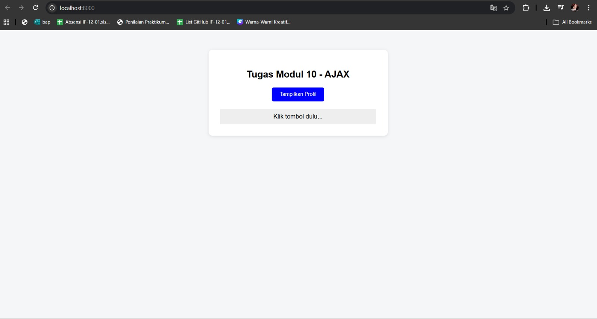
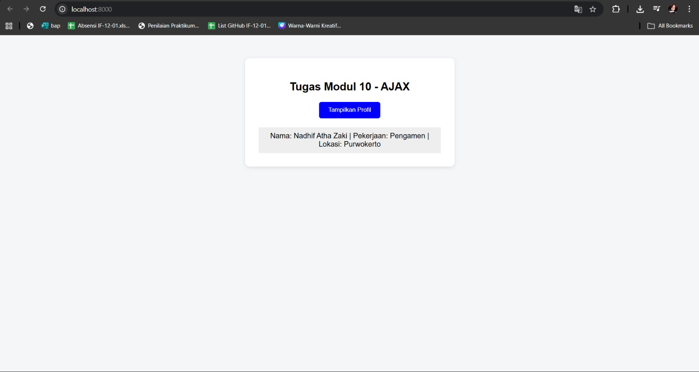

<div align="center">
  <br />
  <h1>LAPORAN PRAKTIKUM <br>APLIKASI BERBASIS PLATFORM</h1>
  <br />
  <h3>TUGAS MODUL 10 <br> AJAX (Asynchronous JavaScript and XML)</h3>
  <br />
  <br />
   
  <br />
  <br />
  <br />
  <br />
  <h3>Disusun Oleh :</h3>
  <p>
    <strong>Nadhif Atha Zaki</strong><br>
    <strong>2311102007</strong><br>
    <strong>S1 IF-11-01</strong>
  </p>
  <br />
  <br />
  <h3>Dosen Pengampu :</h3>
  <p>
    <strong>Dimas Fanny Hebrasianto Permadi, S.ST., M.Kom</strong>
  </p>
  <br />
  <br />
    <h4>Asisten Praktikum :</h4>
    <strong> Apri Pandu Wicaksono </strong> <br>
    <strong>Rangga Pradarrell Fathi</strong>
  <br />
  <h3>LABORATORIUM HIGH PERFORMANCE
 <br>FAKULTAS INFORMATIKA <br>UNIVERSITAS TELKOM PURWOKERTO <br>2026</h3>
</div>

---

# 1. Dasar Teori

**AJAX (Asynchronous JavaScript and XML)** adalah kumpulan teknik pemrograman web yang memungkinkan halaman web untuk mengambil data dari server secara latar belakang (*asynchronously*) tanpa harus memuat ulang (*reload*) seluruh halaman secara penuh. Dengan AJAX, aplikasi web menjadi lebih interaktif, cepat, dan menyerupai aplikasi desktop. Walaupun utamanya mengandung kata "XML", format pertukaran data yang digunakan pada era modern saat ini cenderung lebih bertumpu pada **JSON (JavaScript Object Notation)** karena jauh lebih universal, ringan, dan sejalan langsung dengan sintaks JavaScript bawaan.

Untuk melakukan fungsi pengambilan (*request*) di sisi klien, antarmuka standar modern (API) yang saat ini paling banyak diimplementasikan di berbagai alat peramban (*web browser*) menggantikan `XMLHttpRequest` usang adalah fungsionalitas **`fetch()`**. Fetch API dipuji karena mendukung pengkodingan *Promises* yang memberi kemudahan penanganan sinkronisasi eksekusi HTTP Asynchronous sehingga mempermudah pembacaan, perangkaian `.then()`, dan pemeliharaan struktur kode.

---

## 2. Implementasi 

Program Tampil Profil Karyawan ini telah dirancang untuk memenuhi semua syarat wajib pada soal dengan mengimplementasikan AJAX (*Asynchronous JavaScript and XML*) menggunakan *Fetch API* modern sebagaimana dicontohkan pada cuplikan kode berikut:

### 2.1 Membuat File Server (Database Sederhana) dengan PHP

Data disimpan dalam bentuk array asosiatif PHP yang berisi informasi nama, pekerjaan, dan lokasi dari satu karyawan. Data ini kemudian diubah menjadi format JSON menggunakan fungsi `json_encode()`. Header `Content-Type: application/json` wajib dideklarasikan paling atas — tidak boleh ada spasi atau baris kosong sebelumnya — agar *output* dibaca dengan benar oleh *client* sebagai dokumen JSON. Perintah `exit` ditambahkan setelah `echo` guna memastikan tidak ada karakter atau *whitespace* yang bocor setelah output JSON, yang dapat merusak proses parsing di sisi klien. *File Referensi: `data.php`*

```php
<?php

header('Content-Type: application/json');

// Data karyawan dalam bentuk array asosiatif
$data = [
    "nama" => "Nadhif Atha Zaki",
    "pekerjaan" => "Pengamen",
    "lokasi" => "Purwokerto"
];

// Output JSON
echo json_encode($data);
exit;
```

### 2.2 Mengambil Data Menggunakan Fetch API (AJAX)

Pengambilan data dari *server* dilakukan di sisi *client* menggunakan fungsi bawaan *browser*, yaitu `fetch()`. Proses ini berjalan secara *asynchronous* di latar belakang, sehingga pertukaran data terjadi tanpa me-*reload* halaman web secara keseluruhan. Pengecekan `response.ok` dilakukan untuk mendeteksi status HTTP error seperti 404 atau 500, dan akan melempar *exception* yang kemudian ditangkap oleh blok `.catch()`. *File Referensi: `index.html`*

```javascript
fetch("data.php")
    .then(response => {
        console.log("STATUS:", response.status);

        if (!response.ok) {
            throw new Error("File tidak ditemukan / error server (" + response.status + ")");
        }

        // Mengonversi respon HTTP mentah ke dalam objek JavaScript (JSON)
        return response.json();
    })
    .then(data => {
        console.log("DATA:", data);

        document.getElementById("hasil-profil").innerHTML =
            `Nama: ${data.nama} | Pekerjaan: ${data.pekerjaan} | Lokasi: ${data.lokasi}`;
    })
    .catch(error => {
        console.error("ERROR:", error);

        document.getElementById("hasil-profil").innerHTML =
            "ERROR: " + error.message;
    });
```

### 2.3 Menampilkan Data Profil ke Halaman HTML

Data JSON yang telah di-*fetch* kemudian ditampilkan langsung ke dalam elemen `<div id="hasil-profil">` menggunakan manipulasi DOM (*Document Object Model*) via *template literal* JavaScript. Proses ini dipicu oleh *Event Listener* pada tombol `<button id="btn">`, sehingga data hanya dimuat ketika pengguna menekan tombol "Tampilkan Profil" — tanpa perlu me-*reload* halaman sama sekali. *File Referensi: `index.html`*

```javascript
document.getElementById("btn").addEventListener("click", function () {
    fetch("data.php")
        .then(response => {
            if (!response.ok) {
                throw new Error("File tidak ditemukan / error server (" + response.status + ")");
            }
            return response.json();
        })
        .then(data => {
            document.getElementById("hasil-profil").innerHTML =
                `Nama: ${data.nama} | Pekerjaan: ${data.pekerjaan} | Lokasi: ${data.lokasi}`;
        })
        .catch(error => {
            document.getElementById("hasil-profil").innerHTML =
                "ERROR: " + error.message;
        });
});
```

---

## 3. Penjelasan Kode Sumber (Struktur File & Arsitektur)

Proyek ini sengaja dibuat efisien dengan hanya menggunakan 2 file dasar (Client-Server) sesuai dengan persyaratan soal:

1. **`data.php` (REST API Sederhana / Pseudo-Backend):**  
   Bertindak sebagai penyuplai data *(Database Provider)*. Script ini memproses array asosiatif PHP menjadi string bertipe MIME `application/json`. Penggunaan `exit` setelah `echo` memastikan tidak ada karakter tambahan yang keluar setelah output JSON, yang dapat merusak parsing di sisi klien.

2. **`index.html` (View HTML, UI, & AJAX Controller):**  
   Titik jumpa (*interface*) interaksi untuk *user* (Front-End). File ini berisi struktur HTML dengan elemen tombol `<button id="btn">` sebagai pemicu aksi, dan elemen `<div id="hasil-profil">` sebagai wadah tampil hasil data. Styling CSS internal memberikan tampilan sederhana namun rapi dengan *box* terpusat. Di dalam tag `<script>` internal terdapat *Event Listener* yang mengikat klik tombol ke operasi `fetch()`, lengkap dengan penanganan error melalui blok `.catch()`.

---

## 4. Hasil Tampilan (Screenshots) Aplikasi AJAX

Berikut adalah lampiran UI / *screenshot* dari Aplikasi Tampil Profil Karyawan AJAX yang menampilkan data secara dinamis dari *backend* PHP ke tampilan UI tanpa *reload* halaman, dijalankan di lingkungan Web Server Lokal (seperti Laragon/XAMPP).

* Tampilan awal sebelum tombol diklik:



* Tampilan setelah tombol "Tampilkan Profil" diklik dan data berhasil di-*fetch*:



---

## 5. Referensi Web

- **MDN Web Docs - Fetch API (AJAX Asinkron)**: [https://developer.mozilla.org/en-US/docs/Web/API/Fetch_API/Using_Fetch](https://developer.mozilla.org/en-US/docs/Web/API/Fetch_API/Using_Fetch)
- **PHP Documentation - *json_encode***: [https://www.php.net/manual/en/function.json-encode.php](https://www.php.net/manual/en/function.json-encode.php)
- **MDN Web Docs - Basic DOM Manipulation**: [https://developer.mozilla.org/en-US/docs/Learn/JavaScript/Client-side_web_APIs/Manipulating_documents](https://developer.mozilla.org/en-US/docs/Learn/JavaScript/Client-side_web_APIs/Manipulating_documents)
- **MDN Web Docs - EventTarget: addEventListener()**: [https://developer.mozilla.org/en-US/docs/Web/API/EventTarget/addEventListener](https://developer.mozilla.org/en-US/docs/Web/API/EventTarget/addEventListener)
- **CSS Google Fonts SDK (Font Poppins)**: [https://fonts.google.com/specimen/Poppins](https://fonts.google.com/specimen/Poppins)
