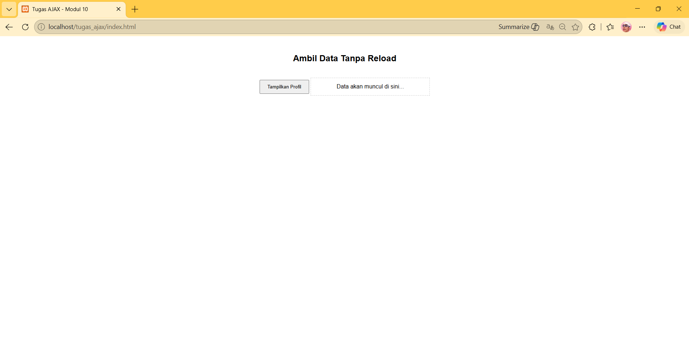
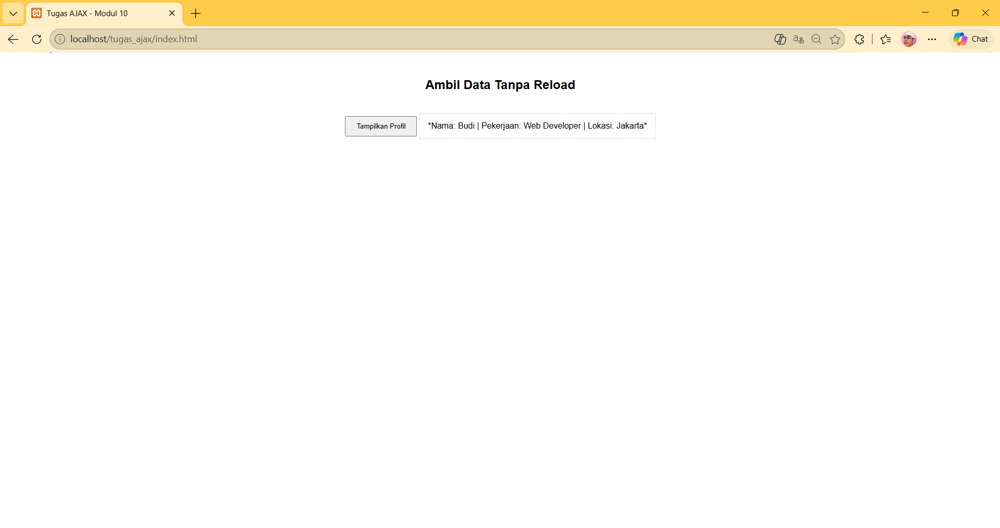

<div align="center">

# LAPORAN PRAKTIKUM
# APLIKASI BERBASIS PLATFORM

---

## MODUL 10
## AJAX

---


---

**Disusun Oleh :**

**SHERINE NAURA EARLY GUNAWAN**

**2311102020**

**S1 IF-11-REG01**

---

**Dosen Pengampu :**

Dimas Fanny Hebrasianto Permadi, S.ST., M.Kom

---

**PROGRAM STUDI S1 INFORMATIKA**

**FAKULTAS INFORMATIKA**

**UNIVERSITAS TELKOM PURWOKERTO**

**2025/2026**

</div>

---

## 1. Dasar Teori
**AJAX** adalah teknik pemrograman web yang memungkinkan pertukaran data antara client dan server secara asynchronous tanpa perlu memuat ulang seluruh halaman web. Teknologi ini meningkatkan interaktivitas dan kecepatan aplikasi karena hanya bagian data tertentu yang diperbarui dalam struktur DOM (Document Object Model).
Keuntungan penggunaan AJAX:
- Efisiensi Bandwidth: Hanya data yang diperlukan yang dikirimkan antara server dan browser, bukan seluruh dokumen HTML.
- Kecepatan: Aplikasi terasa lebih cepat karena pengguna tidak perlu menunggu proses refresh halaman secara total.
- Interaktivitas: Memungkinkan fitur modern seperti validasi formulir real-time, pembaruan notifikasi otomatis, dan pengisian konten secara dinamis.

---

## 2. Source Code

```php
<?php
header('Content-Type: application/json');

$data = [
    'nama' => 'Budi',
    'pekerjaan' => 'Web Developer',
    'lokasi' => 'Jakarta'
];

echo json_encode($data);
?>
```

```html
<!DOCTYPE html>
<html lang="id">

<head>
    <meta charset="UTF-8">
    <title>Tugas AJAX - Modul 10</title>
    <style>
        body {
            font-family: sans-serif;
            padding: 20px;
            text-align: center;
        }

        #hasil-profil {
            margin-top: 20px;
            padding: 15px;
            border: 1px dashed #ccc;
            display: inline-block;
            min-width: 300px;
        }

        button {
            padding: 10px 20px;
            cursor: pointer;
        }
    </style>
</head>

<body>

    <h2>Ambil Data Tanpa Reload</h2>

    <button id="btn-tampil">Tampilkan Profil</button>

    <div id="hasil-profil">Data akan muncul di sini...</div>

    <script>
        document.getElementById('btn-tampil').addEventListener('click', function () {

            fetch('data.php')
                .then(response => response.json()) 
                .then(data => {
                    const info = `*Nama: ${data.nama} | Pekerjaan: ${data.pekerjaan} | Lokasi: ${data.lokasi}*`;
                    document.getElementById('hasil-profil').innerHTML = info;
                })
                .catch(error => {
                    console.error('Error:', error);
                    document.getElementById('hasil-profil').innerHTML = "Gagal mengambil data.";
                });
        });
    </script>

</body>

</html>
```

## Penjelasan Kode 
Implementasi AJAX pada halaman ini memungkinkan pembaruan konten profil secara dinamis tanpa proses pemuatan ulang halaman. Mekanisme ini diinisiasi oleh event listener pada tombol btn-tampil yang memicu metode fetch() untuk mengirimkan permintaan asynchronous ke server data.php. Respon mentah dari server kemudian dikonversi ke format JSON agar data dapat diolah sebagai objek JavaScript.

Setelah konversi berhasil, properti data seperti nama, pekerjaan, dan lokasi diekstraksi dan disisipkan ke dalam elemen hasil-profil melalui manipulasi DOM menggunakan innerHTML. Sistem ini juga dilengkapi dengan blok .catch() sebagai penanganan kesalahan (error handling) jaringan, guna memastikan pengguna tetap menerima umpan balik informatif jika proses pengambilan data gagal dilakukan.

---

### 3. Hasil
<div align="center">
    
    
</div>