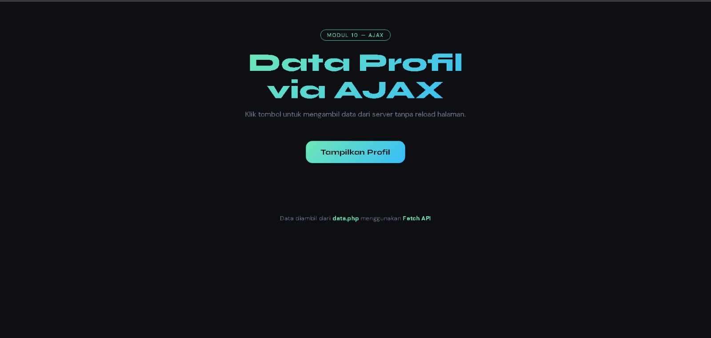
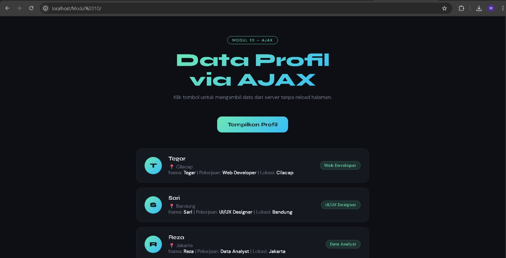

<div align="center">

# LAPORAN PRAKTIKUM
# APLIKASI BERBASIS PLATFORM

---

## MODUL 10
## AJAX (ASYNCHRONOUS JAVASCRIPT AND XML)

---


---

**Disusun Oleh :**

**TEGAR BANGKIT WIJAYA**  
**2311102027**  
**S1 IF-11-REG01**

---

**Dosen Pengampu :**  
Dimas Fanny Hebrasianto Permadi, S.ST., M.Kom

---

**PROGRAM STUDI S1 INFORMATIKA**  
**FAKULTAS INFORMATIKA**  
**UNIVERSITAS TELKOM PURWOKERTO**  
**2025/2026**

</div>

---

## 1. Dasar Teori

### AJAX (Asynchronous JavaScript and XML)
AJAX adalah teknik pengembangan web yang memungkinkan halaman web berkomunikasi dengan server tanpa reload halaman.

### Fetch API
Fetch API digunakan untuk mengambil data dari server secara asynchronous menggunakan Promise.

### JSON
JSON adalah format pertukaran data berbentuk key-value.

### PHP sebagai Server
PHP digunakan untuk mengirim data dalam format JSON.

### Event Listener
Digunakan untuk menangani event klik tombol.

### DOM Manipulation
Digunakan untuk menampilkan data ke halaman.

### Bootstrap 5
Framework CSS untuk tampilan modern dan responsif.

---

## 2. Struktur Project

2311102027_TegarBangkitWijaya/
├── data.php
├── index.html
├── ss-1.jpeg
├── ss-2.jpeg
└── Logo_Telkom_University_potrait.png


---

## 3. Source Code

### data.php
```php
<?php
header('Content-Type: application/json');

$profil = [
    ['nama' => 'Tegar', 'pekerjaan' => 'Web Developer', 'lokasi' => 'Cilacap'],
    ['nama' => 'Sari', 'pekerjaan' => 'UI/UX Designer', 'lokasi' => 'Bandung'],
    ['nama' => 'Reza', 'pekerjaan' => 'Data Analyst', 'lokasi' => 'Jakarta'],
    ['nama' => 'Dina', 'pekerjaan' => 'Backend Engineer', 'lokasi' => 'Surabaya'],
    ['nama' => 'Farhan', 'pekerjaan' => 'Mobile Developer', 'lokasi' => 'Yogyakarta'],
];

echo json_encode($profil);

<!DOCTYPE html>
<html lang="id">
<head>
<meta charset="UTF-8">
<title>AJAX Demo</title>
</head>
<body>

<h2>Data Profil</h2>
<button onclick="loadData()">Tampilkan Profil</button>

<div id="hasil"></div>

<script>
function loadData() {
    fetch('data.php')
    .then(res => res.json())
    .then(data => {
        let hasil = '';
        data.forEach(d => {
            hasil += `<p>${d.nama} - ${d.pekerjaan} (${d.lokasi})</p>`;
        });
        document.getElementById('hasil').innerHTML = hasil;
    });
}
</script>

</body>
</html>

<!DOCTYPE html>
<html lang="id">
<head>
<meta charset="UTF-8">
<title>AJAX Demo</title>
</head>
<body>

<h2>Data Profil</h2>
<button onclick="loadData()">Tampilkan Profil</button>

<div id="hasil"></div>

<script>
function loadData() {
    fetch('data.php')
    .then(res => res.json())
    .then(data => {
        let hasil = '';
        data.forEach(d => {
            hasil += `<p>${d.nama} - ${d.pekerjaan} (${d.lokasi})</p>`;
        });
        document.getElementById('hasil').innerHTML = hasil;
    });
}
</script>

</body>
</html>

## 4. Hasil Tampilan

### 4.1 Tampilan Awal Halaman

Pada saat halaman pertama kali dibuka, pengguna akan melihat tampilan awal aplikasi AJAX yang terdiri dari judul halaman dan tombol **"Tampilkan Profil"**. Pada tahap ini, data profil belum ditampilkan karena belum ada interaksi dari pengguna.

<div align="center">
<
</div>

---

### 4.2 Tampilan Setelah Tombol Diklik

Setelah tombol **"Tampilkan Profil"** diklik, aplikasi akan mengambil data dari server (`data.php`) menggunakan **Fetch API** tanpa melakukan reload halaman. Data yang diterima dalam format JSON kemudian ditampilkan ke halaman dalam bentuk daftar profil yang berisi nama, pekerjaan, dan lokasi.

<div align="center">
>
</div>