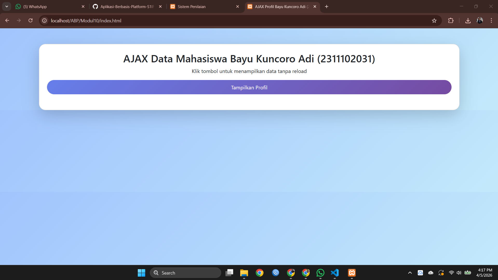
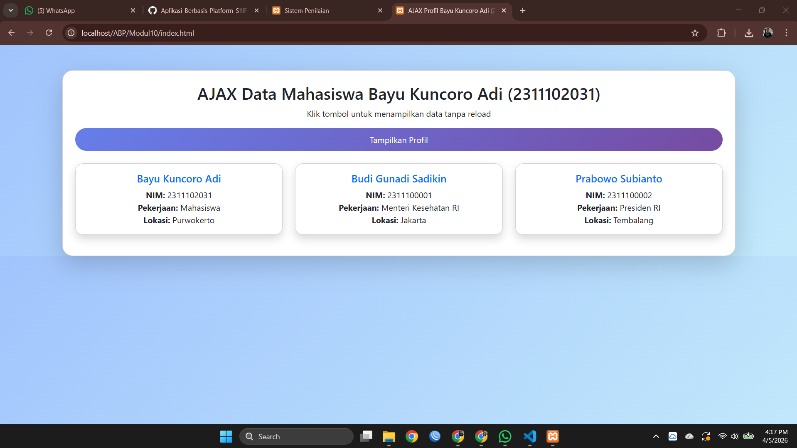

<div align="center">
  <br />
  <h1>LAPORAN PRAKTIKUM <br>APLIKASI BERBASIS PLATFORM</h1>
  <br />
  <h3> MODUL 10 <br> AJAX </h3>
  <br />
   
  <br />
  <br />
  <br />
  <h3>Disusun Oleh :</h3>
  <p>
    <strong>Bayu Kuncoro Adi</strong><br>
    <strong>2311102031</strong><br>
    <strong>S1 IF-11-01</strong>
  </p>
  <br />
  <h3>Dosen Pengampu :</h3>
  <p>
    <strong>Dimas Fanny Hebrasianto Permadi, S.ST., M.Kom</strong>
  </p>
  <br />
  <br />
    <h4>Asisten Praktikum :</h4>
    <strong> Apri Pandu Wicaksono </strong> <br>
    <strong>Rangga Pradarrell Fathi</strong>
  <br />
  <h3>LABORATORIUM HIGH PERFORMANCE
 <br>FAKULTAS INFORMATIKA <br>UNIVERSITAS TELKOM PURWOKERTO <br>2026</h3>
</div>

---

## Dasar Teori

### AJAX (Asynchronous JavaScript and XML)

AJAX (Asynchronous JavaScript and XML) merupakan teknik dalam pengembangan web yang memungkinkan proses pertukaran data antara client (browser) dan server dilakukan secara **asinkron**, tanpa harus memuat ulang (*reload*) seluruh halaman. Dengan menggunakan AJAX, hanya bagian tertentu dari halaman yang diperbarui, sehingga aplikasi web terasa lebih cepat, responsif, dan interaktif.

Meskipun namanya mengandung kata XML, dalam praktik modern format data yang paling sering digunakan adalah **JSON**, karena lebih ringan dan mudah diproses.

---

### Cara Kerja AJAX

Secara umum, alur kerja AJAX dapat dijelaskan sebagai berikut:

1. **User melakukan aksi**
   Misalnya klik tombol, mengisi form, atau melakukan pencarian.

2. **JavaScript mengirim request ke server**
   Permintaan dikirim menggunakan teknologi seperti `fetch()` atau `XMLHttpRequest`.

3. **Server memproses request**
   Server (misalnya menggunakan PHP) akan mengambil atau mengolah data yang diminta.

4. **Server mengirim response**
   Data dikirim kembali ke client dalam format tertentu (umumnya JSON).

5. **JavaScript menerima dan memproses data**
   Data yang diterima diolah oleh JavaScript.

6. **Halaman diperbarui tanpa reload**
   Hanya bagian tertentu dari halaman yang berubah, tanpa refresh keseluruhan halaman.

---

### Kelebihan AJAX

Penggunaan AJAX memberikan beberapa keuntungan dalam pengembangan web modern, antara lain:

* **Tidak perlu reload halaman**
  Hal ini membuat pengalaman pengguna (*user experience*) lebih halus dan nyaman.

* **Respons lebih cepat**
  Karena hanya data yang diperlukan saja yang diambil dari server.

* **Efisiensi bandwidth**
  Data yang ditransfer lebih sedikit dibandingkan reload seluruh halaman.

* **Interaktivitas tinggi**
  Cocok digunakan pada fitur seperti:

  * Live search
  * Autocomplete
  * Dashboard real-time
  * Aplikasi chat

---

### Kekurangan AJAX

Meskipun memiliki banyak kelebihan, AJAX juga memiliki beberapa keterbatasan, yaitu:

* **Ketergantungan pada JavaScript**
  Jika JavaScript dinonaktifkan, maka fitur AJAX tidak dapat berjalan.

* **Masalah SEO (Search Engine Optimization)**
  Konten yang dimuat secara dinamis terkadang sulit diindeks oleh mesin pencari (meskipun sudah banyak solusi modern).

* **Keamanan**
  Jika tidak dilakukan validasi di sisi server, data bisa rentan terhadap serangan.

* **Debugging lebih kompleks**
  Karena melibatkan komunikasi antara client dan server.

---

### Fetch API

Dalam implementasi modern, AJAX biasanya menggunakan **Fetch API**, yaitu fitur bawaan JavaScript untuk melakukan HTTP request ke server.

Contoh penggunaan:

```javascript
fetch('data.php')
  .then(response => response.json())
  .then(data => console.log(data));
```

Keunggulan Fetch API:

* Sintaks lebih sederhana dibanding `XMLHttpRequest`
* Mendukung Promise (asynchronous programming)
* Mudah digunakan untuk mengambil data JSON

---

### JSON (JavaScript Object Notation)

JSON (JavaScript Object Notation) adalah format pertukaran data yang ringan, mudah dibaca oleh manusia, dan mudah diproses oleh mesin.

Contoh JSON:

```json
{
  "nama": "Budi",
  "pekerjaan": "Web Developer",
  "lokasi": "Jakarta"
}
```

JSON sering digunakan sebagai format standar dalam komunikasi antara client dan server karena:

* Ringan
* Mudah dipahami
* Didukung hampir semua bahasa pemrograman

---

### JSON dalam PHP

Dalam PHP, fungsi `json_encode()` digunakan untuk mengubah data seperti array atau object menjadi format JSON.

Contoh:

```php
$data = ["nama" => "Budi", "pekerjaan" => "Web Developer"];
echo json_encode($data);
```

Fungsi ini sangat penting dalam implementasi AJAX karena:

* Data dari server dapat dikirim ke client dalam format JSON
* Data tersebut dapat langsung diproses oleh JavaScript

---

### Kesimpulan

AJAX merupakan teknik penting dalam pengembangan web modern yang memungkinkan komunikasi antara client dan server tanpa reload halaman. Dengan dukungan teknologi seperti Fetch API dan JSON, proses pertukaran data menjadi lebih cepat, efisien, dan mudah diimplementasikan. Dalam konteks aplikasi ini, AJAX digunakan untuk mengambil data dari server (PHP) dan menampilkannya secara dinamis di halaman web.


## Sourcecode 

### Sourcecode data.php
``` PHP
<?php
header('Content-Type: application/json');

$data = [
    [
        "nama" => "Bayu Kuncoro Adi",
        "nim" => "2311102031",
        "pekerjaan" => "Mahasiswa",
        "lokasi" => "Purwokerto"
    ],
    [
        "nama" => "Budi Gunadi Sadikin",
        "nim" => "2311100001",
        "pekerjaan" => "Menteri Kesehatan RI",
        "lokasi" => "Jakarta"
    ],
    [
        "nama" => "Prabowo Subianto",
        "nim" => "2311100002",
        "pekerjaan" => "Presiden RI",
        "lokasi" => "Tembalang"
    ]
];

echo json_encode($data);
?>
```

### Sourcecode index.html
``` HTML
<!DOCTYPE html>
<html lang="id">
<head>
    <meta charset="UTF-8">
    <title>AJAX Profil Bayu Kuncoro Adi (2311102031)</title>
    <link href="https://cdn.jsdelivr.net/npm/bootstrap@5.3.0/dist/css/bootstrap.min.css" rel="stylesheet">

    <style>
        body {
            background: linear-gradient(135deg, #a1c4fd, #c2e9fb);
            font-family: 'Segoe UI', sans-serif;
        }

        .card-main {
            border-radius: 20px;
            background: white;
        }

        .btn-custom {
            background: linear-gradient(135deg, #667eea, #764ba2);
            color: white;
            border: none;
            border-radius: 30px;
            padding: 10px 20px;
        }

        .btn-custom:hover {
            opacity: 0.9;
        }

        .profile-card {
            border-radius: 15px;
            transition: 0.3s;
        }

        .profile-card:hover {
            transform: scale(1.05);
        }
    </style>
</head>

<body>

<div class="container mt-5 text-center">
    <div class="card shadow-lg p-4 card-main">
        <h2>AJAX Data Mahasiswa Bayu Kuncoro Adi (2311102031)</h2>
        <p>Klik tombol untuk menampilkan data tanpa reload</p>

        <button onclick="loadData()" class="btn btn-custom">
            Tampilkan Profil
        </button>

        <div id="hasil-profil" class="row mt-4"></div>
    </div>
</div>

<script>
function loadData() {
    fetch('data.php')
        .then(response => response.json())
        .then(data => {
            let output = "";

            data.forEach(item => {
                output += `
                <div class="col-md-4 mb-3">
                    <div class="card profile-card shadow">
                        <div class="card-body">
                            <h5 class="card-title text-primary">${item.nama}</h5>
                            <p class="card-text">
                                <b>NIM:</b> ${item.nim} <br>
                                <b>Pekerjaan:</b> ${item.pekerjaan} <br>
                                <b>Lokasi:</b> ${item.lokasi}
                            </p>
                        </div>
                    </div>
                </div>
                `;
            });

            document.getElementById('hasil-profil').innerHTML = output;
        })
        .catch(error => {
            document.getElementById('hasil-profil').innerHTML =
                `<div class="alert alert-danger mt-3">Gagal mengambil data!</div>`;
        });
}
</script>

</body>
</html>
```


## Tampilan Output

<p align="center">
  
</p>

<p align="center">
  
</p>


## Penjelasan Program AJAX Data Mahasiswa

### 1. Struktur Umum Program

Program ini terdiri dari dua bagian utama:

1. **Client (Frontend)** → `index.html`
   Berfungsi sebagai tampilan dan interaksi pengguna
2. **Server (Backend)** → `data.php`
   Berfungsi menyediakan data dalam format JSON

Kedua bagian ini dihubungkan menggunakan teknik **AJAX (Fetch API)** sehingga data dapat ditampilkan tanpa reload halaman.

---

## Penjelasan Kode Client (HTML + CSS + JavaScript)

### a. Struktur HTML Dasar

```html
<!DOCTYPE html>
<html lang="id">
```

Menentukan bahwa dokumen menggunakan HTML5 dan bahasa Indonesia.

---

### b. Import Bootstrap

```html
<link href="https://cdn.jsdelivr.net/npm/bootstrap@5.3.0/dist/css/bootstrap.min.css" rel="stylesheet">
```

Digunakan untuk mempercantik tampilan dengan framework Bootstrap.

---

### c. Styling (CSS)

```css
body {
    background: linear-gradient(135deg, #a1c4fd, #c2e9fb);
}
```

Digunakan untuk:

* Background gradasi cerah
* Tampilan modern
* Efek hover pada card

Class penting:

* `.card-main` → card utama
* `.btn-custom` → tombol custom
* `.profile-card` → card data mahasiswa

---

### d. Struktur Tampilan

```html
<button onclick="loadData()">Tampilkan Profil</button>
<div id="hasil-profil"></div>
```

* Tombol digunakan untuk memicu AJAX
* `<div id="hasil-profil">` sebagai tempat menampilkan data

---

## 3. Logika AJAX (JavaScript)

### a. Fungsi loadData()

```javascript
function loadData() {
    fetch('data.php')
```

Fungsi ini akan dijalankan saat tombol diklik.

---

### b. Mengambil Data dari Server

```javascript
.then(response => response.json())
```

Mengubah response dari server menjadi format JSON agar bisa diproses.

---

### c. Menampilkan Data

```javascript
data.forEach(item => {
```

Loop digunakan untuk menampilkan banyak data mahasiswa.

---

### d. Membuat Tampilan Dinamis

```javascript
output += `
<div class="card">
    ${item.nama}
</div>
`;
```

Menggunakan template literal untuk membuat HTML secara dinamis.

---

### e. Menampilkan ke Halaman

```javascript
document.getElementById('hasil-profil').innerHTML = output;
```

Menampilkan hasil ke dalam halaman tanpa reload.

---

### f. Error Handling

```javascript
.catch(error => {
```

Menangani jika terjadi error saat mengambil data.

---

## 4. Penjelasan Kode Server (PHP)

### a. Header JSON

```php
header('Content-Type: application/json');
```

Menentukan bahwa data yang dikirim adalah format JSON.

---

### b. Data Mahasiswa

```php
$data = [
    ["nama"=>"Bayu", ...],
];
```

Menyimpan data dalam bentuk array multidimensi.

---

### c. Konversi ke JSON

```php
echo json_encode($data);
```

Mengubah array menjadi JSON agar dapat dibaca oleh JavaScript.

---

## 5. Alur Kerja Program

1. User klik tombol **Tampilkan Profil**
2. JavaScript menjalankan `fetch()`
3. Request dikirim ke `data.php`
4. PHP memproses dan mengirim JSON
5. JavaScript menerima data
6. Data ditampilkan dalam bentuk card
7. Halaman tidak reload

---

## 6. Hasil Program

Data mahasiswa akan tampil dalam bentuk **card Bootstrap** yang berisi:

* Nama
* NIM
* Pekerjaan
* Lokasi

---

## 7. Kesimpulan

Program ini berhasil mengimplementasikan AJAX menggunakan Fetch API untuk mengambil data dari server tanpa reload halaman. Dengan memanfaatkan JSON dan PHP, data dapat ditampilkan secara dinamis sehingga meningkatkan interaktivitas dan pengalaman pengguna.

---

##  Referensi

[1] PHP Documentation. (2024). *json_encode*.
   https://www.php.net/manual/en/function.json-encode.php

[2] PHP Documentation. (2024). *HTTP Headers*.
   https://www.php.net/manual/en/function.header.php

[3] MDN Web Docs. (2024). *Fetch API*.
   https://developer.mozilla.org/en-US/docs/Web/API/Fetch_API

[4] MDN Web Docs. (2024). *Working with JSON*.
   https://developer.mozilla.org/en-US/docs/Learn/JavaScript/Objects/JSON

[5] Bootstrap Documentation. (2024). *Bootstrap 5 Components*.
   https://getbootstrap.com/docs/5.3/

[6] Kadir, A. (2018). *Dasar Pemrograman Web Dinamis Menggunakan PHP*. Andi Publisher.

[7] [AJAX] (https://terapan-ti.vokasi.unesa.ac.id/post/memahami-ajax-dalam-pengembangan-web) </br>
