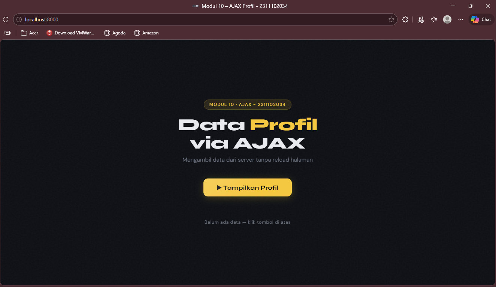
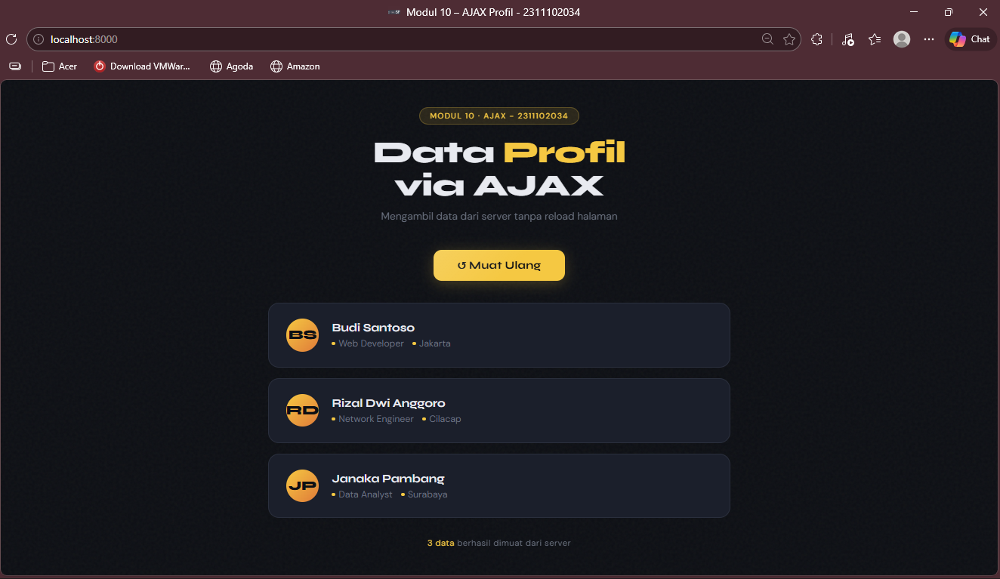

<div align="center">
  <br />
  <h1>LAPORAN PRAKTIKUM <br>APLIKASI BERBASIS PLATFORM</h1>
  <br />
  <h3>MODUL 10 <br> AJAX  </h3>
  <br />
   
  <br />
  <br />
  <br />
  <h3>Disusun Oleh :</h3>
  <p>
    <strong>Rizal Dwi Anggoro</strong><br>
    <strong>2311102034</strong><br>
    <strong>IF-11-REG01</strong>
  </p>
  <br />
  <h3>Dosen Pengampu :</h3>
  <p>
    <strong>Dimas Fanny Hebrasianto Permadi, S.ST., M.Kom</strong>
  </p>
  <br />
  <br />
    <h4>Asisten Praktikum :</h4>
    <strong> Apri Pandu Wicaksono </strong> <br>
    <strong>Rangga Pradarrell Fathi</strong>
  <br />
  <h3>LABORATORIUM HIGH PERFORMANCE
 <br>FAKULTAS INFORMATIKA <br>UNIVERSITAS TELKOM PURWOKERTO <br>2026</h3>
</div>

---
## 1. DASAR MATERI
### 1.1 Pengertian AJAX
AJAX (Asynchronous JavaScript and XML) adalah teknik dalam pengembangan web yang memungkinkan halaman web untuk mengambil dan menampilkan data dari server tanpa perlu melakukan reload halaman secara keseluruhan.

Dengan AJAX, komunikasi antara client (browser) dan server dilakukan secara asynchronous, sehingga hanya sebagian data saja yang diperbarui. Hal ini membuat aplikasi web menjadi lebih cepat, responsif, dan interaktif.

### 1.2 Cara Kerja AJAX
Secara umum, proses kerja AJAX adalah sebagai berikut:
1. Pengguna melakukan aksi (misalnya klik tombol)
2. JavaScript mengirim request ke server
3. Server memproses request dan mengirim response (biasanya JSON)
4. JavaScript menerima data dan memperbarui tampilan halaman

Teknik ini memungkinkan pertukaran data terjadi di belakang layar tanpa mengganggu tampilan utama halaman web.

### 1.3 Fetch API
Fetch API adalah fitur modern dalam JavaScript yang digunakan untuk melakukan HTTP request ke server.

Fungsi utama dari `fetch()` adalah:

- Mengambil data dari server
- Mengirim data ke server
- Mendukung Promise untuk penanganan asynchronous

Contoh Penggunaan :
```js
fetch('data.php')
  .then(response => response.json())
  .then(data => console.log(data));
```

### 1.4 JSON (JavaScript Object Notation)
JSON (JavaScript Object Notation) adalah format pertukaran data yang ringan dan mudah dibaca oleh manusia maupun mesin.

Contoh JSON:
```js
{
  "nama": "Budi",
  "pekerjaan": "Web Developer",
  "lokasi": "Jakarta"
}
```
Dalam PHP, JSON dapat dibuat menggunakan fungsi: `json_encode($data);`

JSON sangat umum digunakan dalam AJAX karena:
- Ringan
- Mudah diproses oleh JavaScript
- Format standar untuk komunikasi data

---
## 2. PENJELASAN CODE
### 2.1 Code data.php
**Code :**
```php
<?php
header('Content-Type: application/json');
header('Access-Control-Allow-Origin: *');

$profil = [
    ['nama' => 'Budi Santoso', 'pekerjaan' => 'Web Developer', 'lokasi' => 'Jakarta'],
    ['nama' => 'Rizal Dwi Anggoro', 'pekerjaan' => 'Network Engineer', 'lokasi' => 'Cilacap'],
    ['nama' => 'Janaka Pambang', 'pekerjaan' => 'Data Analyst', 'lokasi' => 'Surabaya'],
];

echo json_encode($profil);
?>
```
***Penjelasan :** 
File `data.php` merupakan bagian server yang berfungsi untuk menyediakan data dalam format JSON yang nantinya akan diakses oleh client menggunakan AJAX. 

Selanjutnya, terdapat perintah `header('Content-Type: application/json');` yang digunakan untuk memberi tahu browser bahwa data yang dikirimkan oleh server memiliki format JSON. Hal ini penting agar data dapat dikenali dan diproses dengan benar oleh JavaScript pada sisi client. Selain itu, terdapat juga `header('Access-Control-Allow-Origin: *');` yang berfungsi untuk mengizinkan akses dari semua domain. Header ini biasanya digunakan untuk mencegah masalah CORS (Cross-Origin Resource Sharing) saat data diambil menggunakan AJAX.

Pada bagian berikutnya, dibuat sebuah variabel `$profil` yang berisi array multidimensi. Array ini menyimpan beberapa data profil, di mana setiap elemen memiliki atribut seperti nama, pekerjaan, dan lokasi. Data tersebut disusun dalam bentuk associative array sehingga mudah diolah dan dikonversi ke format lain.

Kemudian, fungsi `json_encode($profil)` digunakan untuk mengubah data array tersebut menjadi format JSON. Hasil konversi ini selanjutnya ditampilkan menggunakan perintah `echo`, sehingga data dapat dikirim sebagai response dari server ke client. 

### 2.2 Code index.html
**Code :**

```html
<!DOCTYPE html>
<html lang="id">
<head>
  <meta charset="UTF-8" />
  <meta name="viewport" content="width=device-width, initial-scale=1.0"/>
  <title>Modul 10 – AJAX Profil - 2311102034</title>
  <link href="https://fonts.googleapis.com/css2?family=Syne:wght@700;800&family=DM+Sans:ital,wght@0,400;0,500;1,400&display=swap" rel="stylesheet"/>
  <style>
    *, *::before, *::after { box-sizing: border-box; margin: 0; padding: 0; }

    :root {
      --bg: #0d0f14;
      --surface: #14171f;
      --card: #1b1f2b;
      --accent: #f5c842;
      --accent2: #e07b39;
      --text: #e8eaf0;
      --muted: #6b7280;
      --border: #2a2f3d;
    }

    body {
      font-family: 'DM Sans', sans-serif;
      background: var(--bg);
      color: var(--text);
      min-height: 100vh;
      display: flex;
      flex-direction: column;
      align-items: center;
      justify-content: center;
      padding: 2rem;
      overflow-x: hidden;
    }

    /* Noise texture overlay */
    body::before {
      content: '';
      position: fixed;
      inset: 0;
      background-image: url("data:image/svg+xml,%3Csvg viewBox='0 0 200 200' xmlns='http://www.w3.org/2000/svg'%3E%3Cfilter id='n'%3E%3CfeTurbulence type='fractalNoise' baseFrequency='0.85' numOctaves='4' stitchTiles='stitch'/%3E%3C/filter%3E%3Crect width='100%25' height='100%25' filter='url(%23n)' opacity='0.04'/%3E%3C/svg%3E");
      pointer-events: none;
      z-index: 0;
    }

    .wrapper {
      position: relative;
      z-index: 1;
      width: 100%;
      max-width: 680px;
    }

    /* Header */
    .header {
      margin-bottom: 2.5rem;
      text-align: center;
    }
    .badge {
      display: inline-block;
      background: rgba(245,200,66,0.12);
      color: var(--accent);
      font-size: 0.72rem;
      font-weight: 500;
      letter-spacing: 0.12em;
      text-transform: uppercase;
      padding: 0.3rem 0.9rem;
      border-radius: 999px;
      border: 1px solid rgba(245,200,66,0.25);
      margin-bottom: 1rem;
    }
    h1 {
      font-family: 'Syne', sans-serif;
      font-size: clamp(2rem, 5vw, 2.8rem);
      font-weight: 800;
      line-height: 1.1;
      letter-spacing: -0.02em;
    }
    h1 span {
      color: var(--accent);
    }
    .subtitle {
      color: var(--muted);
      font-size: 0.95rem;
      margin-top: 0.6rem;
    }

    /* Button */
    .btn-wrap {
      display: flex;
      justify-content: center;
      margin-bottom: 2rem;
    }
    #btn-tampilkan {
      font-family: 'Syne', sans-serif;
      font-size: 1rem;
      font-weight: 700;
      letter-spacing: 0.02em;
      background: var(--accent);
      color: #0d0f14;
      border: none;
      padding: 0.85rem 2.2rem;
      border-radius: 12px;
      cursor: pointer;
      position: relative;
      overflow: hidden;
      transition: transform 0.15s ease, box-shadow 0.15s ease;
      box-shadow: 0 4px 20px rgba(245,200,66,0.25);
    }
    #btn-tampilkan::after {
      content: '';
      position: absolute;
      inset: 0;
      background: linear-gradient(135deg, rgba(255,255,255,0.15) 0%, transparent 60%);
      border-radius: inherit;
    }
    #btn-tampilkan:hover {
      transform: translateY(-2px);
      box-shadow: 0 8px 28px rgba(245,200,66,0.38);
    }
    #btn-tampilkan:active {
      transform: translateY(0);
    }
    #btn-tampilkan.loading {
      pointer-events: none;
      opacity: 0.7;
    }

    /* Result area */
    #hasil-profil {
      display: flex;
      flex-direction: column;
      gap: 1rem;
    }

    /* Skeleton */
    .skeleton {
      background: var(--card);
      border: 1px solid var(--border);
      border-radius: 16px;
      padding: 1.4rem 1.6rem;
      animation: shimmer 1.4s infinite;
    }
    .skeleton-line {
      height: 14px;
      background: linear-gradient(90deg, var(--border) 25%, #2f3545 50%, var(--border) 75%);
      background-size: 200% 100%;
      animation: shimmer-slide 1.4s infinite;
      border-radius: 6px;
      margin-bottom: 0.7rem;
    }
    .skeleton-line:last-child { margin-bottom: 0; width: 60%; }
    @keyframes shimmer-slide {
      0% { background-position: 200% 0; }
      100% { background-position: -200% 0; }
    }

    /* Profile card */
    .profil-card {
      background: var(--card);
      border: 1px solid var(--border);
      border-radius: 16px;
      padding: 1.4rem 1.6rem;
      display: flex;
      align-items: center;
      gap: 1.2rem;
      opacity: 0;
      transform: translateY(12px);
      animation: fadeUp 0.4s ease forwards;
    }
    @keyframes fadeUp {
      to { opacity: 1; transform: translateY(0); }
    }

    .avatar {
      width: 48px;
      height: 48px;
      border-radius: 50%;
      background: linear-gradient(135deg, var(--accent), var(--accent2));
      display: flex;
      align-items: center;
      justify-content: center;
      font-family: 'Syne', sans-serif;
      font-weight: 800;
      font-size: 1.2rem;
      color: #0d0f14;
      flex-shrink: 0;
    }

    .info { flex: 1; }
    .nama {
      font-family: 'Syne', sans-serif;
      font-weight: 700;
      font-size: 1.05rem;
      margin-bottom: 0.3rem;
    }
    .detail {
      font-size: 0.85rem;
      color: var(--muted);
      display: flex;
      gap: 0.8rem;
      flex-wrap: wrap;
    }
    .detail span {
      display: flex;
      align-items: center;
      gap: 0.3rem;
    }
    .dot {
      width: 5px; height: 5px;
      border-radius: 50%;
      background: var(--accent);
      display: inline-block;
    }

    /* Error */
    .error-box {
      background: rgba(239,68,68,0.1);
      border: 1px solid rgba(239,68,68,0.3);
      border-radius: 12px;
      padding: 1rem 1.4rem;
      color: #fca5a5;
      font-size: 0.9rem;
    }

    /* Status bar */
    .status-bar {
      text-align: center;
      font-size: 0.78rem;
      color: var(--muted);
      margin-top: 1.8rem;
      letter-spacing: 0.04em;
    }
    .status-bar span { color: var(--accent); }
  </style>
</head>
<body>
  <div class="wrapper">
    <div class="header">
      <div class="badge">Modul 10 · AJAX - 2311102034</div>
      <h1>Data <span>Profil</span><br/>via AJAX</h1>
      <p class="subtitle">Mengambil data dari server tanpa reload halaman</p>
    </div>

    <div class="btn-wrap">
      <button id="btn-tampilkan">&#9654; Tampilkan Profil</button>
    </div>

    <div id="hasil-profil"></div>

    <p class="status-bar" id="status-bar">Belum ada data &mdash; klik tombol di atas</p>
  </div>

  <script>
    const btn = document.getElementById('btn-tampilkan');
    const hasil = document.getElementById('hasil-profil');
    const statusBar = document.getElementById('status-bar');

    btn.addEventListener('click', function () {
      // Tampilkan skeleton loading
      btn.classList.add('loading');
      btn.textContent = '⟳ Memuat...';
      hasil.innerHTML = `
        <div class="skeleton"><div class="skeleton-line"></div><div class="skeleton-line"></div><div class="skeleton-line"></div></div>
        <div class="skeleton"><div class="skeleton-line"></div><div class="skeleton-line"></div><div class="skeleton-line"></div></div>
        <div class="skeleton"><div class="skeleton-line"></div><div class="skeleton-line"></div><div class="skeleton-line"></div></div>
      `;
      statusBar.innerHTML = 'Mengambil data dari <span>data.php</span>…';

      // Fetch ke data.php
      fetch('data.php')
        .then(function (response) {
          if (!response.ok) throw new Error('HTTP error: ' + response.status);
          return response.json();
        })
        .then(function (data) {
          hasil.innerHTML = '';

          data.forEach(function (profil, index) {
            const inisial = profil.nama.split(' ').map(w => w[0]).join('').substring(0, 2).toUpperCase();
            const card = document.createElement('div');
            card.className = 'profil-card';
            card.style.animationDelay = (index * 0.1) + 's';
            card.innerHTML = `
              <div class="avatar">${inisial}</div>
              <div class="info">
                <div class="nama">${profil.nama}</div>
                <div class="detail">
                  <span><span class="dot"></span>${profil.pekerjaan}</span>
                  <span><span class="dot"></span>${profil.lokasi}</span>
                </div>
              </div>
            `;
            hasil.appendChild(card);
          });

          statusBar.innerHTML = '<span>' + data.length + ' data</span> berhasil dimuat dari server';
          btn.textContent = '↺ Muat Ulang';
          btn.classList.remove('loading');
        })
        .catch(function (err) {
          hasil.innerHTML = `<div class="error-box">⚠ Gagal mengambil data: <strong>${err.message}</strong><br/><small>Pastikan file data.php ada di server dan server PHP sudah berjalan.</small></div>`;
          statusBar.innerHTML = 'Terjadi <span>kesalahan</span> saat fetch';
          btn.textContent = '↺ Coba Lagi';
          btn.classList.remove('loading');
        });
    });
  </script>
</body>
</html>
```

**Penjelasan :**
File `index.html` merupakan bagian client yang berfungsi untuk menampilkan antarmuka (interface) serta mengambil data dari server menggunakan AJAX tanpa perlu melakukan reload halaman. 

Pada bagian `<head>`, terdapat pengaturan metadata seperti karakter encoding `(UTF-8)` dan viewport agar tampilan responsif di berbagai perangkat. Selain itu, terdapat judul halaman serta penggunaan font dari Google Fonts untuk mempercantik tampilan. Di dalam `<style>`, terdapat berbagai aturan CSS yang digunakan untuk mendesain tampilan halaman, seperti warna latar belakang, tombol, kartu profil, animasi loading (skeleton), serta efek visual lainnya sehingga tampilan menjadi lebih modern dan interaktif .

Pada bagian `<body>`, terdapat struktur utama halaman yang dibungkus dalam sebuah `<div>` dengan `class wrapper.` Di dalamnya terdapat bagian header yang menampilkan judul dan deskripsi halaman. Selanjutnya terdapat tombol dengan id `btn-tampilkan` yang digunakan untuk memicu pengambilan data dari server. Selain itu, disediakan juga sebuah `<div>` dengan id `hasil-profil` yang berfungsi sebagai tempat untuk menampilkan data yang diterima dari server, serta elemen status untuk memberikan informasi kepada pengguna mengenai proses yang sedang berlangsung.

Pada bagian `<script>`, terdapat kode JavaScript yang mengatur logika AJAX. Pertama, program mengambil elemen tombol, area hasil, dan status menggunakan `document.getElementById`. Kemudian ditambahkan event listener pada tombol yang akan dijalankan ketika tombol diklik. Saat tombol ditekan, sistem akan menampilkan animasi loading (skeleton) dan mengubah teks tombol menjadi indikator bahwa data sedang dimuat.

Selanjutnya, digunakan fungsi `fetch('data.php')` untuk mengambil data dari server. Jika response berhasil, data akan diubah ke format JSON menggunakan `response.json().` Setelah itu, data yang diterima akan diproses menggunakan perulangan `forEach`, di mana setiap data profil akan ditampilkan dalam bentuk kartu (card) yang berisi nama, pekerjaan, dan lokasi. Selain itu, dibuat juga inisial nama untuk ditampilkan sebagai avatar.

Setelah data berhasil ditampilkan, status halaman akan diperbarui untuk menunjukkan jumlah data yang berhasil dimuat, dan tombol akan berubah menjadi “Muat Ulang”. Namun, jika terjadi kesalahan saat pengambilan data, maka akan ditampilkan pesan error pada halaman serta status akan diperbarui sesuai kondisi kegagalan.

---
## 3. Hasil




---

## Referensi
[1] https://developer.mozilla.org  
[2] https://www.php.net  
[3] https://www.json.org  
[4] https://www.w3schools.com  
