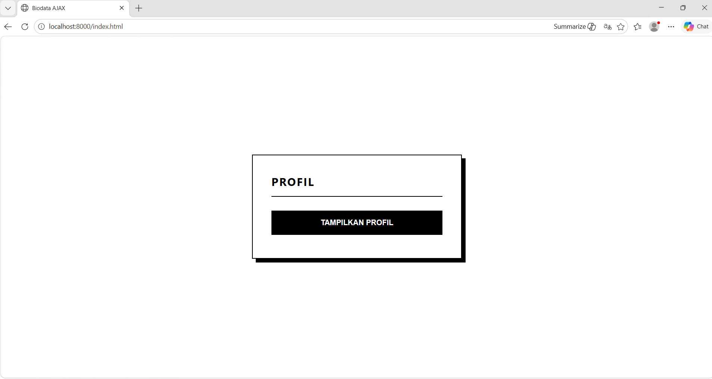
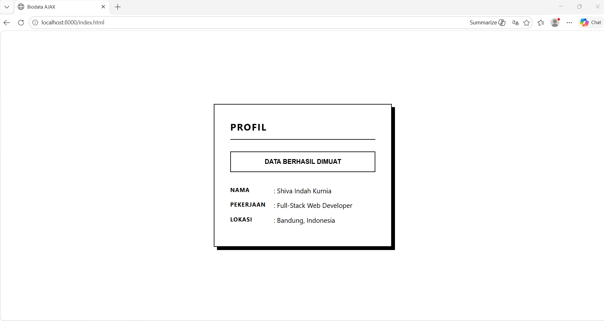

<div align="center">
  <br />
  <h1>LAPORAN PRAKTIKUM <br> APLIKASI BERBASIS PLATFORM</h1>
  <br />
  <h3>MODUL 10 <br> AJAX</h3>
  <br />
  
  <br />
  <br />
  <br />
  <h3>Disusun Oleh :</h3>
  <p>
    <strong>Shiva Indah Kurnia</strong><br>
    <strong>2311102035</strong><br>
    <strong>S1 IF-11-01</strong>
  </p>
  <br />
  <h3>Dosen Pengampu :</h3>
  <p>
    <strong>Dimas Fanny Hebrasianto Permadi, S.ST., M.Kom</strong>
  </p>
  <br />
  <br />
  <h4>Asisten Praktikum :</h4>
  <strong>Apri Pandu Wicaksono</strong> <br>
  <strong>Rangga Pradarrell Fathi</strong>
  <br />
  <br />
  <br />
  <br />
  <h3>LABORATORIUM HIGH PERFORMANCE <br> FAKULTAS INFORMATIKA <br> UNIVERSITAS TELKOM PURWOKERTO <br> 2026</h3>
</div>

---

## 1. Dasar Teori

**AJAX** (Asynchronous JavaScript and XML) merupakan teknik kontemporer yang memungkinkan halaman web berbagi data dengan server secara asinkron, dengan keunggulan utama berupa kemampuan memperbarui konten tertentu tanpa perlu memuat ulang seluruh halaman sehingga interaksi menjadi lebih cepat dan responsif. Secara teknis, AJAX menggunakan JavaScript untuk berkomunikasi dengan server di balik layar, di mana format JSON (JavaScript Object Notation) kini lebih populer dibandingkan XML karena sifatnya yang lebih ringan dan mudah diolah. Perkembangan teknik ini dapat dilakukan melalui metode konvensional XMLHttpRequest, penggunaan library tambahan seperti jQuery AJAX, atau standar modern Fetch API yang lebih sederhana dan efektif sebagaimana yang diterapkan dalam praktikum ini. Dalam sinergi antara PHP dan JavaScript, PHP bertugas menyediakan data dalam bentuk array asosiatif yang kemudian diubah menjadi format JSON melalui fungsi json_encode, dengan dukungan header application/json agar browser dapat mengenali format data dengan benar. Prosedur di sisi pengguna dimulai saat tindakan seperti klik tombol memicu fungsi fetch(), kemudian data diambil dari file PHP dan diubah menjadi objek JavaScript melalui metode .json(), hingga akhirnya konten ditampilkan ke elemen HTML secara dinamis. Implementasi AJAX dalam praktik ini berhasil menciptakan halaman web sederhana yang mampu menampilkan data profil seperti nama, pekerjaan, dan lokasi dari server secara real-time, menjadikannya komponen vital dalam pengembangan aplikasi web modern seperti dashboard dan sistem berbasis API.

---

## 2. Penjelasan Kode PHP, HTML, dan AJAX

### Kode Program (`data.php`)

```php
<?php
// Memberitahu browser bahwa data yang dikirim adalah format JSON
header('Content-Type: application/json');

// Membuat array asosiatif untuk data profil
$data = [
    'nama' => 'Shiva Indah Kurnia',
    'pekerjaan' => 'Full-Stack Web Developer',
    'lokasi' => 'Bandung, Indonesia'
];

// Mengubah format array PHP menjadi format JSON lalu menampilkannya
echo json_encode($data);
?>
```

### Kode Program (`index.html`)

```html
<!DOCTYPE html>
<html lang="id">
<head>
    <meta charset="UTF-8">
    <meta name="viewport" content="width=device-width, initial-scale=1.0">
    <title>Biodata AJAX</title>
    <style>
        /* Desain Monokrom Minimalis (Hitam Putih) */
        * {
            box-sizing: border-box;
            margin: 0;
            padding: 0;
        }

        body {
            /* Font standar yang bersih tanpa perlu link eksternal */
            font-family: -apple-system, BlinkMacSystemFont, "Segoe UI", Roboto, Helvetica, Arial, sans-serif;
            background-color: #ffffff; /* Latar belakang putih mutlak */
            color: #000000; /* Teks hitam mutlak */
            display: flex;
            justify-content: center;
            align-items: center;
            min-height: 100vh;
            padding: 20px;
        }

        /* Kotak Biodata */
        .card {
            width: 100%;
            max-width: 450px;
            border: 2px solid #000000; /* Garis tepi tegas */
            padding: 40px;
            background-color: #ffffff;
            box-shadow: 8px 8px 0px #000000; /* Bayangan solid ala desain Brutalism */
        }

        .header {
            margin-bottom: 30px;
            border-bottom: 2px solid #000000;
            padding-bottom: 15px;
        }

        h1 {
            font-size: 1.5rem;
            text-transform: uppercase;
            letter-spacing: 2px;
        }

        /* Tombol */
        button {
            width: 100%;
            background-color: #000000;
            color: #ffffff;
            border: 2px solid #000000;
            padding: 15px;
            font-size: 1rem;
            font-weight: bold;
            text-transform: uppercase;
            cursor: pointer;
            transition: all 0.2s ease-in-out;
            margin-bottom: 10px;
        }

        button:hover {
            background-color: #ffffff;
            color: #000000;
        }

        /* Wadah Hasil */
        #hasil-profil {
            display: none; /* Disembunyikan sampai tombol diklik */
            margin-top: 25px;
        }

        /* Format list biodata */
        .baris-data {
            display: flex;
            margin-bottom: 15px;
            font-size: 1.05rem;
        }

        .label {
            width: 110px;
            font-weight: bold;
            text-transform: uppercase;
            font-size: 0.9rem;
            letter-spacing: 1px;
        }

        .nilai {
            flex: 1;
        }

        /* Teks format sebaris (Sesuai instruksi soal) */
        .format-raw {
            margin-top: 30px;
            padding-top: 15px;
            border-top: 1px dashed #000000;
            font-family: monospace;
            font-size: 0.85rem;
            color: #444;
        }
    </style>
</head>
<body>

    <div class="card">
        <div class="header">
            <h1>Profil</h1>
        </div>

        <button id="btn-tampil">Tampilkan Profil</button>
        
        <div id="hasil-profil"></div>
    </div>

    <script>
        const btnTampil = document.getElementById('btn-tampil');
        const wadahHasil = document.getElementById('hasil-profil');

        btnTampil.addEventListener('click', function() {
            btnTampil.innerText = 'MEMUAT DATA...';

            fetch('data.php')
                .then(response => response.json())
                .then(data => {
                    // Tombol diubah teksnya agar tahu sukses
                    btnTampil.innerText = 'DATA BERHASIL DIMUAT';
                    btnTampil.style.backgroundColor = '#ffffff';
                    btnTampil.style.color = '#000000';
                    btnTampil.disabled = true; // Matikan tombol setelah berhasil

                    // Memasukkan data dengan tampilan list biodata yang rapi
                    wadahHasil.innerHTML = `
                        <div class="baris-data">
                            <div class="label">Nama</div>
                            <div class="nilai">: ${data.nama}</div>
                        </div>
                        <div class="baris-data">
                            <div class="label">Pekerjaan</div>
                            <div class="nilai">: ${data.pekerjaan}</div>
                        </div>
                        <div class="baris-data">
                            <div class="label">Lokasi</div>
                            <div class="nilai">: ${data.lokasi}</div>
                        </div>
                        `;

                    // Tampilkan wadah hasil
                    wadahHasil.style.display = 'block';
                })
                .catch(error => {
                    console.error('Error:', error);
                    btnTampil.innerText = 'GAGAL MEMUAT';
                });
        });
    </script>
</body>
</html>
```

---

### Penjelasan Kode

---

### 1. PHP (`data.php`)

Pada sisi server, digunakan file data.php yang berfungsi sebagai penyedia data atau API sederhana. Di sini, data profil disimpan dalam bentuk Array Asosiatif yang kemudian dikonversi menjadi format JSON menggunakan fungsi json_encode(). Penggunaan header Content-Type: application/json sangat penting untuk memastikan bahwa browser menerima dan mengenali data tersebut sebagai objek JSON, bukan sekadar teks biasa, sehingga data dapat diproses lebih lanjut oleh JavaScript.

---

### 2. HTML (`index.html`)

Struktur halaman web dibangun menggunakan HTML dengan pendekatan minimalis. Komponen utamanya terdiri dari sebuah container berupa card yang berfungsi sebagai pembungkus biodata, sebuah tombol (button) sebagai pemicu event, serta elemen div kosong dengan ID hasil-profil. Elemen kosong inilah yang nantinya akan diisi secara dinamis oleh data yang diambil dari server. Penggunaan ID yang spesifik memudahkan manipulasi DOM (Document Object Model) saat proses integrasi data berlangsung.

---

### 3. JavaScript (AJAX)

Logika AJAX diimplementasikan menggunakan Fetch API untuk menangani pertukaran data secara asinkron. Ketika tombol diklik, JavaScript akan mengirimkan permintaan (request) ke data.php tanpa memicu pemuatan ulang halaman (reload). Setelah data JSON diterima, JavaScript akan melakukan parsing dan menyusun ulang data tersebut ke dalam struktur HTML baru, lalu menampilkannya ke dalam DOM. Teknik ini membuat pengalaman pengguna menjadi lebih lancar karena transisi data terjadi secara instan di belakang layar.


### 4. CSS

Sisi visual atau CSS menggunakan konsep monokrom dengan skema warna hitam-putih untuk menciptakan kesan profesional dan bersih. Desain ini menerapkan gaya brutalism minimalis yang terlihat dari penggunaan garis tepi (border) yang tegas dan bayangan solid (box-shadow). Pengaturan layout menggunakan Flexbox memastikan posisi kartu biodata selalu berada di tengah layar, sementara properti transition memberikan efek visual yang halus pada tombol saat berinteraksi dengan pengguna.

---

### Hasil Tampilan (Screenshot)




---

---

## 3. Kesimpulan

Implementasi teknologi AJAX dalam praktikum ini menunjukkan bahwa pemisahan antara logika server (PHP) dan antarmuka pengguna (HTML/CSS) dapat menghasilkan aplikasi web yang lebih responsif dan efisien. Dengan memanfaatkan Fetch API, proses pengambilan data dari server dapat dilakukan secara asinkron, yang berarti pengguna tidak perlu menunggu halaman dimuat ulang untuk melihat pembaruan informasi. Secara teknis, kombinasi dari keempat elemen ini (PHP, HTML, JS, dan CSS) merupakan fondasi utama dalam membangun arsitektur aplikasi web modern yang mengutamakan kecepatan dan kenyamanan interaksi pengguna.

---

## 4. Referensi

- Modul Praktikum Aplikasi Berbasis Platform – Modul 10 AJAX  
- W3Schools AJAX Tutorial : https://www.w3schools.com/xml/ajax_intro.asp  
- W3Schools Fetch API : https://www.w3schools.com/js/js_api_fetch.asp
- Bootstrap 5 Official Docs: https://getbootstrap.com/docs/5.3/getting-started/introduction/
- JavaScript.info - Fetch: https://javascript.info/fetch
