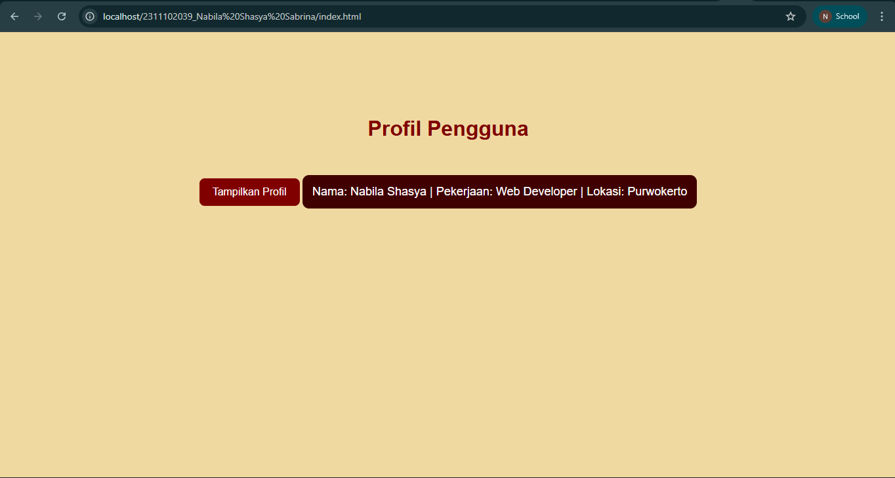

<div align="center">
  <br />
  <h1>LAPORAN PRAKTIKUM <br>APLIKASI BERBASIS PLATFORM</h1>
  <br />
  <h3>MODUL 2 <br> HTML</h3>
  <br />
  <br />
   
  <br />
  <br />
  <br />
  <h3>Disusun Oleh :</h3>
  <p>
    <strong>Nabila Shasya Sabrina</strong><br>
    <strong>2311102039</strong><br>
    <strong>S1 IF-11-01</strong>
  </p>
  <br />
  <h3>Dosen Pengampu :</h3>
  <p>
    <strong>Dimas Fanny Hebrasianto Permadi, S.ST., M.Kom</strong>
  </p>
  <br />
  <br />
    <h4>Asisten Praktikum :</h4>
    <strong> Apri Pandu Wicaksono </strong> <br>
    <strong>Rangga Pradarrell Fathi</strong>
  <br />
  <h3>LABORATORIUM HIGH PERFORMANCE
 <br>FAKULTAS INFORMATIKA <br>UNIVERSITAS TELKOM PURWOKERTO <br>2026</h3>
</div>

---

## 1. Dasar Teori

**AJAX (Asynchronous JavaScript and XML)** merupakan teknik dalam pengembangan web yang memungkinkan halaman mengambil data dari server secara asynchronous tanpa perlu melakukan reload seluruh halaman. Dengan pendekatan ini, interaksi pengguna menjadi lebih cepat dan responsif, sehingga pengalaman penggunaan terasa lebih dinamis seperti aplikasi desktop. Meskipun istilah AJAX mengandung kata "XML", pada praktik saat ini pertukaran data lebih sering menggunakan format JSON (JavaScript Object Notation) karena lebih ringan, mudah dibaca, dan langsung kompatibel dengan JavaScript.

Pada implementasi di sisi klien seperti pada kode yang digunakan, proses pengambilan data dilakukan menggunakan Fetch API. Fetch merupakan pengganti modern dari XMLHttpRequest yang menyediakan cara lebih sederhana dan terstruktur dalam melakukan request HTTP. Dengan dukungan konsep Promises, fetch memungkinkan pengolahan data asynchronous menjadi lebih mudah dipahami melalui penggunaan .then(), sehingga kode menjadi lebih rapi, mudah dikembangkan, dan lebih mudah dirawat.

---

## 2. Source Code

**1. data.php**

```php
<?php
header('Content-Type: application/json');

// Data sederhana (sebagai database)
$data = [
    'nama' => 'Nabila Shasya',
    'pekerjaan' => 'Web Developer',
    'lokasi' => 'Purwokerto'
];

// Ubah ke JSON dan tampilkan
echo json_encode($data);
?>
```

**Penjelasan Kode:**
PHP digunakan sebagai server-side untuk menyediakan data.
Pada kode ini, PHP menyimpan data dalam bentuk array (nama, pekerjaan, lokasi), lalu mengubahnya menjadi format JSON menggunakan `json_encode()`.
`Header Content-Type: application/json` ditambahkan agar browser memahami bahwa data yang dikirim berupa JSON.

**2. index.html**

```html
<!DOCTYPE html>
<html lang="id">
<head>
    <meta charset="UTF-8">
    <title>Profil Sederhana</title>

    <style>
        body {
            font-family: Arial, sans-serif;
            background-color: #F0D8A1;
            color: white;
            text-align: center;
            padding-top: 100px;
        }

        h1 {
            color: #800000;
        }

        button {
            background-color: #800000;
            color: white;
            border: none;
            padding: 12px 20px;
            font-size: 16px;
            cursor: pointer;
            border-radius: 8px;
        }

        button:hover {
            background-color: #a00000;
        }

        #hasil-profil {
            margin-top: 30px;
            font-size: 18px;
            background-color: #400000;
            padding: 15px;
            border-radius: 10px;
            display: inline-block;
        }
    </style>
</head>
<body>

    <h1>Profil Pengguna</h1>

    <button onclick="ambilData()">Tampilkan Profil</button>

    <div id="hasil-profil"></div>

    <script>
        function ambilData() {
            fetch('data.php')
                .then(response => response.json())
                .then(data => {
                    document.getElementById('hasil-profil').innerHTML =
                        `Nama: ${data.nama} | Pekerjaan: ${data.pekerjaan} | Lokasi: ${data.lokasi}`;
                })
                .catch(error => {
                    console.error('Error:', error);
                });
        }
    </script>

</body>
</html>
```

**Penjelasan Kode:**
HTML berfungsi untuk struktur tampilan halaman.
Terdapat tombol “Tampilkan Profil” yang digunakan untuk memicu pengambilan data, serta `<div id="hasil-profil">` sebagai tempat menampilkan hasil data dari server.
CSS digunakan untuk mengatur tampilan (styling) halaman.
Pada kode ini digunakan tema merah maroon untuk background, tombol, dan area hasil.
JavaScript digunakan untuk mengambil data dari server tanpa reload halaman.
Fungsi `fetch()` mengambil data dari `data.php`, lalu mengubahnya ke format JSON dengan `.json()`.
Data tersebut kemudian ditampilkan ke dalam `<div>` menggunakan `innerHTML`.

---

## 3. Hasil Tampilan

