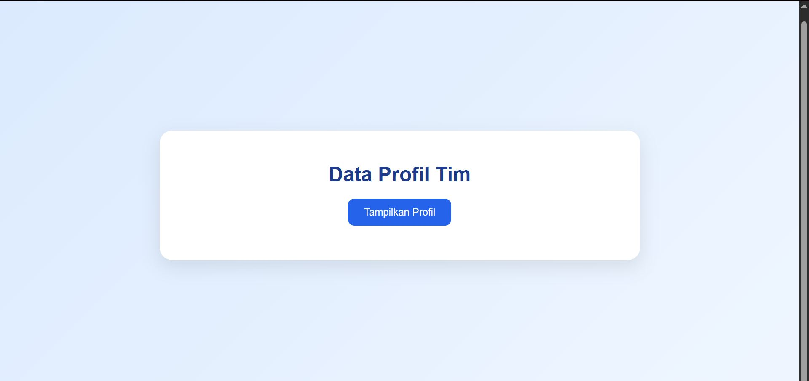
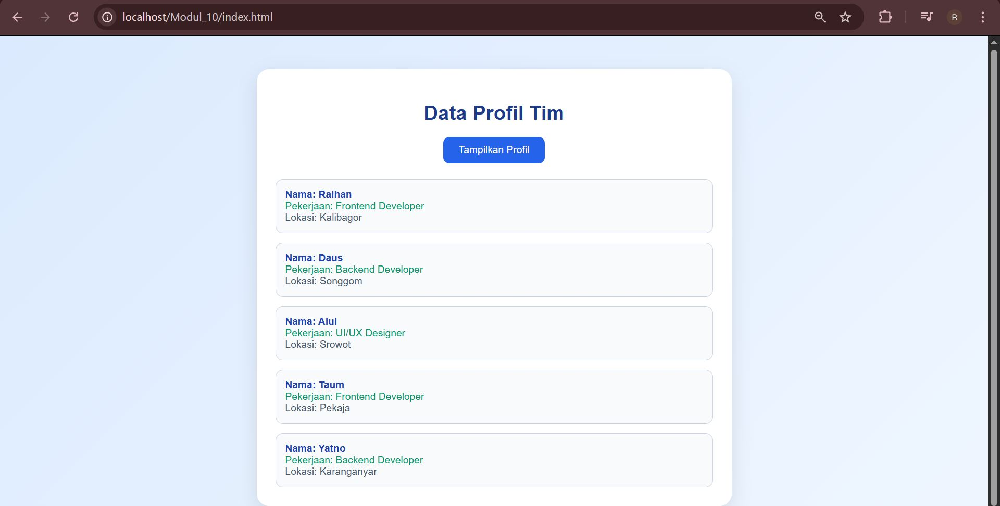

<div align="center">

# LAPORAN PRAKTIKUM  
# APLIKASI BERBASIS PLATFORM

## MODUL 10
## AJAX


### Disusun Oleh
**Raihan Ramadhan**  
2311102040  
S1 IF-11-REG01  

### Dosen Pengampu
**Dimas Fanny Hebrasianto Permadi, S.ST., M.Kom**

### Asisten Praktikum
Apri Pandu Wicaksono  
Rangga Pradarrell Fathi  

### LABORATORIUM HIGH PERFORMANCE  
FAKULTAS INFORMATIKA  
UNIVERSITAS TELKOM PURWOKERTO  
2026

</div>

---

# 1. Dasar Teori
AJAX (Asynchronous JavaScript and XML) adalah teknik dalam pemrograman web yang digunakan untuk mengambil data dari server tanpa harus me-refresh halaman. Dengan AJAX, halaman web menjadi lebih interaktif karena hanya bagian tertentu saja yang diperbarui.

Pada implementasi modern, AJAX biasanya menggunakan Fetch API di JavaScript. Fungsi fetch() digunakan untuk mengambil data dari server, kemudian data tersebut diubah ke format JSON agar mudah digunakan di dalam program.

JSON (JavaScript Object Notation) adalah format pertukaran data yang ringan dan mudah dibaca. JSON sering digunakan dalam komunikasi antara client dan server karena strukturnya sederhana.

Di sisi server, PHP digunakan untuk menyediakan data. Data disimpan dalam bentuk array lalu diubah menjadi JSON menggunakan fungsi json_encode(). Selain itu, digunakan header Content-Type: application/json agar browser mengetahui bahwa data yang dikirim berupa JSON.

Dengan kombinasi AJAX, JSON, dan PHP, data dapat ditampilkan ke halaman web secara dinamis tanpa reload.
---

# 2. Implementasi Persyaratan Tugas (Kebutuhan Sistem)

Program ini dibuat untuk memenuhi tugas Modul 10 dengan mengimplementasikan konsep **AJAX (Asynchronous JavaScript and XML)** menggunakan **Fetch API**. Sistem ini dapat mengambil data dari server dan menampilkannya ke halaman web tanpa melakukan reload.

## 2.1 Membuat File Server (Database Sederhana) dengan PHP

Pada bagian server, digunakan file `data.php` sebagai database sederhana. Data disimpan dalam bentuk array PHP yang berisi beberapa profil dengan atribut **nama, pekerjaan, dan lokasi**.

Data tersebut kemudian diubah menjadi format **JSON** menggunakan fungsi `json_encode()` agar dapat dibaca oleh client. Selain itu, ditambahkan header agar response dikenali sebagai JSON.

```php
<?php
header('Content-Type: application/json');

$data = [
    [
        'nama' => 'Raihan',
        'pekerjaan' => 'Frontend Developer',
        'lokasi' => 'Kalibagor'
    ],
    [
        'nama' => 'Daus',
        'pekerjaan' => 'Backend Developer',
        'lokasi' => 'Songgom'
    ],
    [
        'nama' => 'Alul',
        'pekerjaan' => 'UI/UX Designer',
        'lokasi' => 'Srowot'
    ],
    [
        'nama' => 'Taum',
        'pekerjaan' => 'Frontend Developer',
        'lokasi' => 'Pekaja'
    ],
    [
        'nama' => 'Yatno',
        'pekerjaan' => 'Backend Developer',
        'lokasi' => 'Karanganyar'
    ]
];

echo json_encode($data);
?>
```
## 2.2 Membuat Halaman Client (index.html)

Pada sisi client dibuat halaman HTML yang berfungsi untuk menampilkan data. Halaman ini memiliki tombol untuk mengambil data serta area untuk menampilkan hasil.

```html
<button id="btnProfil">Tampilkan Profil</button>
<div id="hasil-profil"></div>

Elemen tombol digunakan untuk memicu proses pengambilan data, sedangkan <div> digunakan untuk menampilkan hasil dari server.
```
## 2.3 Mengambil Data Menggunakan AJAX (Fetch API)

Pengambilan data dilakukan menggunakan **Fetch API** pada JavaScript. Proses ini berjalan secara asynchronous sehingga tidak memerlukan reload halaman.

### Langkah-langkah:
1. User menekan tombol  
2. JavaScript memanggil `fetch('data.php')`  
3. Data diubah menjadi JSON  
4. Data ditampilkan ke halaman  

### Potongan kode JavaScript:

```javascript
const btn = document.getElementById('btnProfil');
const hasil = document.getElementById('hasil-profil');

btn.addEventListener('click', function () {
    hasil.innerHTML = '<div class="loading">Loading data...</div>';

    fetch('data.php')
        .then(res => res.json())
        .then(data => {
            let output = '';

            data.forEach(item => {
                output += `
                    <div class="card">
                        <div class="nama">Nama: ${item.nama}</div>
                        <div class="job">Pekerjaan: ${item.pekerjaan}</div>
                        <div class="lokasi">Lokasi: ${item.lokasi}</div>
                    </div>
                `;
            });

            hasil.innerHTML = output;
        })
        .catch(err => {
            hasil.innerHTML = '<div class="error">Gagal mengambil data!</div>';
        });
});
```
## 2.4 Hasil Implementasi

Ketika tombol **"Tampilkan Profil"** diklik, sistem akan mengambil data dari `data.php` dan menampilkannya ke halaman tanpa reload.

### Contoh output:

```text
Nama: Raihan | Pekerjaan: Frontend Developer | Lokasi: Kalibagor
Nama: Daus | Pekerjaan: Backend Developer | Lokasi: Songgom
Nama: Alul | Pekerjaan: UI/UX Designer | Lokasi: Srowot
Nama: Taum | Pekerjaan: Frontend Developer | Lokasi: Pekaja
Nama: Yatno | Pekerjaan: Backend Developer | Lokasi: Karanganyar
```
# 3. Hasil Tampilan (Screenshots) Aplikasi AJAX



# 4. Daftar Pustaka

1. MDN Web Docs. *Fetch API*.  
   https://developer.mozilla.org/en-US/docs/Web/API/Fetch_API

2. MDN Web Docs. *Using Fetch*.  
   https://developer.mozilla.org/en-US/docs/Web/API/Fetch_API/Using_Fetch

3. MDN Web Docs. *JSON*.  
   https://developer.mozilla.org/en-US/docs/Learn_web_development/Core/Scripting/JSON

4. PHP Manual. *json_encode()*.  
   https://www.php.net/manual/en/function.json-encode.php

5. PHP Manual. *header()*.  
   https://www.php.net/manual/en/function.header.php