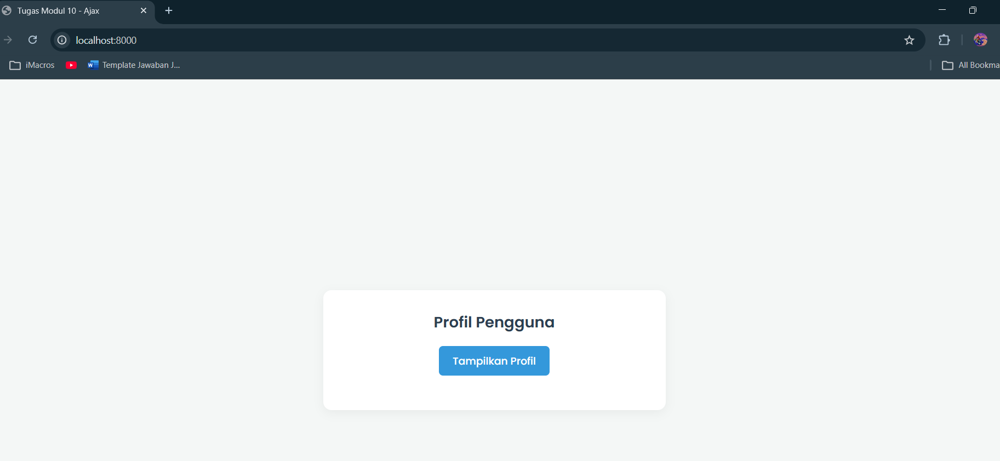
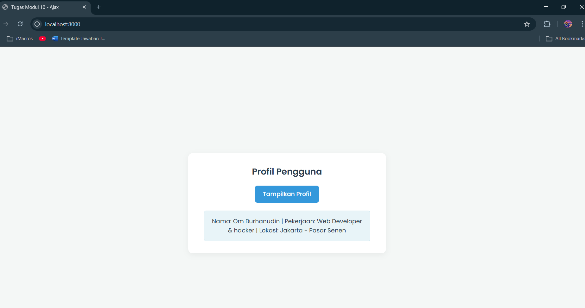

<div align="center">
  <br />

  <h1>LAPORAN PRAKTIKUM <br>
  APLIKASI BERBASIS PLATFORM
  </h1>

  <br />

  <h3>MODUL 10 <br>
  AJAX
  </h3>

  <br />

  <p align="center">

</p>

  <br />
  <br />
  <br />

  <h3>Disusun Oleh :</h3>

  <p>
    <strong>Abda Firas Rahman</strong><br>
    <strong>2311102049</strong><br>
    <strong>S1 IF-11-REG01</strong>
  </p>

  <br />

  <h3>Dosen Pengampu :</h3>

  <p>
    <strong>Dimas Fanny Hebrasianto Permadi, S.ST., M.Kom</strong>
  </p>
  
  <br />
  <br />
    <h4>Asisten Praktikum :</h4>
    <strong>Apri Pandu Wicaksono </strong> <br>
    <strong>Rangga Pradarrell Fathi</strong>
  <br />

  <h3>LABORATORIUM HIGH PERFORMANCE
 <br>FAKULTAS INFORMATIKA <br>UNIVERSITAS TELKOM PURWOKERTO <br>2026</h3>
</div>

<hr>

### Dasar Teori
1. AJAX (Asynchronous JavaScript and XML)
AJAX bukanlah sebuah bahasa pemrograman baru melainkan sebuah konsep atau teknik pengembangan web yang menggabungkan beberapa teknologi (seperti HTML, CSS, JavaScript, dan manipulasi DOM) untuk membuat aplikasi web bekerja secara asynchronous (berjalan di latar belakang). Dengan AJAX halaman web dapat mengirimkan permintaan (request) dan mengambil data dari server tanpa harus memuat ulang (reload) seluruh halaman secara penuh. Hal ini membuat aplikasi web terasa lebih cepat, dinamis, dan interaktif. Walaupun kepanjangannya memuat kata XML pada pengembangan web modern saat ini AJAX lebih sering menggunakan format JSON untuk pertukaran datanya.

2. JSON (JavaScript Object Notation)
JSON adalah format pertukaran data teks yang sangat ringan, mudah dibaca oleh manusia dan mudah diuraikan (parsing) oleh mesin. JSON telah menjadi standar de facto untuk mengirimkan data antara client dan server dalam arsitektur REST API. Strukturnya didasarkan pada sintaks objek bawaan JavaScript di mana data selalu disimpan dalam bentuk pasangan kunci dan nilai (key-value pairs).

3. Fetch API
Fetch API adalah fitur bawaan pada JavaScript modern yang menyediakan interface untuk melakukan proses pengambilan sumber daya melalui jaringan internet. Fetch API hadir sebagai pengganti modern untuk objek XMLHttpRequest (XHR) yang dulu sering digunakan untuk AJAX. Keunggulan utama dari Fetch adalah pendekatannya yang menggunakan Promise sehingga penulisan kode asynchronous menjadi jauh lebih bersih, terstruktur, dan mudah dikelola (terutama saat menggunakan method .then() dan .catch()).

5. Menjalankan menggunakan php -S localhost:8000. 
Untuk menjalankan dan menguji proyek ini secara lokal digunakan perintah php -S localhost:8000 melalui terminal atau command prompt. Perintah ini berfungsi untuk mengaktifkan web server pengembangan bawaan (built-in web server) yang secara otomatis sudah disediakan oleh instalasi PHP. Pendekatan ini sangat praktis karena meniadakan kebutuhan untuk menjalankan aplikasi server pihak ketiga yang lebih berat seperti XAMPP atau Laragon. Parameter -S dengan huruf kapital secara spesifik menginstruksikan PHP untuk memulai fungsi server tersebut, sementara localhost:8000 menetapkan bahwa server akan berjalan di komputer lokal dan mendengarkan permintaan melalui port 8000. Saat perintah ini dieksekusi, direktori tempat terminal beroperasi akan langsung diubah menjadi document root atau folder utama aplikasi.

## Kode program 
Berikut adalah kode program:

### index.html
```html
<!DOCTYPE html>
<html lang="id">
<head>
    <meta charset="UTF-8">
    <meta name="viewport" content="width=device-width, initial-scale=1.0">
    <title>Tugas Modul 10 - Ajax</title>
    
    <link href="https://fonts.googleapis.com/css2?family=Poppins:wght@400;500;600&display=swap" rel="stylesheet">
    
    <style>
        * {
            box-sizing: border-box;
        }
        body {
            font-family: 'Poppins', sans-serif;
            background-color: #f4f7f6;
            color: #333;
            display: flex;
            justify-content: center;
            align-items: center;
            height: 100vh;
            margin: 0;
        }
        .container {
            background-color: #fff;
            padding: 30px 40px;
            border-radius: 12px;
            box-shadow: 0 4px 15px rgba(0, 0, 0, 0.05);
            text-align: center;
            max-width: 500px;
            width: 100%;
        }
        h2 {
            margin-top: 0;
            font-size: 22px;
            color: #2c3e50;
        }
        button {
            background-color: #3498db;
            color: white;
            border: none;
            padding: 10px 20px;
            font-size: 15px;
            font-family: 'Poppins', sans-serif;
            font-weight: 500;
            border-radius: 6px;
            cursor: pointer;
            transition: background-color 0.2s ease;
            margin-bottom: 20px;
        }
        button:hover {
            background-color: #2980b9;
        }
        #hasil-profil {
            padding: 15px;
            background-color: #e8f4f8;
            border: 1px solid #d1e8f0;
            border-radius: 6px;
            font-size: 15px;
            color: #2c3e50;
            display: none; 
        }
        /* Class tambahan untuk efek munculin box */
        .tampil {
            display: block !important;
        }
    </style>
</head>
<body>

    <div class="container">
        <h2>Profil Pengguna</h2>
        <button id="btn-tampil">Tampilkan Profil</button>
        
        <div id="hasil-profil"></div>
    </div>

    <script>
        // Menangkap elemen tombol dan div hasil
        const btnTampil = document.getElementById('btn-tampil');
        const hasilProfil = document.getElementById('hasil-profil');
                                // Abad Firas Rahman - 2311102049 - IF-REG-01
        // Menambahkan event listener klik pada tombol
        btnTampil.addEventListener('click', function() {
            // Ubah teks tombol biar ada indikator loading nya
            btnTampil.innerText = "Memuat...";

            // Fetch API untuk ambil data dari file data.php
            fetch('data.php')
                .then(response => {
                    if (!response.ok) {
                        throw new Error('Network response was not ok');
                    }
                    return response.json();
                })
                .then(data => {
                    hasilProfil.innerHTML = `Nama: ${data.nama} | Pekerjaan: ${data.pekerjaan} | Lokasi: ${data.lokasi}`;
                    hasilProfil.classList.add('tampil');
                    
                    // Kembalikan teks tombol
                    btnTampil.innerText = "Tampilkan Profil";
                })
                .catch(error => {
                    console.error('Ada masalah dengan fetch:', error);
                    hasilProfil.innerHTML = "Gagal mengambil data nya.";
                    hasilProfil.classList.add('tampil');
                    btnTampil.innerText = "Tampilkan Profil";
                });
        });
    </script>

</body>
</html>
```
berperan sebagai frontend yang menangani tampilan antarmuka sekaligus logika interaksi program. Pada bagian struktur dokumen telah disisipkan CSS internal untuk membentuk tata letak antarmuka menyerupai card agar terlihat rapi. Komponen utama yang disiapkan meliputi sebuah tombol pemicu aksi dan sebuah area penampung kosong dengan penanda atribut id berupa hasil-profil yang kondisinya disembunyikan pada saat halaman pertama kali dimuat. Logika utama aplikasi diletakkan pada bagian script JavaScript. Saat tombol tersebut ditekan oleh pengguna instruksi JavaScript akan mengeksekusi Fetch API untuk melakukan permintaan (request) data ke URL data.php secara asynchronous. Begitu respons JSON berhasil diterima oleh sistem data tersebut diekstrak dan disuntikkan secara langsung ke dalam area penampung yang kosong tadi melalui teknik manipulasi DOM.

### data.php 
```php
<?php
// Set header 
header('Content-Type: application/json');

// Membuat array sederhana
$data = [
    'nama' => 'Om Burhanudin',
    'pekerjaan' => 'Web Developer & hacker',
    'lokasi' => 'Jakarta - Pasar Senen'
];
// Abda Firas Rahman - 2311102049 - IF-REG-01
// Mengubah array menjadi format JSON
echo json_encode($data);
?>
```
File data.php bertugas sebagai backend atau server tiruan yang berfokus pada penyediaan data. Pada baris awal perintah header('Content-Type: application/json') ditambahkan agar browser langsung mengenali bahwa data yang dikirimkan merupakan murni format JSON bukan teks biasa ataupun dokumen HTML. Selanjutnya sebuah array associative PHP dideklarasikan untuk menyimpan informasi spesifik seperti nama, pekerjaan, dan lokasi. Mengingat JavaScript pada sisi client tidak dapat langsung membaca struktur array bawaan PHP data tersebut harus dikonversi terlebih dahulu. Oleh karena itu fungsi json_encode() digunakan pada baris terakhir untuk mengubah bentuk array menjadi string berformat JSON yang kemudian dicetak menggunakan perintah echo agar siap diakses oleh sistem frontend.

### Tampilan Hasil Kode Program:



