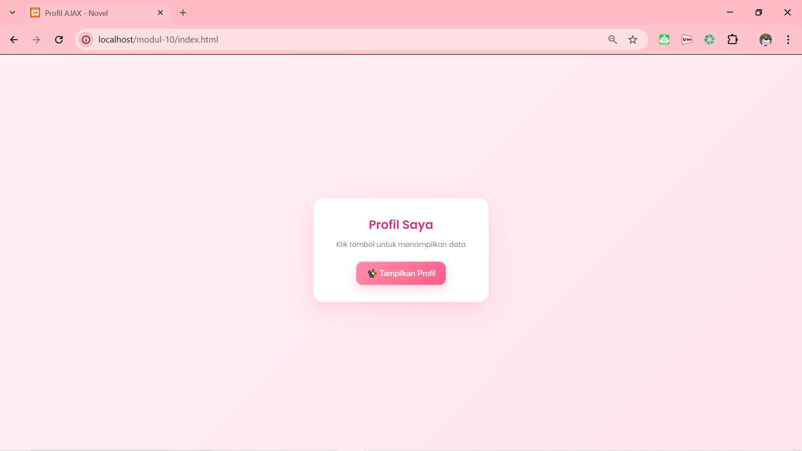
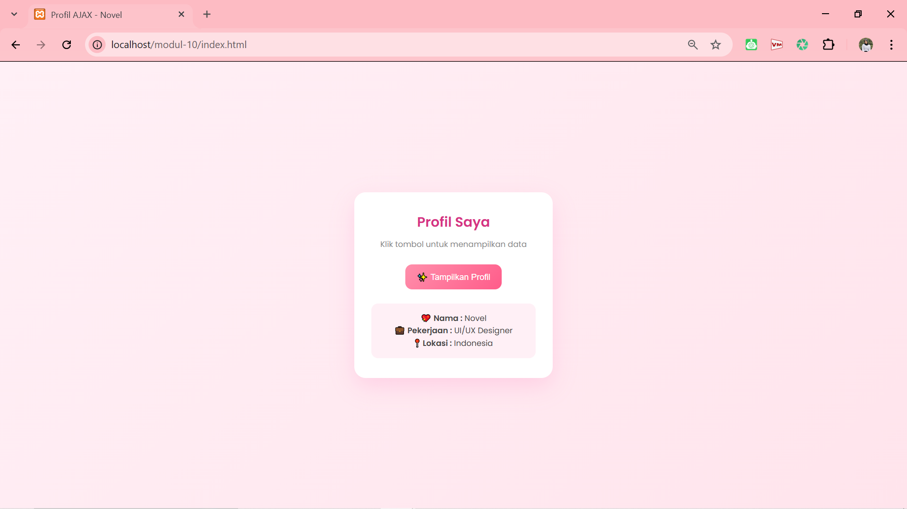

<div align="center">
  <br />
  <h1>LAPORAN PRAKTIKUM <br> APLIKASI BERBASIS PLATFORM</h1>
  <br />
  <h3>MODUL 10 <br> AJAX</h3>
  <br />
  
  <br />
  <br />
  <br />
  <h3>Disusun Oleh :</h3>
  <p>
    <strong>Nia Novela Ariandini</strong><br>
    <strong>2311102057</strong><br>
    <strong>S1 IF-11-01</strong>
  </p>
  <br />
  <h3>Dosen Pengampu :</h3>
  <p>
    <strong>Dimas Fanny Hebrasianto Permadi, S.ST., M.Kom</strong>
  </p>
  <br />
  <br />
  <h4>Asisten Praktikum :</h4>
  <strong>Apri Pandu Wicaksono</strong> <br>
  <strong>Rangga Pradarrell Fathi</strong>
  <br />
  <br />
  <br />
  <br />
  <h3>LABORATORIUM HIGH PERFORMANCE <br> FAKULTAS INFORMATIKA <br> UNIVERSITAS TELKOM PURWOKERTO <br> 2026</h3>
</div>

---

## 1. Dasar Teori

AJAX (Asynchronous JavaScript and XML) merupakan teknik dalam pengembangan web yang memungkinkan sebuah halaman untuk mengambil atau mengirim data ke server tanpa perlu melakukan reload halaman secara keseluruhan. Dengan adanya AJAX, interaksi pada website menjadi lebih cepat, responsif, dan nyaman digunakan karena hanya bagian tertentu saja yang diperbarui.

Pada dasarnya, AJAX bekerja dengan memanfaatkan JavaScript untuk melakukan komunikasi dengan server di belakang layar. Data yang dikirim atau diterima dari server biasanya menggunakan format **JSON (JavaScript Object Notation)** karena lebih ringan, mudah dibaca, dan mudah diolah di dalam JavaScript dibandingkan format XML yang digunakan pada awal perkembangan AJAX.

Dalam implementasinya, AJAX dapat dilakukan dengan beberapa cara, seperti menggunakan **XMLHttpRequest**, library seperti **jQuery AJAX**, atau yang paling modern yaitu menggunakan fungsi **fetch()** pada JavaScript. Pada praktikum ini digunakan `fetch()` karena lebih sederhana dan mudah dipahami, serta sudah menjadi standar dalam pengembangan web modern.

Pada sisi server, digunakan bahasa pemrograman **PHP** untuk menyediakan data yang akan diambil oleh client. Data disimpan dalam bentuk **array asosiatif**, kemudian dikonversi menjadi format JSON menggunakan fungsi `json_encode()`. Selain itu, ditambahkan header `Content-Type: application/json` agar browser mengetahui bahwa data yang dikirimkan berupa JSON.

Pada sisi client, ketika tombol ditekan, JavaScript akan menjalankan fungsi `fetch()` untuk mengambil data dari file PHP. Setelah data berhasil diterima, data tersebut akan diubah menjadi objek JavaScript menggunakan `.json()`, kemudian ditampilkan ke dalam elemen HTML secara dinamis tanpa perlu me-refresh halaman.

Dengan menggunakan AJAX, proses pengambilan data menjadi lebih efisien karena hanya data yang dibutuhkan saja yang diambil dari server, bukan seluruh halaman. Hal ini membuat performa website menjadi lebih baik dan memberikan pengalaman pengguna yang lebih interaktif.

Pada praktikum ini, AJAX digunakan untuk membuat halaman web sederhana yang dapat menampilkan data profil (nama, pekerjaan, dan lokasi) dari server ke halaman web tanpa reload. Implementasi ini menjadi dasar penting dalam pengembangan aplikasi web modern seperti dashboard, aplikasi real-time, dan sistem berbasis API.

---

## 2. Penjelasan Kode PHP, HTML, dan AJAX

### Kode Program (`data.php`)

```php
<?php
header('Content-Type: application/json');

$data = [
    'nama' => 'Novel',
    'pekerjaan' => 'UI/UX Designer',
    'lokasi' => 'Indonesia'
];

echo json_encode($data);
?>
```

### Kode Program (`index.html`)

```html
<!DOCTYPE html>
<html lang="id">
<head>
    <meta charset="UTF-8">
    <meta name="viewport" content="width=device-width, initial-scale=1.0">
    <title>Profil AJAX - Novel</title>

    <link href="https://fonts.googleapis.com/css2?family=Poppins:wght@300;400;500;600&display=swap" rel="stylesheet">

    <style>
        * {
            margin: 0;
            padding: 0;
            box-sizing: border-box;
        }

        body {
            font-family: 'Poppins', sans-serif;
            background: linear-gradient(135deg, #fff0f6, #ffe4ec);
            height: 100vh;
            display: flex;
            justify-content: center;
            align-items: center;
        }

        .card {
            background: white;
            padding: 35px 30px;
            border-radius: 20px;
            width: 350px;
            text-align: center;
            box-shadow: 0 15px 40px rgba(255, 105, 180, 0.2);
            transition: 0.3s;
        }

        .card:hover {
            transform: translateY(-5px);
        }

        h1 {
            color: #d63384;
            margin-bottom: 10px;
            font-size: 24px;
        }

        p.subtitle {
            color: #888;
            font-size: 14px;
            margin-bottom: 25px;
        }

        button {
            background: linear-gradient(135deg, #ff8fab, #ff5c8a);
            border: none;
            padding: 12px 20px;
            color: white;
            border-radius: 12px;
            cursor: pointer;
            font-size: 15px;
            font-weight: 500;
            transition: 0.3s;
        }

        button:hover {
            transform: scale(1.05);
            box-shadow: 0 8px 20px rgba(255, 105, 180, 0.3);
        }

        #hasil-profil {
            margin-top: 25px;
            padding: 15px;
            border-radius: 12px;
            background: #fff0f6;
            color: #444;
            font-size: 14px;
            line-height: 1.6;
            display: none;
        }

        .fade-in {
            animation: fadeIn 0.6s ease forwards;
        }

        @keyframes fadeIn {
            from {
                opacity: 0;
                transform: translateY(10px);
            }
            to {
                opacity: 1;
                transform: translateY(0);
            }
        }
    </style>
</head>
<body>

    <div class="card">
        <h1>Profil Saya</h1>
        <p class="subtitle">Klik tombol untuk menampilkan data</p>

        <button id="btnProfil">✨ Tampilkan Profil</button>

        <div id="hasil-profil"></div>
    </div>

    <script>
        document.getElementById("btnProfil").addEventListener("click", function() {
            fetch("data.php")
                .then(response => response.json())
                .then(data => {
                    const hasil = document.getElementById("hasil-profil");

                    hasil.style.display = "block";
                    hasil.classList.add("fade-in");

                    hasil.innerHTML = `
                        💖 <b>Nama :</b> ${data.nama} <br>
                        💼 <b>Pekerjaan :</b> ${data.pekerjaan} <br>
                        📍 <b>Lokasi :</b> ${data.lokasi}
                    `;
                })
                .catch(error => {
                    document.getElementById("hasil-profil").innerHTML = "Gagal ambil data 😢";
                    console.error(error);
                });
        });
    </script>

</body>
</html>
```

---

### Penjelasan Kode

---

### 1. PHP (`data.php`)

Pada file `data.php`, program digunakan sebagai **server sederhana** yang menyediakan data dalam bentuk JSON.

Baris:
```php
header('Content-Type: application/json');
```
berfungsi untuk memberi tahu browser bahwa data yang dikirimkan berupa format JSON, bukan HTML.

Kemudian terdapat variabel :
```php
$data = [
    'nama' => 'Novel',
    'pekerjaan' => 'UI/UX Designer',
    'lokasi' => 'Indonesia'
];
```
yang merupakan **array asosiatif** untuk menyimpan data profil. Setiap data memiliki key seperti `nama`, `pekerjaan`, dan `lokasi`.

Selanjutnya:

```php
echo json_encode($data);

digunakan untuk mengubah array PHP menjadi format JSON agar bisa dibaca oleh JavaScript di sisi client.
```

Secara keseluruhan, file ini berfungsi sebagai penyedia data (API sederhana).

---

### 2. HTML (`index.html`)

Bagian HTML berfungsi sebagai **struktur tampilan halaman**.

Terdapat tombol:
```html
<button id="btnProfil">✨ Tampilkan Profil</button>
```
yang digunakan untuk memicu pengambilan data dari server.

Kemudian terdapat:

```html
<div id="hasil-profil"></div>
```
yang berfungsi sebagai tempat untuk menampilkan data hasil dari AJAX.

Struktur halaman dibuat dalam bentuk card UI agar tampilan lebih rapi dan modern.

---

### 3. JavaScript (AJAX)

Bagian ini merupakan inti dari AJAX.

Event klik tombol:

```javascript
document.getElementById("btnProfil").addEventListener("click", function()
```

digunakan untuk menjalankan fungsi saat tombol ditekan.

Selanjutnya digunakan:

```javascript
fetch("data.php")
```
untuk mengambil data dari server tanpa reload halaman.

Kemudian:
```javascript
.then(response => response.json())
```
digunakan untuk mengubah response menjadi format JSON.

Setelah itu:
```javascript
.then(data => { ... })
```
digunakan untuk mengolah data yang sudah diterima.

Data ditampilkan ke HTML menggunakan:
```javascript
hasil.innerHTML = `
    Nama : ${data.nama}
`;
```
Selain itu, terdapat:
```javascript
hasil.style.display = "block";
hasil.classList.add("fade-in");
```
yang digunakan untuk menampilkan elemen dan memberikan efek animasi.

Jika terjadi error, maka akan masuk ke:
```javascript
.catch(error => { ... })
```
yang menampilkan pesan gagal mengambil data.

---

### 4. CSS

CSS digunakan untuk mempercantik tampilan agar lebih menarik.

- Background menggunakan **gradient pink soft** agar terlihat aesthetic  
- Card memiliki **shadow dan border-radius** agar terlihat modern  
- Button memiliki efek **hover dan scale**  
- Ditambahkan animasi **fade-in** agar data muncul dengan halus  

Contoh:

```css
.card:hover {
    transform: translateY(-5px);
}
```
memberikan efek naik saat di-hover.

Dan:

```css
@keyframes fadeIn
```
digunakan untuk animasi saat data muncul.

---

### Hasil Tampilan (Screenshot)




---

---

## 3. Kesimpulan

Berdasarkan praktikum yang telah dilakukan, dapat disimpulkan bahwa penggunaan AJAX memungkinkan halaman web untuk mengambil dan menampilkan data dari server tanpa perlu melakukan reload halaman secara keseluruhan. Hal ini membuat tampilan menjadi lebih responsif dan interaktif.

Pada praktikum ini, PHP digunakan sebagai server sederhana untuk menyediakan data dalam format JSON, sedangkan JavaScript dengan metode `fetch()` digunakan untuk mengambil data tersebut dan menampilkannya ke dalam halaman web secara dinamis.

Selain itu, penggunaan HTML dan CSS membantu dalam membangun tampilan yang rapi, modern, dan menarik, sehingga tidak hanya berfungsi secara logika, tetapi juga nyaman dilihat oleh pengguna.

Dengan memahami konsep AJAX, mahasiswa dapat mengembangkan aplikasi web yang lebih dinamis, efisien, dan mendekati implementasi pada sistem nyata seperti dashboard, aplikasi real-time, dan sistem berbasis API.

---

## 4. Referensi

- Modul Praktikum Aplikasi Berbasis Platform – Modul 10 AJAX  
- W3Schools AJAX Tutorial : https://www.w3schools.com/xml/ajax_intro.asp  
- W3Schools Fetch API : https://www.w3schools.com/js/js_api_fetch.asp  
- MDN Web Docs - Fetch API : https://developer.mozilla.org/en-US/docs/Web/API/Fetch_API  

