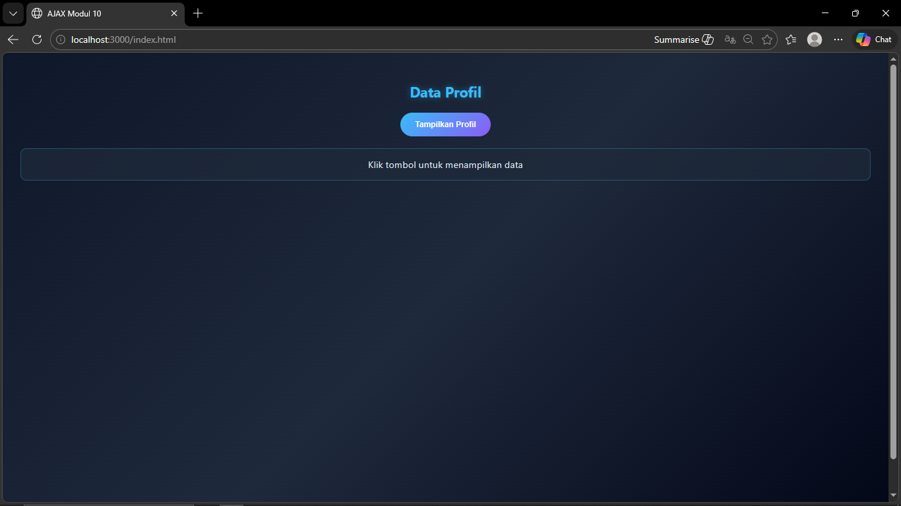
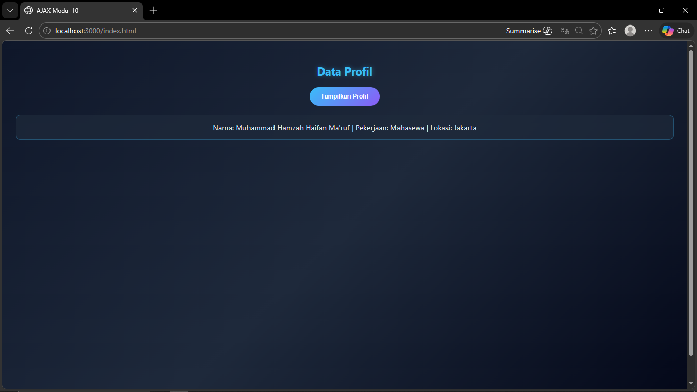

<div align="center">
  <br />
  <h1>LAPORAN PRAKTIKUM <br>APLIKASI BERBASIS PLATFORM</h1>
  <br />
  <h3>MODUL 10 <br> AJAX</h3>
  <br />
  <br />
   
  <br />
  <br />
  <br />
  <br />
  <h3>Disusun Oleh :</h3>
  <p>
    <strong>Muhammad Hamzah Haifan Ma'ruf</strong><br>
    <strong>2311102091</strong><br>
    <strong>S1 IF-11-REG01</strong>
  </p>
  <br />
  <br />
  <h3>Dosen Pengampu :</h3>
  <p>
    <strong>Dimas Fanny Hebrasianto Permadi, S.ST., M.Kom</strong>
  </p>
  <br />
  <br />
    <h4>Asisten Praktikum :</h4>
    <strong> Apri Pandu Wicaksono </strong> <br>
    <strong>Rangga Pradarrell Fathi</strong>
  <br />
  <h3>LABORATORIUM HIGH PERFORMANCE
 <br>FAKULTAS INFORMATIKA <br>UNIVERSITAS TELKOM PURWOKERTO <br>2026</h3>
</div>

---

## 1. Dasar Teori

AJAX (Asynchronous JavaScript and XML) adalah teknik dalam pengembangan web yang memungkinkan pengambilan data dari server tanpa harus me-reload seluruh halaman. Dengan AJAX, interaksi pada website menjadi lebih cepat dan efisien karena hanya bagian tertentu saja yang diperbarui.

Pada praktikum ini, digunakan metode `fetch()` dari JavaScript untuk mengambil data dari file PHP (`data.php`). Data yang dikirim oleh server berbentuk JSON menggunakan `json_encode()`. Selanjutnya, data tersebut ditampilkan ke halaman HTML secara dinamis ketika tombol diklik tanpa melakukan reload halaman.

---

## 2. Code

### 2.1 File Server (`data.php`)

```php
<?php
header('Content-Type: application/json');

$data = [
    "nama" => "Budi",
    "pekerjaan" => "Web Developer",
    "lokasi" => "Jakarta"
];

echo json_encode($data);
?>
````

---

### 2.2 File Client (`index.html`)

```html
<!DOCTYPE html>
<html lang="id">
<head>
    <meta charset="UTF-8">
    <title>AJAX Modul 10</title>
</head>
<body>

<h2>Data Profil</h2>

<button id="btnProfil">Tampilkan Profil</button>

<div id="hasil-profil">Klik tombol untuk menampilkan data</div>

<script src="script.js"></script>

</body>
</html>
```

---

### 2.3 File AJAX (`script.js`)

```javascript
document.getElementById("btnProfil").addEventListener("click", function() {
    fetch("data.php")
        .then(response => response.json())
        .then(data => {
            document.getElementById("hasil-profil").innerHTML =
                "Nama: " + data.nama +
                " | Pekerjaan: " + data.pekerjaan +
                " | Lokasi: " + data.lokasi;
        })
        .catch(error => {
            document.getElementById("hasil-profil").innerHTML =
                "Terjadi kesalahan saat mengambil data.";
            console.log(error);
        });
});
```

---

### 2.4 Style.css

```css
body {
    font-family: 'Segoe UI', Arial, sans-serif;
    background: linear-gradient(135deg, #0f172a, #1e293b, #020617);
    color: #e2e8f0;
    min-height: 100vh;
    margin: 0;
    padding: 30px;
}

.container {
    max-width: 600px;
    margin: auto;
    background: rgba(15, 23, 42, 0.85);
    border: 1px solid rgba(56, 189, 248, 0.3);
    border-radius: 15px;
    padding: 30px;
    box-shadow: 
        0 0 20px rgba(56, 189, 248, 0.2),
        0 0 40px rgba(139, 92, 246, 0.1);
    backdrop-filter: blur(8px);
}

h2 {
    text-align: center;
    margin-bottom: 20px;
    color: #38bdf8;
    text-shadow: 0 0 10px rgba(56, 189, 248, 0.4);
}

button {
    display: block;
    margin: 20px auto;
    padding: 12px 25px;
    border: none;
    border-radius: 30px;
    background: linear-gradient(135deg, #38bdf8, #8b5cf6);
    color: white;
    font-weight: bold;
    cursor: pointer;
    transition: 0.3s;
}

button:hover {
    transform: translateY(-2px);
    box-shadow: 0 0 15px rgba(139, 92, 246, 0.6);
}

#hasil-profil {
    margin-top: 20px;
    padding: 15px;
    border-radius: 10px;
    background: rgba(30, 41, 59, 0.7);
    border: 1px solid rgba(56, 189, 248, 0.3);
    text-align: center;
    font-size: 16px;
    transition: 0.3s;
}

#hasil-profil:hover {
    background: rgba(56, 189, 248, 0.1);
}
```
---

### Hasil Tampilan




---

### Penjelasan Code

File `data.php` berfungsi sebagai server sederhana yang menyimpan data dalam bentuk array. Data tersebut kemudian diubah menjadi format JSON menggunakan `json_encode()` dan dikirim ke client. Header `Content-Type: application/json` digunakan agar browser mengenali data sebagai JSON.

File `index.html` merupakan tampilan utama yang berisi tombol dan area untuk menampilkan data. Ketika tombol diklik, JavaScript akan dijalankan.

File `script.js` berisi logika AJAX menggunakan `fetch()`. Fungsi ini digunakan untuk mengambil data dari `data.php`, kemudian data diubah menjadi JSON dengan `response.json()`. Setelah itu, data ditampilkan ke dalam elemen `<div id="hasil-profil">` sesuai format yang diminta. Jika terjadi error, akan ditampilkan pesan kesalahan.

---

## 3. Kesimpulan

Berdasarkan praktikum yang telah dilakukan, dapat disimpulkan bahwa AJAX memungkinkan pengambilan data dari server secara asynchronous tanpa perlu reload halaman. Dengan menggunakan `fetch()` dan JSON, data dapat ditampilkan secara dinamis sehingga membuat website lebih interaktif dan efisien. Program yang dibuat telah memenuhi seluruh ketentuan tugas Modul 10.