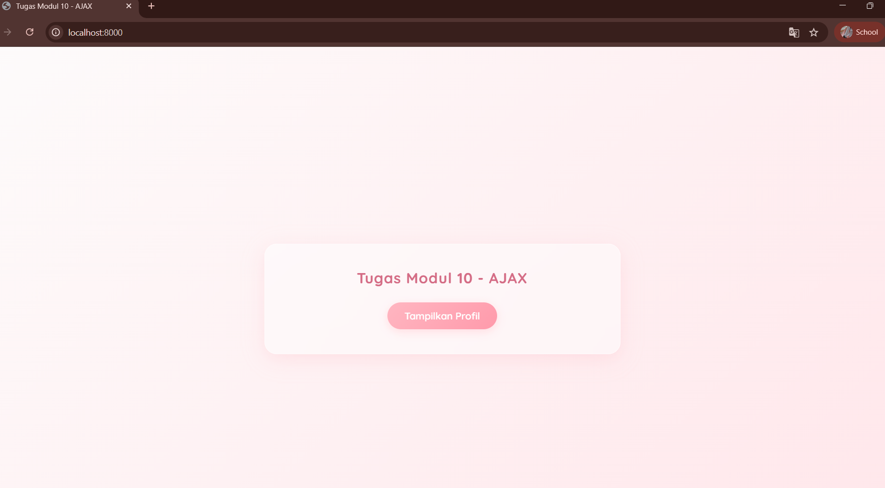
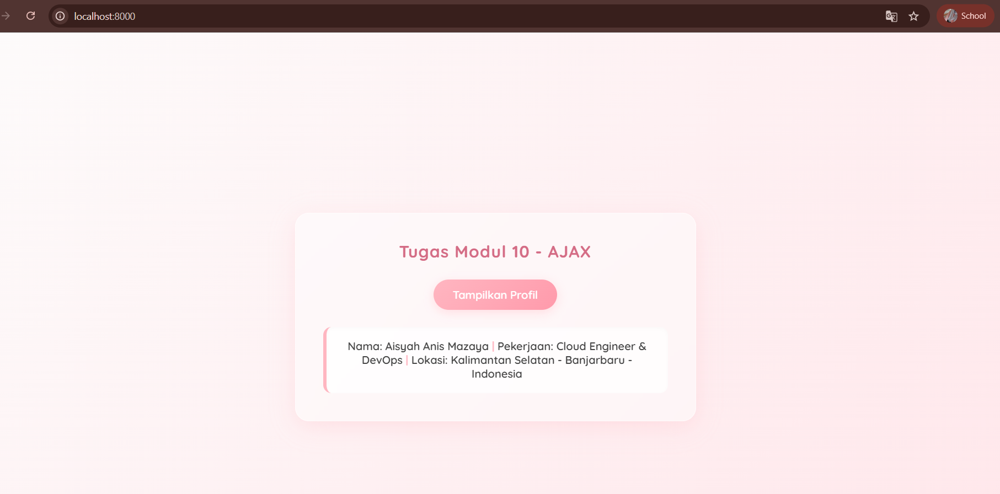

<div align="center">
  <br />

  <h1>LAPORAN PRAKTIKUM <br>
  APLIKASI BERBASIS PLATFORM
  </h1>

  <br />

  <h3>MODUL 10  <br>
  AJAX
  </h3>

  <br />

  <p align="center">

</p>

  <br />
  <br />
  <br />

  <h3>Disusun Oleh :</h3>

  <p>
    <strong>Aisyah Anis Mazaya</strong><br>
    <strong>2311102095</strong><br>
    <strong>S1 IF-11-REG01</strong>
  </p>

  <br />

  <h3>Dosen Pengampu :</h3>

  <p>
    <strong>Dimas Fanny Hebrasianto Permadi, S.ST., M.Kom</strong>
  </p>
  
  <br />
  <br />
    <h4>Asisten Praktikum :</h4>
    <strong>Apri Pandu Wicaksono </strong> <br>
    <strong>Rangga Pradarrell Fathi</strong>
  <br />

  <h3>LABORATORIUM HIGH PERFORMANCE
 <br>FAKULTAS INFORMATIKA <br>UNIVERSITAS TELKOM PURWOKERTO <br>2026</h3>
</div>

<hr>

### Dasar Teori
1. AJAX (Asynchronous JavaScript and XML)
AJAX bukanlah sebuah bahasa pemrograman baru, melainkan sebuah teknik pengembangan web yang menggabungkan beberapa teknologi (seperti HTML, CSS, JavaScript, dan DOM) untuk menciptakan aplikasi web yang lebih cepat dan interaktif. Fungsi utama AJAX adalah memungkinkan halaman web untuk berkomunikasi dengan server di latar belakang (secara asinkron). Dengan teknik ini aplikasi dapat meminta, menerima, dan mengirim data ke server lalu memperbarui bagian tertentu dari halaman web tanpa perlu memuat ulang (reload) seluruh halaman tersebut. Hal ini memberikan pengalaman pengguna (user experience) yang lebih mulus dan menghemat bandwidth jaringan.

2. Fetch API
Fetch API adalah antarmuka bawaan JavaScript modern yang menyediakan cara standar dan lebih kuat untuk mengambil sumber daya (sumber daya jaringan) melintasi jaringan. Fetch API merupakan standar baru yang menggantikan metode klasik XMLHttpRequest (XHR). Keunggulan utama dari Fetch API adalah penggunaannya yang berbasis Promise (janji). Konsep Promise ini membuat penulisan kode asinkron menjadi lebih bersih, mudah dibaca, dan terhindar dari masalah callback hell. Fetch menggunakan metode .then() untuk menangani respons yang berhasil dan .catch() untuk menangkap dan menangani kesalahan (error handling).

3. JSON (JavaScript Object Notation)
Meskipun AJAX memiliki kata "XML" pada singkatannya, dalam pengembangan web modern JSON jauh lebih sering digunakan sebagai format pertukaran data. JSON adalah format teks yang ringan independen dari bahasa pemrograman dan sangat mudah dibaca baik oleh manusia maupun mesin. Dalam konteks aplikasi ini, data di sisi server (PHP) yang awalnya berupa array dikonversi menjadi format JSON menggunakan fungsi json_encode(). Setelah dikirim ke sisi klien (browser) JavaScript dapat dengan mudah mengurai (parsing) format JSON tersebut kembali menjadi objek JavaScript menggunakan metode.json() sehingga datanya dapat dimanipulasi dan ditampilkan ke antarmuka pengguna.

4. Komunikasi Client-Server
Aplikasi web ini mengimplementasikan arsitektur Client-Server sederhana. Sisi Klien (Front-end) diwakili oleh file HTML, CSS, dan JavaScript yang berjalan di dalam browser pengguna. Klien bertugas menampilkan antarmuka dan memicu permintaan (HTTP Request). Sementara itu Sisi Server (Back-end) diwakili oleh file PHP yang berjalan di lingkungan web server. Server bertugas menerima permintaan dari klien memproses data logika sederhana dan mengembalikan respons (HTTP Response) berupa data murni (JSON) kepada klien.

5. Menjalankan sistem penilaian ini digunakan fitur PHP Built-in Web Server melalui perintah php -S localhost:8000 pada terminal. Perintah ini memungkinkan pengembang untuk menjalankan aplikasi web berbasis PHP secara instan tanpa perlu memindahkan file ke folder htdocs atau mengaktifkan layanan Apache pada XAMPP secara manual. Secara teknis instruksi php memanggil program utama PHP bendera -S (Server) berfungsi untuk mengaktifkan mode web server lokal sedangkan localhost:8000 menentukan alamat dan nomor port yang digunakan untuk mengakses aplikasi melalui browser. Metode ini sangat efektif untuk tahap pengembangan (development) karena lebih ringan, cepat, dan memungkinkan proses debugging dilakukan langsung melalui output terminal secara real-time

### Tampilan Hasil Kode Program:



## Kode program 
Berikut adalah kode program nya:

### index.html
```html
<!DOCTYPE html>
<html lang="id">
<head>
    <meta charset="UTF-8">
    <meta name="viewport" content="width=device-width, initial-scale=1.0">
    <title>Tugas Modul 10 - AJAX</title>
    
    <link href="https://fonts.googleapis.com/css2?family=Quicksand:wght@400;600;700&display=swap" rel="stylesheet">
    
    <style>
        body {
            font-family: 'Quicksand', sans-serif;
            background: linear-gradient(135deg, #fdfbfb 0%, #ffe6ea 100%);
            display: flex;
            justify-content: center;
            align-items: center;
            height: 100vh;
            margin: 0;
            color: #555;
        }

        /* Container dengan efek Glassmorphism  */
        .glass-card {
            background: rgba(255, 255, 255, 0.45);
            backdrop-filter: blur(10px);
            -webkit-backdrop-filter: blur(10px);
            border: 1px solid rgba(255, 255, 255, 0.6);
            padding: 40px;
            border-radius: 20px;
            box-shadow: 0 8px 32px 0 rgba(255, 182, 193, 0.3);
            text-align: center;
            max-width: 500px;
            width: 90%;
        }

        h2 {
            color: #d46c85;
            margin-top: 0;
            font-weight: 700;
            letter-spacing: 1px;
            margin-bottom: 25px;
        }

        button {
            background: linear-gradient(135deg, #ffb6c1 0%, #ff9aab 100%);
            color: #fff;
            border: none;
            padding: 12px 28px;
            border-radius: 50px;
            font-size: 16px;
            font-weight: 600;
            font-family: inherit;
            cursor: pointer;
            transition: all 0.3s ease;
            box-shadow: 0 4px 15px rgba(255, 182, 193, 0.4);
        }

        button:hover {
            transform: translateY(-3px);
            box-shadow: 0 8px 20px rgba(255, 154, 171, 0.6);
        }

        button:active {
            transform: translateY(1px);
        }

        #hasil-profil {
            margin-top: 25px;
            padding: 18px 20px;
            background-color: rgba(255, 255, 255, 0.8);
            border-radius: 12px;
            font-size: 16px;
            font-weight: 600;
            color: #444;
            display: none;
            border-left: 5px solid #ffb6c1;
            box-shadow: inset 0 2px 5px rgba(0,0,0,0.02);
        }
    </style>
</head>
<body>

    <div class="glass-card">
        <h2>Tugas Modul 10 - AJAX</h2>
        <button id="btn-tampil">Tampilkan Profil</button>
        
        <div id="hasil-profil"></div>
    </div>

    <script>
        const btnTampil = document.getElementById('btn-tampil');
        const hasilProfil = document.getElementById('hasil-profil');

        btnTampil.addEventListener('click', function() {
            // Efek loading simpel
            hasilProfil.style.display = 'block';
            hasilProfil.innerHTML = "<span style='color:#aaa; font-style:italic;'>Mengambil data dari server...</span>";
// Aisyah Anis Mazaya
// 2311102095
// IF-REG-01
            // Proses AJAX
            fetch('data.php')
                .then(response => {
                    if (!response.ok) throw new Error('Koneksi gagal');
                    return response.json();
                })
                .then(data => {
                    // Format Sesuai Intruksi nya
                    hasilProfil.innerHTML = `Nama: ${data.nama} <span style="color:#ffb6c1;">|</span> Pekerjaan: ${data.pekerjaan} <span style="color:#ffb6c1;">|</span> Lokasi: ${data.lokasi}`;
                })
                // Tampilankan pesan eror
                .catch(error => {
                    hasilProfil.innerHTML = `<span style="color: #e74c3c;">Gagal memuat: ${error.message}</span>`;
                });
        });
    </script>

</body>
</html>
```
## Penjelasan Program
file ini menggunakan JavaScript dengan Fetch API untuk menjalankan proses AJAX. Ketika pengguna mengklik tombol "Tampilkan Profil",JavaScript akan mengirimkan request ke file data.php di latar belakang tanpa melakukan reload halaman. Sambil menunggu, sebuah teks indikator loading akan muncul. Begitu data berformat JSON dari server diterima, JavaScript akan mengurai data tersebut dan merangkainya menjadi satu baris teks (Nama: ... | Pekerjaan: ... | Lokasi: ...)

### data.php 
```php
<?php
// Mengatur header agar browser mengenali output sebagai JSON
header('Content-Type: application/json');
// Aisyah Anis Mazaya
// 2311102095
// IF-REG-01
// Membuat array data sederhana
$data = [
    'nama'      => 'Aisyah Anis Mazaya',
    'pekerjaan' => 'Cloud Engineer & DevOps',
    'lokasi'    => 'Kalimantan Selatan - Banjarbaru - Indonesia'
];

// Mengubah array PHP menjadi format JSON 
echo json_encode($data);
?>
```
## Penjelasan Program
File ini bertindak sebagai "database" dan server sederhana. Pertama file ini menggunakan header('Content-Type: application/json') untuk memberi tahu browser bahwa data yang dikirimkan berupa format JSON, bukan teks biasa atau HTML. Di dalamnya terdapat sebuah array asosiatif PHP yang menyimpan data profil statis (nama, pekerjaan, dan lokasi). Agar data ini bisa dibaca dan diproses oleh JavaScript di sisi klien array tersebut kemudian diubah menjadi format JSON menggunakan fungsi bawaan json_encode() dan ditampilkan dengan perintah echo.