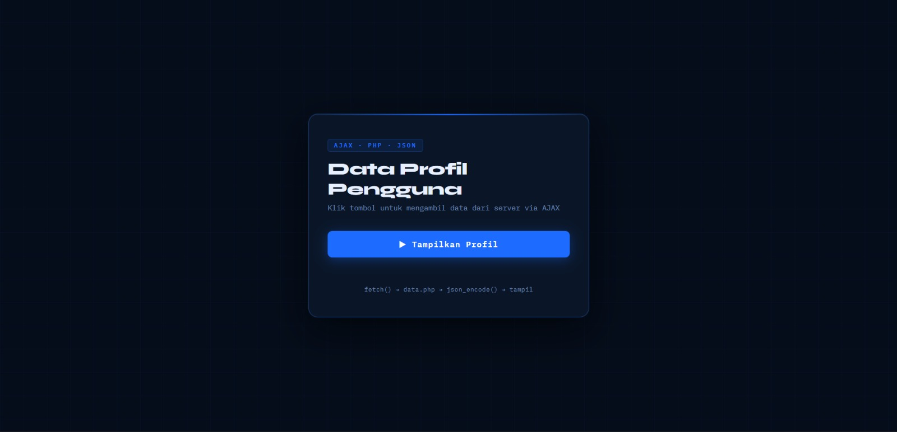
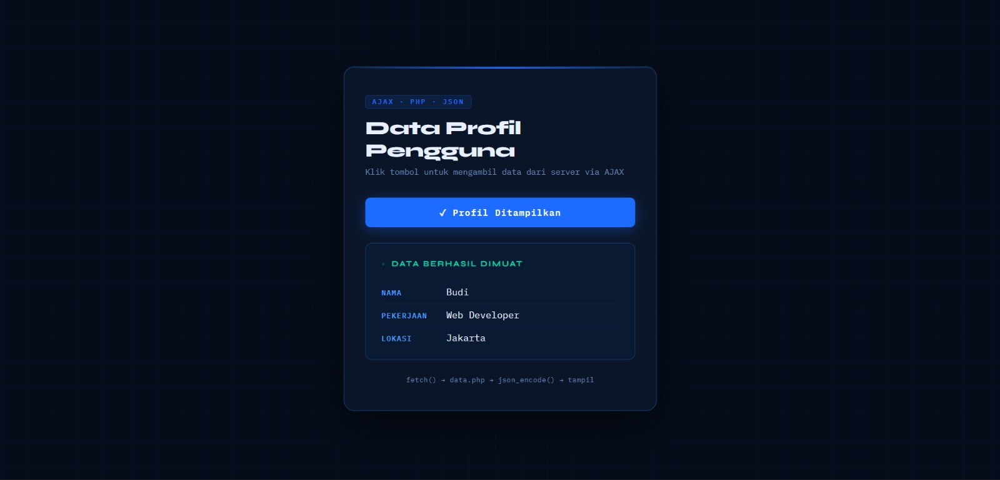

<div align="center">
  <br />
  <h1>LAPORAN PRAKTIKUM <br>APLIKASI BERBASIS PLATFORM</h1>
  <br />
  <h2> MODUL 10 <br> AJAX (Asynchronous JavaScript and XML) </h2>
  <br />
  <br />
   
  <br />
  <br />
  <br />
  <h3>Disusun Oleh :</h3>
  <p>
    <strong>Rafaldo Al Maqdis</strong><br>
    <strong>2311102099</strong><br>
    <strong>S1 IF-11-REG 01</strong>
  </p>
  <br />
  <h3>Dosen Pengampu :</h3>
  <p>
    <strong>Dimas Fanny Hebrasianto Permadi, S.ST., M.Kom</strong>
  </p>
  <br />
  <br />
    <h4>Asisten Praktikum :</h4>
    <strong> Apri Pandu Wicaksono </strong> <br>
    <strong>Rangga Pradarrell Fathi</strong>
  <br />
  <h2>LABORATORIUM HIGH PERFORMANCE
 <br>FAKULTAS INFORMATIKA <br>UNIVERSITAS TELKOM PURWOKERTO <br>2026</h2>
</div>

---

# 1. Dasar Teori

### 1. Arsitektur Asynchronous pada Web

Pada awalnya, aplikasi web menggunakan pendekatan sinkron (*synchronous*), di mana setiap interaksi pengguna yang membutuhkan data dari server akan menyebabkan halaman dimuat ulang secara keseluruhan (*full page reload*). Proses ini membuat penggunaan bandwidth menjadi lebih besar dan pengalaman pengguna terasa kurang efisien karena halaman harus menunggu respon server. Untuk mengatasi hal tersebut, dikembangkan teknologi AJAX (*Asynchronous JavaScript and XML*) yang memungkinkan proses pertukaran data dilakukan di latar belakang tanpa memuat ulang halaman. Dengan pendekatan asinkron, JavaScript dapat mengirim permintaan ke server dan tetap menjalankan kode lainnya tanpa harus menunggu respon selesai, sehingga tampilan antarmuka tetap responsif dan interaktif.

### 2. Perkembangan Teknologi: Dari XMLHttpRequest ke Fetch API

Pada implementasi awal AJAX, komunikasi antara klien dan server dilakukan menggunakan objek `XMLHttpRequest` (XHR). Meskipun fungsional, penggunaan XHR cukup rumit karena memerlukan banyak konfigurasi dan sering menghasilkan struktur kode yang sulit dibaca, terutama saat menangani banyak permintaan sekaligus (*callback hell*). Untuk meningkatkan efisiensi dan keterbacaan kode, diperkenalkan Fetch API sebagai standar modern berbasis *Promise*. Fetch API menyediakan cara yang lebih sederhana dan terstruktur dalam mengambil data dari jaringan, serta memberikan fleksibilitas dalam mengelola objek `Request` dan `Response`, termasuk dukungan fitur modern seperti pemrosesan data secara bertahap (*streaming*).

### 3. JSON sebagai Format Pertukaran Data

Pada awal pengembangan AJAX, XML digunakan sebagai format utama dalam pertukaran data. Namun, dalam praktik pengembangan web modern, JSON (*JavaScript Object Notation*) menjadi pilihan utama karena lebih ringan dan mudah dipahami. JSON merupakan format data yang bersifat *language-independent* dan memiliki struktur yang sederhana, sehingga dapat digunakan oleh berbagai bahasa pemrograman. Keunggulan utama JSON adalah ukuran file yang lebih kecil dibandingkan XML serta kemampuannya untuk langsung dikonversi menjadi objek JavaScript, sehingga proses pengolahan data menjadi lebih cepat dan efisien.

### 4. Siklus Permintaan HTTP dalam AJAX

Dalam proses komunikasi AJAX, terdapat beberapa komponen penting yang berperan dalam pertukaran data antara klien dan server. Pertama adalah *Request Headers*, yang berfungsi memberikan informasi tambahan mengenai permintaan yang dikirim, seperti tipe data yang diharapkan (`Accept: application/json`). Kedua adalah *HTTP Methods*, seperti `GET` untuk mengambil data dan `POST` untuk mengirim data ke server. Selanjutnya terdapat *Response Status Code*, yaitu kode yang diberikan server untuk menunjukkan hasil permintaan, seperti `200 OK` untuk permintaan berhasil atau `404 Not Found` jika data tidak ditemukan. Terakhir adalah *Response Body*, yang berisi data utama (umumnya dalam format JSON) yang akan diproses oleh JavaScript di sisi klien.

### 5. Manipulasi DOM dan Event Loop

Keberhasilan penggunaan AJAX juga bergantung pada kemampuan JavaScript dalam memanipulasi *Document Object Model* (DOM). Setelah data diterima dari server secara asinkron, JavaScript akan memperbarui elemen HTML secara langsung tanpa memuat ulang halaman. Proses ini berjalan melalui mekanisme *Event Loop* pada browser, yang mengatur eksekusi kode secara efisien sehingga pembaruan tampilan dapat dilakukan secara real-time tanpa mengganggu kinerja *thread* utama. Dengan mekanisme ini, aplikasi web dapat memberikan pengalaman pengguna yang lebih cepat, dinamis, dan responsif.

---

### 6. Deskripsi Aplikasi

Aplikasi ini adalah sistem informasi profil ringkas yang menghubungkan antarmuka *front-end* (HTML/CSS/JS) dengan *back-end* (PHP). 
* **Tujuan**: Menampilkan data pengguna secara dinamis dari server.
* **Teknologi**: HTML5, CSS3 (Modern UI), JavaScript (Fetch API), dan PHP.
* **Alur Kerja**: User klik tombol → JavaScript mengirim permintaan ke `data.php` → PHP mengirimkan data JSON → JavaScript memproses data dan memperbarui tampilan secara instan.

---


## Implementasi AJAX Fetch dengan Backend PHP JSON

---

## Deskripsi Aplikasi

Aplikasi ini merupakan sistem informasi profil sederhana berbasis web yang mengimplementasikan **AJAX (Asynchronous JavaScript and XML)** menggunakan **Fetch API** untuk mengambil data dari server tanpa melakukan proses muat ulang halaman (*page refresh*).

Sistem ini menghubungkan **front-end (HTML, CSS, JavaScript)** dengan **back-end (PHP)** melalui pertukaran data dalam format **JSON**.

### Tujuan Aplikasi

* Menampilkan data profil pengguna secara dinamis
* Menghubungkan JavaScript dengan PHP menggunakan Fetch API
* Menggunakan JSON sebagai media pertukaran data
* Menghindari reload halaman
* Memberikan tampilan modern dan interaktif

### Teknologi yang Digunakan

* HTML5
* CSS3 (Modern UI)
* JavaScript (Fetch API)
* PHP
* JSON

### Alur Kerja Sistem

User menekan tombol → JavaScript mengirim request ke server → PHP mengirim data JSON → JavaScript menerima data → Data ditampilkan di halaman tanpa reload.

---

## Struktur Folder

Struktur proyek terdiri dari dua file utama yang berada dalam satu direktori.

```
project-folder
│
├── index.html
└── data.php
```

### Keterangan

**index.html**
Berfungsi sebagai antarmuka pengguna dan berisi logika JavaScript untuk mengambil data dari server.

**data.php**
Berfungsi sebagai penyedia data JSON yang akan dikirim ke client.

---

## Penjelasan Fungsi dan Sample Code

### Penyediaan Data JSON Menggunakan PHP

File `data.php` berfungsi sebagai **API sederhana** yang menyediakan data dalam format JSON.

Fungsi utama dari file ini adalah mengatur header agar browser membaca data sebagai JSON dan mengirimkan data profil dari server.

### Sample Code

```php
<?php

header('Content-Type: application/json');

$profil = [
    "nama" => "Budi",
    "pekerjaan" => "Web Developer",
    "lokasi" => "Jakarta"
];

echo json_encode($profil);

?>
```

### Penjelasan

* `header('Content-Type: application/json')` digunakan untuk memberi tahu browser bahwa data yang dikirim adalah JSON.
* `$profil` adalah array asosiatif yang berisi data pengguna.
* `json_encode()` mengubah array PHP menjadi format JSON.
* `echo` mengirimkan data ke browser.

Output yang dihasilkan:

```
{
  "nama": "Budi",
  "pekerjaan": "Web Developer",
  "lokasi": "Jakarta"
}
```

---

### Pengambilan Data Menggunakan Fetch API

Pada file `index.html`, JavaScript menggunakan fungsi `fetch()` untuk mengambil data dari server secara asinkron.

Fungsi ini memungkinkan halaman tetap aktif tanpa perlu melakukan reload.

### Sample Code

```javascript
fetch('data.php')
  .then(function (response) {

    if (!response.ok) {
      throw new Error('Gagal terhubung ke server');
    }

    return response.json();
  })
  .then(function (data) {
    console.log(data);
  });
```

### Penjelasan

* `fetch('data.php')` mengirim permintaan ke server
* `response.ok` mengecek apakah server berhasil merespons
* `response.json()` mengubah data menjadi objek JavaScript
* `console.log(data)` menampilkan data di console

---

### Manipulasi DOM untuk Menampilkan Data

Setelah data diterima, JavaScript akan menampilkan data ke dalam halaman web.

Data dimasukkan ke dalam elemen HTML menggunakan `innerHTML`.

### Sample Code

```javascript
hasilProfil.innerHTML = `
  <div class="profil-box">

    <div class="profil-row">
      <span class="profil-label">Nama</span>
      <span class="profil-value">${data.nama}</span>
    </div>

    <div class="profil-row">
      <span class="profil-label">Pekerjaan</span>
      <span class="profil-value">${data.pekerjaan}</span>
    </div>

    <div class="profil-row">
      <span class="profil-label">Lokasi</span>
      <span class="profil-value">${data.lokasi}</span>
    </div>

  </div>
`;
```

### Penjelasan

* `innerHTML` digunakan untuk memasukkan data ke HTML
* Template literal digunakan untuk menyisipkan variabel
* `${data.nama}` mengambil data dari JSON
* Tampilan akan langsung berubah tanpa reload

---

### Penanganan Error (Error Handling)

Fungsi ini digunakan untuk menangani kesalahan ketika server tidak dapat diakses atau file tidak ditemukan.

### Sample Code

```javascript
.catch(function (error) {

  hasilProfil.innerHTML = `
    <div class="error-box">
      Error: ${error.message}
    </div>
  `;

});
```

### Penjelasan

* `.catch()` menangkap error
* `error.message` menampilkan pesan kesalahan
* Pesan error ditampilkan di halaman web

Contoh error:

```
Error: Gagal terhubung ke server
```

---

## Tampilan Web

Aplikasi memiliki tampilan modern dengan tema **Cyber Blue UI**.

### Komponen Tampilan

Header berisi judul aplikasi dan teknologi yang digunakan.

Button memiliki efek glow dan animasi loading.

Result area menampilkan data profil dalam bentuk box transparan.

---

### Screenshot Aplikasi

Masukkan gambar pada folder **assets**

```
assets/
│
└── screenshot.png
```

### Tampilan



---

## Referensi

MDN Web Docs
https://developer.mozilla.org/en-US/docs/Web/API/Fetch_API

PHP Manual
https://www.php.net/manual/en/function.json-encode.php

W3Schools AJAX
https://www.w3schools.com/xml/ajax_intro.asp

JSON Official
https://www.json.org

Google Fonts
https://fonts.google.com

---
