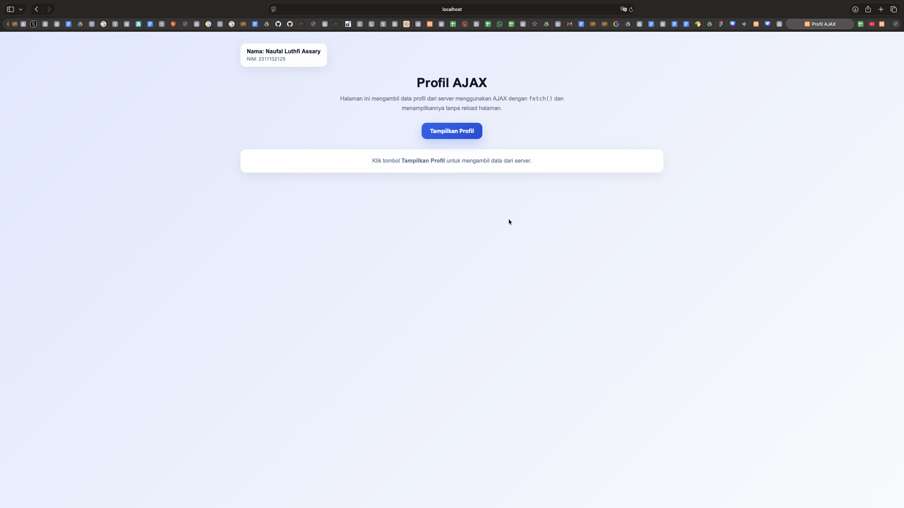
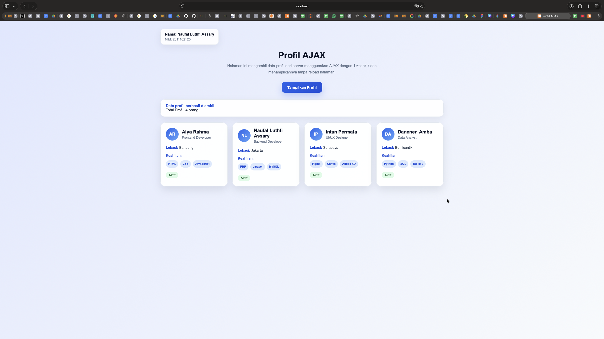

<div align="center">
  <br />
  <h1>LAPORAN PRAKTIKUM <br>APLIKASI BERBASIS PLATFORM</h1>
  <br />
  <h3>MODUL 10 <br> AJAX</h3>
  <br />
  <br />
   
  <br />
  <br />
  <br />
  <br />
  <h3>Disusun Oleh :</h3>
  <p>
    <strong>NAUFAL LUTHFI ASSARY</strong><br>
    <strong>2311102125</strong><br>
    <strong>S1 IF-11-REG01</strong>
  </p>
  <br />
  <h3>Dosen Pengampu :</h3>
  <p>
    <strong>Dimas Fanny Hebrasianto Permadi, S.ST., M.Kom</strong>
  </p>
  <br />
  <br />
    <h4>Asisten Praktikum :</h4>
    <strong> Apri Pandu Wicaksono </strong> <br>
    <strong>Rangga Pradarrell Fathi</strong>
  <br />
  <h3>LABORATORIUM HIGH PERFORMANCE
 <br>FAKULTAS INFORMATIKA <br>UNIVERSITAS TELKOM PURWOKERTO <br>2026</h3>
</div>

---

## 1. Dasar Teori

1. Pengertian AJAX

AJAX adalah singkatan dari **Asynchronous JavaScript and XML**. AJAX merupakan teknik pada pengembangan web yang memungkinkan halaman mengambil atau mengirim data ke server **tanpa harus me-reload seluruh halaman**. Dengan AJAX, interaksi pada website menjadi lebih cepat, dinamis, dan responsif karena hanya bagian tertentu dari halaman yang diperbarui.

2. Cara Kerja AJAX

Secara umum, AJAX bekerja dengan alur berikut:
- Pengguna melakukan aksi pada halaman web, misalnya menekan tombol.
- JavaScript mengirim request ke server secara asynchronous.
- Server memproses request dan mengembalikan data.
- JavaScript menerima data dari server.
- Data yang diterima ditampilkan ke halaman web tanpa reload.

Konsep ini membuat website terasa lebih interaktif dibandingkan halaman web biasa yang harus dimuat ulang setiap kali mengambil data.

3. JavaScript dalam AJAX

JavaScript berperan sebagai penghubung antara halaman web dan server. Dalam implementasi AJAX modern, JavaScript biasanya menggunakan fungsi **`fetch()`** untuk mengambil data dari server. Fungsi ini dapat mengirim request ke file server, menerima response, lalu memproses data tersebut agar bisa ditampilkan ke halaman HTML.

Penggunaan `fetch()` lebih sederhana dan modern dibandingkan teknik AJAX lama seperti `XMLHttpRequest`.

4. PHP sebagai Server Side

PHP adalah bahasa pemrograman **server-side scripting**, yaitu bahasa yang dijalankan di sisi server. Dalam sistem AJAX, PHP sering digunakan untuk:
- mengambil data
- memproses data
- mengubah data menjadi format tertentu
- mengirimkan hasil ke client

Pada tugas ini, file PHP digunakan sebagai server sederhana yang menyediakan data profil. Data tersebut kemudian diakses oleh JavaScript melalui AJAX.

5. JSON sebagai Format Pertukaran Data

JSON adalah singkatan dari **JavaScript Object Notation**. JSON merupakan format pertukaran data yang ringan, mudah dibaca, dan mudah diproses oleh JavaScript. Dalam pengembangan web modern, JSON lebih sering digunakan daripada XML karena sintaksnya lebih sederhana.

Contoh struktur JSON:
```json
{
  "nama": "Budi",
  "pekerjaan": "Web Developer",
  "lokasi": "Jakarta"
}
``` 
Dalam PHP, data array dapat diubah menjadi JSON menggunakan fungsi json_encode().

6. Fungsi json_encode() pada PHP

Fungsi json_encode() digunakan untuk mengubah data dalam bentuk array atau object PHP menjadi format JSON. Fungsi ini penting dalam AJAX karena data dari server perlu dikirim ke browser dalam format yang mudah diproses oleh JavaScript.

Contoh:
```json
$data = [
    "nama" => "Budi",
    "pekerjaan" => "Web Developer",
    "lokasi" => "Jakarta"
];

echo json_encode($data);
```
Hasil dari kode tersebut adalah data JSON yang dapat dibaca oleh JavaScript di browser.

7. DOM Manipulation

DOM atau Document Object Model adalah representasi struktur halaman HTML yang dapat diakses dan diubah menggunakan JavaScript. Dalam AJAX, DOM manipulation digunakan untuk menampilkan data hasil response server ke elemen tertentu pada halaman, misalnya ke dalam `<div>.`

Dengan manipulasi DOM, isi halaman dapat diperbarui secara langsung tanpa perlu memuat ulang halaman secara keseluruhan.

8. Event pada JavaScript

Event adalah kejadian yang terjadi pada elemen halaman web, misalnya klik tombol, input teks, atau submit form. Dalam AJAX, event digunakan untuk memicu proses pengambilan data dari server.

Sebagai contoh, saat pengguna menekan tombol Tampilkan Profil, JavaScript akan menjalankan fungsi fetch() untuk mengambil data dari file PHP.

9. Hubungan AJAX, PHP, dan JSON

Dalam aplikasi web sederhana, ketiga komponen ini saling berkaitan:
- AJAX digunakan untuk mengirim dan menerima data tanpa reload halaman
- PHP digunakan untuk menyediakan data dari server
- JSON digunakan sebagai format data yang dikirim dari server ke client

Gabungan ketiganya memungkinkan pembuatan web yang lebih modern, cepat, dan interaktif.

10. Penerapan pada Tugas

Pada tugas ini, konsep AJAX diterapkan dengan membuat:
- file data.php sebagai server sederhana yang menyediakan data profil
- file index.html sebagai client yang menampilkan halaman web
- JavaScript fetch() untuk mengambil data dari data.php
- elemen HTML untuk menampilkan data profil yang diterima dari server

---

## 2. Penjelasan Kode 

Berikut merupakan implementasi mengambil data dari server dengan menggunakan AJAX.

### Kode php (`data.php`)

```php
<?php
header('Content-Type: application/json');

$daftarProfil = [
    [
        'nama' => 'Alya Rahma',
        'pekerjaan' => 'Frontend Developer',
        'lokasi' => 'Bandung',
        'avatar' => 'AR',
        'keahlian' => ['HTML', 'CSS', 'JavaScript'],
        'status' => 'Aktif'
    ],
    [
        'nama' => 'Naufal Luthfi Assary',
        'pekerjaan' => 'Backend Developer',
        'lokasi' => 'Jakarta',
        'avatar' => 'NL',
        'keahlian' => ['PHP', 'Laravel', 'MySQL'],
        'status' => 'Aktif'
    ],
    [
        'nama' => 'Intan Permata',
        'pekerjaan' => 'UI/UX Designer',
        'lokasi' => 'Surabaya',
        'avatar' => 'IP',
        'keahlian' => ['Figma', 'Canva', 'Adobe XD'],
        'status' => 'Aktif'
    ],
    [
        'nama' => 'Danenen Amba',
        'pekerjaan' => 'Data Analyst',
        'lokasi' => 'Bumicantik',
        'avatar' => 'DA',
        'keahlian' => ['Python', 'SQL', 'Tableau'],
        'status' => 'Aktif'
    ]
];

$response = [
    'pesan' => 'Data profil berhasil diambil',
    'jumlah' => count($daftarProfil),
    'profil' => $daftarProfil
];

echo json_encode($response, JSON_PRETTY_PRINT | JSON_UNESCAPED_UNICODE);
?>
```

### Kode html (`index.html`)

```html
<!DOCTYPE html>
<html lang="id">
<head>
  <meta charset="UTF-8" />
  <meta name="viewport" content="width=device-width, initial-scale=1.0" />
  <title>Profil AJAX </title>
  <style>
    * {
      margin: 0;
      padding: 0;
      box-sizing: border-box;
    }

    body {
      font-family: Arial, Helvetica, sans-serif;
      min-height: 100vh;
      background: linear-gradient(135deg, #e0e7ff, #f8fafc);
      color: #1e293b;
      padding: 32px 20px;
    }

    .container {
      max-width: 1200px;
      margin: 0 auto;
    }

    .identity {
      display: inline-block;
      background: rgba(255, 255, 255, 0.9);
      border: 1px solid #e2e8f0;
      padding: 14px 18px;
      border-radius: 16px;
      box-shadow: 0 10px 30px rgba(15, 23, 42, 0.08);
      margin-bottom: 24px;
    }

    .identity h4 {
      font-size: 16px;
      color: #0f172a;
      margin-bottom: 4px;
    }

    .identity p {
      color: #64748b;
      font-size: 14px;
    }

    .hero {
      text-align: center;
      margin-bottom: 28px;
    }

    .hero h1 {
      font-size: 36px;
      color: #0f172a;
      margin-bottom: 10px;
    }

    .hero p {
      color: #64748b;
      font-size: 16px;
      max-width: 700px;
      margin: 0 auto;
      line-height: 1.7;
    }

    .action-box {
      display: flex;
      justify-content: center;
      margin-bottom: 28px;
    }

    button {
      border: none;
      background: linear-gradient(135deg, #2563eb, #1d4ed8);
      color: white;
      padding: 14px 24px;
      border-radius: 14px;
      font-size: 16px;
      font-weight: bold;
      cursor: pointer;
      box-shadow: 0 12px 30px rgba(37, 99, 235, 0.25);
      transition: 0.3s ease;
    }

    button:hover {
      transform: translateY(-2px);
      opacity: 0.96;
    }

    .summary {
      display: none;
      margin-bottom: 24px;
      background: rgba(255, 255, 255, 0.95);
      border-radius: 18px;
      padding: 18px 22px;
      box-shadow: 0 10px 30px rgba(15, 23, 42, 0.08);
      border: 1px solid #e2e8f0;
    }

    .summary strong {
      color: #1d4ed8;
    }

    #hasil-profil {
      min-height: 100px;
    }

    .placeholder,
    .loading,
    .error-message {
      background: rgba(255, 255, 255, 0.95);
      border: 1px solid #e2e8f0;
      border-radius: 18px;
      padding: 24px;
      text-align: center;
      color: #64748b;
      box-shadow: 0 10px 30px rgba(15, 23, 42, 0.08);
    }

    .loading {
      color: #2563eb;
      font-weight: bold;
    }

    .error-message {
      color: #dc2626;
      font-weight: bold;
    }

    .profil-grid {
      display: grid;
      grid-template-columns: repeat(auto-fit, minmax(260px, 1fr));
      gap: 20px;
    }

    .profil-card {
      background: rgba(255, 255, 255, 0.97);
      border-radius: 22px;
      padding: 22px;
      box-shadow: 0 15px 35px rgba(15, 23, 42, 0.10);
      border: 1px solid #e2e8f0;
      transition: transform 0.25s ease, box-shadow 0.25s ease;
    }

    .profil-card:hover {
      transform: translateY(-4px);
      box-shadow: 0 20px 40px rgba(15, 23, 42, 0.14);
    }

    .profil-top {
      display: flex;
      align-items: center;
      gap: 14px;
      margin-bottom: 18px;
    }

    .avatar {
      width: 54px;
      height: 54px;
      border-radius: 50%;
      background: linear-gradient(135deg, #2563eb, #60a5fa);
      color: white;
      display: flex;
      align-items: center;
      justify-content: center;
      font-weight: bold;
      font-size: 18px;
      flex-shrink: 0;
    }

    .profil-name {
      font-size: 20px;
      font-weight: bold;
      color: #0f172a;
      margin-bottom: 4px;
    }

    .profil-job {
      color: #64748b;
      font-size: 14px;
    }

    .profil-item {
      margin-bottom: 10px;
      font-size: 15px;
      color: #334155;
      line-height: 1.6;
    }

    .label {
      font-weight: bold;
      color: #1d4ed8;
    }

    .status {
      display: inline-block;
      padding: 6px 12px;
      border-radius: 999px;
      background: #dcfce7;
      color: #166534;
      font-size: 13px;
      font-weight: bold;
      margin-top: 8px;
    }

    .skills {
      display: flex;
      flex-wrap: wrap;
      gap: 8px;
      margin-top: 8px;
    }

    .skill-badge {
      background: #dbeafe;
      color: #1d4ed8;
      padding: 6px 10px;
      border-radius: 999px;
      font-size: 12px;
      font-weight: bold;
    }

    @media (max-width: 600px) {
      .hero h1 {
        font-size: 28px;
      }

      button {
        width: 100%;
      }

      .action-box {
        display: block;
      }
    }
  </style>
</head>
<body>
  <div class="container">
    <div class="identity">
      <h4>Nama: Naufal Luthfi Assary</h4>
      <p>NIM: 2311102125</p>
    </div>

    <div class="hero">
      <h1>Profil AJAX </h1>
      <p>
        Halaman ini mengambil data profil dari server menggunakan AJAX dengan
        <code>fetch()</code> dan menampilkannya tanpa reload halaman.
      </p>
    </div>

    <div class="action-box">
      <button id="btnProfil">Tampilkan Profil</button>
    </div>

    <div class="summary" id="summaryBox"></div>

    <div id="hasil-profil">
      <div class="placeholder">
        Klik tombol <strong>Tampilkan Profil</strong> untuk mengambil data dari server.
      </div>
    </div>
  </div>

<script>
  const tombol = document.getElementById("btnProfil");
  const hasilProfil = document.getElementById("hasil-profil");
  const summaryBox = document.getElementById("summaryBox");

  tombol.addEventListener("click", function () {
    hasilProfil.innerHTML = `<div class="loading">Memuat data profil dari server...</div>`;
    summaryBox.style.display = "none";
    summaryBox.innerHTML = "";

    fetch("data.php")
      .then((response) => {
        if (!response.ok) {
          throw new Error("Gagal mengambil data dari server");
        }
        return response.json();
      })
      .then((result) => {
        summaryBox.style.display = "block";
        summaryBox.innerHTML = `
          <strong>${result.pesan}</strong><br>
          Total Profil: ${result.jumlah} orang
        `;

        const cards = result.profil.map((profil) => {
          const skills = profil.keahlian
            .map((skill) => `<span class="skill-badge">${skill}</span>`)
            .join("");

          return `
            <div class="profil-card">
              <div class="profil-top">
                <div class="avatar">${profil.avatar}</div>
                <div>
                  <div class="profil-name">${profil.nama}</div>
                  <div class="profil-job">${profil.pekerjaan}</div>
                </div>
              </div>

              <div class="profil-item">
                <span class="label">Lokasi:</span> ${profil.lokasi}
              </div>

              <div class="profil-item">
                <span class="label">Keahlian:</span>
                <div class="skills">${skills}</div>
              </div>

              <div class="status">${profil.status}</div>
            </div>
          `;
        }).join("");

        hasilProfil.innerHTML = `<div class="profil-grid">${cards}</div>`;
      })
      .catch((error) => {
        hasilProfil.innerHTML = `<div class="error-message">${error.message}</div>`;
      });
  });
  </script>
</body>
</html>
```

### Hasil Tampilan (Screenshot)




### Penjelasan Code:

1. File `data.php` berfungsi sebagai **server** yang menyediakan data profil.
Data disimpan dalam variabel `$daftarProfil` dalam bentuk **array multidimensi**.
Setiap profil memiliki data:
  - nama
  - pekerjaan
  - lokasi
  - avatar
  - keahlian
  - status
Baris:
```php
  header('Content-Type: application/json');
```
digunakan agar output dikenali sebagai JSON.
Variabel $response digunakan untuk menyusun data yang akan dikirim, yaitu:
- pesan
- jumlah
- profil

Fungsi:
```php
json_encode()
```
digunakan untuk mengubah array PHP menjadi format JSON.

File ini hanya bertugas mengirim data, bukan menampilkan halaman web.

2. File `index.html` berfungsi sebagai client atau halaman utama website.
- File ini berisi:
- struktur HTML
- desain CSS
- logika JavaScript AJAX
- Bagian identitas digunakan untuk menampilkan nama dan NIM pembuat.
- Bagian judul menjelaskan bahwa halaman mengambil data dari server tanpa reload.
- Tombol Tampilkan Profil digunakan untuk memulai proses pengambilan data.
- `<div id="hasil-profil">` digunakan sebagai tempat menampilkan data profil.
- `<div id="summaryBox">` digunakan untuk menampilkan ringkasan jumlah profil.

JavaScript pada index.html

JavaScript mengambil elemen tombol, area hasil, dan area ringkasan dengan:
```js
document.getElementById()
```

Event:
```js
addEventListener("click", ...)
```
digunakan agar proses berjalan saat tombol diklik.

Saat tombol ditekan, halaman menampilkan status loading.
Fungsi:
```js
fetch("data.php")
```
digunakan untuk mengambil data dari file data.php.

Response dari server diubah ke JSON dengan:
```js
response.json()
```
- Data yang diterima kemudian ditampilkan ke halaman dalam bentuk card profil.
- Keahlian setiap profil ditampilkan sebagai badge.
- Jika terjadi error, program menampilkan pesan gagal mengambil data.


## Referensi
- [MDN Web Docs - Fetch API (AJAX)](https://developer.mozilla.org/en-US/docs/Web/API/Fetch_API/Using_Fetch)
- [PHP](https://www.php.net/manual/en/function.json-encode.php)