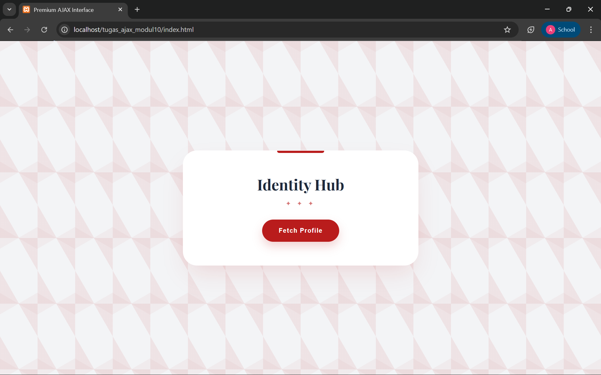
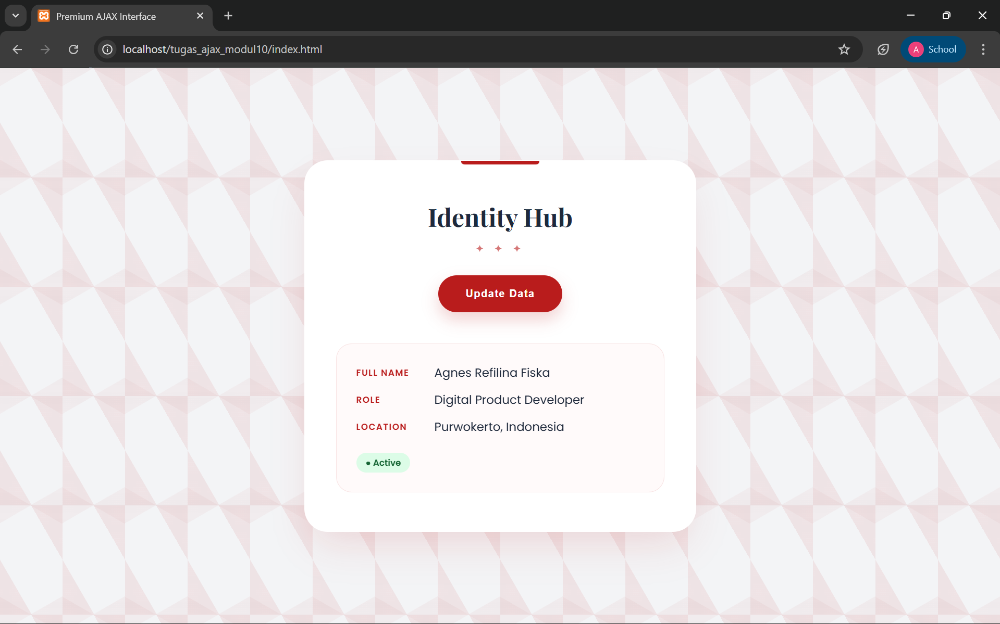

<div align="center">
  <br />
  <h1>LAPORAN PRAKTIKUM <br> APLIKASI BERBASIS PLATFORM</h1>
  <br />
  <h3>MODUL 10 <br> AJAX</h3>
  <br />
  
  <br />
  <br />
  <br />
  <h3>Disusun Oleh :</h3>
  <p>
    <strong>Agnes Refilina Fiska</strong><br>
    <strong>2311102126</strong><br>
    <strong>S1 IF-11-01</strong>
  </p>
  <br />
  <h3>Dosen Pengampu :</h3>
  <p>
    <strong>Dimas Fanny Hebrasianto Permadi, S.ST., M.Kom</strong>
  </p>
  <br />
  <br />
  <h4>Asisten Praktikum :</h4>
  <strong>Apri Pandu Wicaksono</strong> <br>
  <strong>Rangga Pradarrell Fathi</strong>
  <br />
  <br />
  <br />
  <br />
  <h3>LABORATORIUM HIGH PERFORMANCE <br> FAKULTAS INFORMATIKA <br> UNIVERSITAS TELKOM PURWOKERTO <br> 2026</h3>
</div>

---

## 1. Dasar Teori

**AJAX** (Asynchronous JavaScript and XML) adalah teknik modern yang memungkinkan halaman web bertukar data dengan server secara asinkron. Keunggulan utamanya adalah kemampuan memperbarui konten spesifik tanpa perlu memuat ulang (reload) seluruh halaman, sehingga interaksi terasa lebih cepat, responsif, dan nyaman bagi pengguna.

**Cara Kerja dan Format Data**
Secara teknis, AJAX menggunakan JavaScript untuk berkomunikasi dengan server di balik layar. Meskipun awalnya menggunakan XML, saat ini format JSON (JavaScript Object Notation) jauh lebih populer karena strukturnya yang lebih ringan dan lebih mudah diolah oleh JavaScript.

Dalam perkembangannya, implementasi AJAX dapat dilakukan melalui beberapa metode:

- XMLHttpRequest: Metode konvensional.
- jQuery AJAX: Menggunakan library tambahan.
- Fetch API: Standar modern yang lebih sederhana dan efisien, yang juga digunakan dalam praktikum ini.

**Sinergi PHP dan JavaScript**
Pada sisi server-side, PHP berperan menyediakan data dalam bentuk array asosiatif yang kemudian dikonversi menjadi format JSON menggunakan fungsi json_encode(). Penting untuk menyertakan header application/json agar browser dapat mengenali format data dengan benar.
Pada sisi client-side, prosesnya berjalan sebagai berikut:

1. JavaScript memicu fungsi fetch() saat terjadi aksi (misal: klik tombol).
2. Data diambil dari file PHP dan diubah menjadi objek JavaScript melalui metode .json().
3. Konten ditampilkan ke elemen HTML secara dinamis tanpa interupsi pada halaman.

Pada praktikum ini, AJAX digunakan untuk membuat halaman web sederhana yang dapat menampilkan data profil (nama, pekerjaan, dan lokasi) dari server ke halaman web tanpa reload. Implementasi ini menjadi dasar penting dalam pengembangan aplikasi web modern seperti dashboard, aplikasi real-time, dan sistem berbasis API.

---

## 2. Penjelasan Kode PHP, HTML, dan AJAX

### Kode Program (`data.php`)

```php
<?php
header('Content-Type: application/json');

// Data Profil Profesional
$data = [
    'nama'      => 'Agnes Refilina Fiska',
    'pekerjaan' => 'Digital Product Developer',
    'lokasi'    => 'Purwokerto, Indonesia',
    'status'    => 'Active'
];

echo json_encode($data);
?>
```

### Kode Program (`index.html`)

```html
<!DOCTYPE html>
<html lang="id">
<head>
    <meta charset="UTF-8">
    <meta name="viewport" content="width=device-width, initial-scale=1.0">
    <title>Premium AJAX Interface</title>
    <style>
        @import url('https://fonts.googleapis.com/css2?family=Playfair+Display:wght@700&family=Poppins:wght@300;400;600&display=swap');

        :root {
            --primary: #b91c1c;
            --dark: #1e293b;
            --light: #f8fafc;
        }

        body {
            font-family: 'Poppins', sans-serif;
            background-color: #f3f4f6;
            margin: 0;
            display: flex;
            justify-content: center;
            align-items: center;
            height: 100vh;
            overflow: hidden;
            /* Ornamen Background Geometris Halus */
            background-image: 
                linear-gradient(30deg, #b91c1c05 12%, transparent 12.5%, transparent 87%, #b91c1c05 87.5%, #b91c1c05),
                linear-gradient(150deg, #b91c1c05 12%, transparent 12.5%, transparent 87%, #b91c1c05 87.5%, #b91c1c05),
                linear-gradient(30deg, #b91c1c05 12%, transparent 12.5%, transparent 87%, #b91c1c05 87.5%, #b91c1c05),
                linear-gradient(150deg, #b91c1c05 12%, transparent 12.5%, transparent 87%, #b91c1c05 87.5%, #b91c1c05),
                linear-gradient(60deg, #b91c1c0a 25%, transparent 25.5%, transparent 75%, #b91c1c0a 75%, #b91c1c0a),
                linear-gradient(60deg, #b91c1c0a 25%, transparent 25.5%, transparent 75%, #b91c1c0a 75%, #b91c1c0a);
            background-size: 80px 140px;
        }

        .main-card {
            background: white;
            width: 100%;
            max-width: 420px;
            padding: 50px 40px;
            border-radius: 30px;
            box-shadow: 0 25px 50px -12px rgba(185, 28, 28, 0.15);
            text-align: center;
            position: relative;
            border: 1px solid rgba(255, 255, 255, 0.3);
        }

        /* Ornamen Garis Atas */
        .main-card::before {
            content: "";
            position: absolute;
            top: 0; left: 50%;
            transform: translateX(-50%);
            width: 100px; height: 5px;
            background: var(--primary);
            border-bottom-left-radius: 10px;
            border-bottom-right-radius: 10px;
        }

        h2 {
            font-family: 'Playfair Display', serif;
            color: var(--dark);
            font-size: 2rem;
            margin: 0 0 10px 0;
        }

        .decorator {
            color: var(--primary);
            letter-spacing: 5px;
            font-size: 0.8rem;
            margin-bottom: 25px;
            opacity: 0.6;
        }

        #btn-fetch {
            background: var(--primary);
            color: white;
            border: none;
            padding: 16px 35px;
            border-radius: 50px;
            font-weight: 600;
            letter-spacing: 1px;
            cursor: pointer;
            transition: all 0.4s cubic-bezier(0.175, 0.885, 0.32, 1.275);
            box-shadow: 0 10px 20px rgba(185, 28, 28, 0.2);
        }

        #btn-fetch:hover {
            transform: scale(1.05);
            box-shadow: 0 15px 25px rgba(185, 28, 28, 0.3);
            background: #991b1b;
        }

        /* Hasil Profil dengan Efek Card */
        #profile-result {
            margin-top: 40px;
            text-align: left;
            padding: 25px;
            background: #fffafa;
            border-radius: 20px;
            border: 1px solid rgba(185, 28, 28, 0.1);
            display: none;
            animation: slideUp 0.6s ease forwards;
        }

        @keyframes slideUp {
            from { opacity: 0; transform: translateY(30px); }
            to { opacity: 1; transform: translateY(0); }
        }

        .info-row {
            margin-bottom: 12px;
            display: flex;
            align-items: center;
        }

        .info-label {
            font-size: 0.7rem;
            text-transform: uppercase;
            font-weight: 700;
            color: var(--primary);
            width: 100px;
            letter-spacing: 1px;
        }

        .info-value {
            font-size: 0.95rem;
            color: var(--dark);
            font-weight: 500;
        }

        /* Badge Status */
        .status-badge {
            display: inline-block;
            padding: 4px 12px;
            background: #dcfce7;
            color: #166534;
            border-radius: 20px;
            font-size: 0.7rem;
            font-weight: 700;
            margin-top: 10px;
        }
    </style>
</head>
<body>

    <div class="main-card">
        <h2>Identity Hub</h2>
        <div class="decorator">✦ ✦ ✦</div>
        
        <button id="btn-fetch">Fetch Profile</button>

        <div id="profile-result">
            </div>
    </div>

    <script>
        const btn = document.getElementById('btn-fetch');
        const resultBox = document.getElementById('profile-result');

        btn.addEventListener('click', () => {
            btn.innerHTML = "Processing...";
            btn.style.opacity = "0.7";

            fetch('data.php')
                .then(res => res.json())
                .then(data => {
                    resultBox.innerHTML = `
                        <div class="info-row">
                            <span class="info-label">Full Name</span>
                            <span class="info-value">${data.nama}</span>
                        </div>
                        <div class="info-row">
                            <span class="info-label">Role</span>
                            <span class="info-value">${data.pekerjaan}</span>
                        </div>
                        <div class="info-row">
                            <span class="info-label">Location</span>
                            <span class="info-value">${data.lokasi}</span>
                        </div>
                        <span class="status-badge">● ${data.status}</span>
                    `;
                    
                    resultBox.style.display = 'block';
                    btn.innerHTML = "Update Data";
                    btn.style.opacity = "1";
                })
                .catch(err => {
                    alert("Gagal memuat data server.");
                    btn.innerHTML = "Retry Fetch";
                    btn.style.opacity = "1";
                });
        });
    </script>
</body>
</html>
```

---

### Penjelasan Kode

---

### 1. PHP (`data.php`)

Pada file `data.php`, program digunakan sebagai server sederhana yang menyediakan data dalam bentuk JSON. Baris `header('Content-Type: application/json');` berfungsi untuk memberi tahu browser bahwa data yang dikirimkan berupa format JSON, bukan HTML.

Kemudian, terdapat variabel `$data` yang merupakan array asosiatif untuk menyimpan data profil profesional, di mana setiap data memiliki key seperti `nama`, `pekerjaan`, `lokasi`, dan `status`. Terakhir, perintah `echo json_encode($data);` digunakan untuk mengubah array PHP tersebut menjadi format JSON agar bisa dibaca dan diolah oleh JavaScript di sisi client. Secara keseluruhan, file ini berfungsi sebagai penyedia data atau API sederhana untuk kebutuhan halaman web dinamis.

---

### 2. HTML (`index.html`)

Bagian HTML berfungsi sebagai kerangka visual yang menyediakan elemen-elemen interaktif bagi pengguna.

- main-card: Berfungsi sebagai kontainer utama (kartu) yang membungkus seluruh konten agar terlihat terpusat dan rapi.
- Identity Hub & decorator: Digunakan sebagai judul dan elemen estetika untuk memperkuat tema "Premium Interface".
- btn-fetch: Sebuah elemen tombol yang menjadi pemicu utama (trigger) untuk menjalankan proses pengambilan data.
- profile-result: Sebuah div kosong yang nantinya akan diisi secara dinamis oleh JavaScript. Elemen ini disetel tersembunyi (display: none) secara default dan hanya akan muncul setelah data berhasil diambil dari server.

---

### 3. JavaScript (AJAX)

Bagian ini adalah inti dari teknologi AJAX menggunakan Fetch API, yang memungkinkan pertukaran data secara asinkron (tanpa reload).

- Event Listener: Kode `btn.addEventListener('click', ...)` berfungsi untuk memantau kapan pengguna mengeklik tombol.
- Feedback Visual: Saat tombol diklik, teks tombol berubah menjadi "Processing..." dan opasitasnya berkurang. Ini memberikan tanda kepada pengguna bahwa sistem sedang bekerja.
- `fetch('data.php'):` Fungsi ini mengirimkan permintaan ke file data.php di latar belakang.
- `.then(res => res.json()):` Setelah server merespons, data mentah tersebut dikonversi menjadi format objek JSON agar bisa diolah oleh JavaScript.

**DOM Manipulation:**

- Data yang diterima (seperti `data.nama`, `data.pekerjaan`, dll) dimasukkan ke dalam blok HTML menggunakan template literals (tanda backtick `).
- `resultBox.style.display = 'block'` mengubah kotak hasil yang tadinya sembunyi menjadi terlihat.
- `.catch():` Berfungsi sebagai pengaman. Jika terjadi kesalahan (misalnya file data.php hilang atau koneksi terputus), sistem akan menampilkan pesan peringatan (alert).

---

### 4. CSS

CSS digunakan untuk mengubah struktur HTML yang polos menjadi antarmuka yang modern dan mewah.

- **Variabel Warna** `(:root):` Menggunakan sistem variabel untuk warna merah primer dan slate gelap agar konsisten dan mudah diubah.

- **Background Geometris:** Menggunakan teknik `linear-gradient` yang kompleks pada elemen `body` untuk menciptakan pola ornamen latar belakang tanpa perlu menggunakan file gambar tambahan.

- **Flexbox Layout:** Penggunaan `display: flex` pada `body` memastikan kartu utama selalu berada tepat di tengah layar secara vertikal maupun horizontal.

- **Styling Kartu** `(.main-card):` Menggunakan box-shadow yang halus dan border-radius yang lebar (30px) untuk memberikan kesan modern dan "empuk" (soft UI).

- **Animasi** `(@keyframes slideUp):` Ketika data muncul, CSS menjalankan animasi transisi dari bawah ke atas disertai efek memudar (fade-in), sehingga kemunculan data tidak terasa kaku.

- **Pseudo-element** `(::before):` Garis merah kecil di bagian atas kartu dibuat menggunakan properti ini untuk menambah detail estetika premium.

---

### Hasil Tampilan (Screenshot)




---

---

## 3. Kesimpulan

Dari hasil praktikum mengenai AJAX, dapat disimpulkan bahwa:

- Interaksi Tanpa Reload: Teknik AJAX memungkinkan halaman web memperbarui data secara spesifik tanpa harus memuat ulang (reload) seluruh halaman, sehingga website menjadi lebih cepat dan responsif.
- Efisiensi Fetch & JSON: Penggunaan Fetch API mempermudah proses pengambilan data dari server, sementara format JSON terbukti sangat ringan dan efisien untuk pertukaran data antara PHP dan JavaScript.
- Sinergi Client-Server: Praktikum ini menunjukkan alur kerja yang solid di mana PHP berperan sebagai penyedia data (API) dan JavaScript sebagai pengelola tampilan di sisi pengguna.
- Pengalaman Pengguna (UX): Kombinasi AJAX dengan CSS (seperti animasi transisi) menciptakan antarmuka yang lebih modern, profesional, dan interaktif.

Secara keseluruhan, AJAX adalah fondasi penting dalam pengembangan aplikasi web modern untuk menciptakan performa yang optimal dan pengalaman pengguna yang lebih baik.

---

## 4. Referensi

- Modul Praktikum Aplikasi Berbasis Platform – Modul 10 AJAX  
- W3Schools AJAX Tutorial : https://www.w3schools.com/xml/ajax_intro.asp  
- W3Schools Fetch API : https://www.w3schools.com/js/js_api_fetch.asp  
- MDN Web Docs - Fetch API : https://developer.mozilla.org/en-US/docs/Web/API/Fetch_API  

