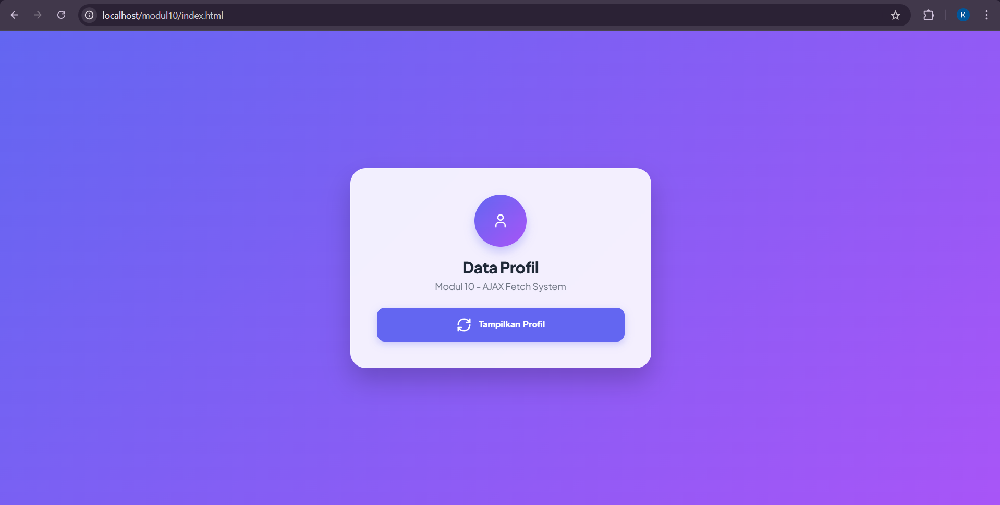
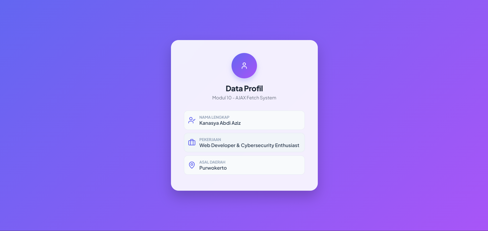

<div align="center">
  <br />
  <h1>LAPORAN PRAKTIKUM <br> APLIKASI BERBASIS PLATFORM</h1>
  <br />
  <h3>MODUL 10 <br> AJAX</h3>
  <br />
  
  <br />
  <br />
  <br />
  <h3>Disusun Oleh :</h3>
  <p>
    <strong>Kanasya Abdi Aziz</strong><br>
    <strong>2311102140</strong><br>
    <strong>S1 IF-11-01</strong>
  </p>
  <br />
  <h3>Dosen Pengampu :</h3>
  <p>
    <strong>Dimas Fanny Hebrasianto Permadi, S.ST., M.Kom</strong>
  </p>
  <br />
  <br />
  <h4>Asisten Praktikum :</h4>
  <strong>Apri Pandu Wicaksono</strong> <br>
  <strong>Rangga Pradarrell Fathi</strong>
  <br />
  <br />
  <br />
  <br />
  <h3>LABORATORIUM HIGH PERFORMANCE <br> FAKULTAS INFORMATIKA <br> UNIVERSITAS TELKOM PURWOKERTO <br> 2026</h3>
</div>

---

## 1. Dasar Teori

**AJAX** (Asynchronous JavaScript and XML) adalah teknik kontemporer yang memungkinkan halaman web berbagi data dengan server secara asinkron. Keunggulan utamanya adalah kemampuan untuk memperbarui konten tertentu tanpa perlu memuat ulang (reload) seluruh halaman, yang membuat interaksi lebih cepat, responsif, dan mudah bagi pengguna.

**Cara Kerja dan Format Data**
Secara teknis, AJAX menggunakan JavaScript untuk berkomunikasi dengan server di balik layar. Meskipun awalnya menggunakan XML, format JSON (JavaScript Object Notation) sekarang lebih populer karena lebih ringan dan mudah diolah oleh JavaScript.

Perkembangan AJAX dapat dilakukan dengan berbagai cara:

- XMLHttpRequest: metode konvensional 
- jQuery AJAX: menggunakan library tambahan 
- Fetch API: standar modern yang lebih sederhana dan efektif, yang juga digunakan dalam praktikum ini.

**Sinergi PHP dan JavaScript**
PHP menyediakan data dalam bentuk array asosiatif, yang kemudian diubah menjadi format JSON dengan menggunakan fungsi json_encode. Menyertakan header application/json sangat penting agar browser dapat mengenali format data dengan benar.
Berikut ini adalah prosedur yang digunakan di sisi pelanggan:

1. Saat terjadi tindakan, seperti klik tombol, JavaScript memicu fungsi fetch(). 
2. Data diambil dari file PHP dan diubah menjadi objek JavaScript menggunakan metode.json(). 
3. Konten ditampilkan ke elemen HTML secara dinamis tanpa mengganggu halaman.

AJAX digunakan dalam praktik ini untuk membuat halaman web sederhana yang dapat menampilkan data profil (nama, pekerjaan, dan lokasi) dari server ke halaman web tanpa reload. AJAX adalah komponen penting dalam pengembangan aplikasi web kontemporer seperti dashboard, aplikasi real-time, dan sistem berbasis API.

---

## 2. Penjelasan Kode PHP, HTML, dan AJAX

### Kode Program (`data.php`)

```php
<?php
header('Content-Type: application/json');

$data = [
    'nama'      => 'Kanasya Abdi Aziz',
    'pekerjaan' => 'Web Developer & Cybersecurity Enthusiast',
    'lokasi'    => 'Purwokerto'
];

echo json_encode($data);
?>
```

### Kode Program (`index.html`)

```html
<!DOCTYPE html>
<html lang="id">
<head>
    <meta charset="UTF-8">
    <meta name="viewport" content="width=device-width, initial-scale=1.0">
    <title>Profil Kanasya - Premium AJAX</title>
    <!-- Font & Icon -->
    <script src="https://unpkg.com/lucide@latest"></script>
    <link href="https://fonts.googleapis.com/css2?family=Plus+Jakarta+Sans:wght@400;600;800&display=swap" rel="stylesheet">
    
    <style>
        :root {
            --primary: #6366f1;
            --secondary: #a855f7;
            --bg-gradient: linear-gradient(135deg, #6366f1 0%, #a855f7 100%);
        }

        body {
            font-family: 'Plus Jakarta Sans', sans-serif;
            background: var(--bg-gradient);
            min-height: 100vh;
            display: flex;
            justify-content: center;
            align-items: center;
            margin: 0;
            color: #1f2937;
        }

        /* Card Glassmorphism */
        .card {
            background: rgba(255, 255, 255, 0.9);
            backdrop-filter: blur(10px);
            padding: 2.5rem;
            border-radius: 24px;
            box-shadow: 0 20px 40px rgba(0,0,0,0.2);
            width: 100%;
            max-width: 380px;
            text-align: center;
            border: 1px solid rgba(255, 255, 255, 0.3);
        }

        .profile-header { margin-bottom: 1.5rem; }

        /* Avatar Placeholder */
        .avatar {
            width: 80px;
            height: 80px;
            background: var(--bg-gradient);
            border-radius: 50%;
            display: flex;
            justify-content: center;
            align-items: center;
            margin: 0 auto 1rem;
            color: white;
            box-shadow: 0 8px 15px rgba(99, 102, 241, 0.3);
        }

        h2 { font-weight: 800; margin: 0; font-size: 1.5rem; letter-spacing: -0.5px; }
        p { color: #6b7280; font-size: 0.9rem; margin-top: 5px; }

        #btn-fetch {
            background: var(--primary);
            color: white;
            border: none;
            padding: 14px;
            border-radius: 12px;
            font-weight: 600;
            width: 100%;
            cursor: pointer;
            display: flex;
            justify-content: center;
            align-items: center;
            gap: 10px;
            transition: all 0.3s ease;
            box-shadow: 0 4px 12px rgba(99, 102, 241, 0.3);
        }

        #btn-fetch:hover {
            transform: translateY(-2px);
            box-shadow: 0 6px 20px rgba(99, 102, 241, 0.4);
            filter: brightness(1.1);
        }

        #hasil-profil {
            margin-top: 2rem;
            text-align: left;
            display: none;
        }

        .data-row {
            display: flex;
            align-items: center;
            gap: 12px;
            padding: 12px;
            background: #f8fafc;
            border-radius: 12px;
            margin-bottom: 10px;
            border: 1px solid #e2e8f0;
            transition: 0.3s;
        }

        .data-row:hover { background: #f1f5f9; }

        .icon-box {
            color: var(--primary);
            display: flex;
            align-items: center;
        }

        .label { font-size: 0.75rem; color: #94a3b8; display: block; font-weight: 600; }
        .value { font-size: 0.95rem; color: #334155; font-weight: 600; }

        /* Animation */
        @keyframes slideUp {
            from { opacity: 0; transform: translateY(20px); }
            to { opacity: 1; transform: translateY(0); }
        }
        .animate { animation: slideUp 0.6s cubic-bezier(0.16, 1, 0.3, 1) forwards; }
    </style>
</head>
<body>

    <div class="card">
        <div class="profile-header">
            <div class="avatar"><i data-lucide="user" size="40"></i></div>
            <h2>Data Profil</h2>
            <p>Modul 10 - AJAX Fetch System</p>
        </div>

        <button id="btn-fetch">
            <i data-lucide="refresh-cw" size="18" id="loader-icon"></i>
            <span>Tampilkan Profil</span>
        </button>

        <div id="hasil-profil">
            <!-- Data AJAX di sini -->
        </div>
    </div>

    <script>
        // Inisialisasi Ikon Lucide
        lucide.createIcons();

        document.getElementById('btn-fetch').addEventListener('click', function() {
            const btn = this;
            const container = document.getElementById('hasil-profil');
            const loader = document.getElementById('loader-icon');

            // Tambah animasi putar pada ikon loading
            loader.style.animation = "spin 1s linear infinite";
            btn.querySelector('span').innerText = 'Menghubungkan...';

            fetch('data.php')
                .then(response => response.json())
                .then(data => {
                    container.innerHTML = `
                        <div class="data-row">
                            <div class="icon-box"><i data-lucide="user-check" size="20"></i></div>
                            <div><span class="label">NAMA LENGKAP</span><span class="value">${data.nama}</span></div>
                        </div>
                        <div class="data-row">
                            <div class="icon-box"><i data-lucide="briefcase" size="20"></i></div>
                            <div><span class="label">PEKERJAAN</span><span class="value">${data.pekerjaan}</span></div>
                        </div>
                        <div class="data-row">
                            <div class="icon-box"><i data-lucide="map-pin" size="20"></i></div>
                            <div><span class="label">ASAL DAERAH</span><span class="value">${data.lokasi}</span></div>
                        </div>
                    `;
                    
                    // Re-render ikon baru yang baru ditambahkan
                    lucide.createIcons();
                    
                    container.style.display = 'block';
                    container.classList.add('animate');
                    
                    btn.style.display = 'none'; // Sembunyikan tombol setelah selesai
                })
                .catch(err => {
                    alert('Gagal mengambil data!');
                    console.error(err);
                });
        });
    </script>

    <style>
        @keyframes spin {
            from { transform: rotate(0deg); }
            to { transform: rotate(360deg); }
        }
    </style>
</body>
</html>
```

---

### Penjelasan Kode

---

### 1. PHP (`data.php`)

Kode PHP di atas berfungsi sebagai titik akhir (API) sederhana yang menyediakan data profil dalam format yang bisa dibaca oleh mesin. Pertama, baris header('Content-Type: application/json') menginstruksikan peramban atau aplikasi pemanggil bahwa data yang akan dikirimkan bukan merupakan teks HTML biasa, melainkan data berformat JSON. Selanjutnya, variabel $data didefinisikan sebagai array asosiatif yang menyimpan informasi spesifik seperti nama, pekerjaan, dan lokasi milik Kanasya. Di tahap akhir, fungsi json_encode($data) dipanggil untuk mengubah struktur data PHP tersebut menjadi teks string JSON, yang kemudian ditampilkan ke layar menggunakan perintah echo agar dapat ditangkap dan diproses oleh logika AJAX pada sisi klien.

---

### 2. HTML (`index.html`)

Bagian HTML berfungsi sebagai fondasi utama atau kerangka dari halaman web yang menentukan elemen apa saja yang akan ditampilkan kepada pengguna. Dalam kode ini, struktur dimulai dengan sebuah kontainer utama bernama .card yang membungkus seluruh komponen profil, termasuk bagian header yang berisi ikon avatar (menggunakan pustaka Lucide) dan judul dinamis. Di dalam kerangka ini, terdapat tombol pemicu dengan ID #btn-fetch yang berfungsi sebagai alat interaksi utama, serta sebuah elemen div kosong dengan ID #hasil-profil yang disiapkan sebagai wadah penampung data. Pemisahan elemen-elemen ini sangat penting agar JavaScript dapat dengan mudah mengidentifikasi di mana data dari server harus diletakkan tanpa merusak tatanan halaman lainnya.

---

### 3. JavaScript (AJAX)

JavaScript bertindak sebagai "otak" yang menjalankan teknologi AJAX melalui Fetch API untuk berkomunikasi dengan server secara latar belakang tanpa perlu memuat ulang (reload) halaman. Ketika tombol diklik, skrip ini menangkap instruksi tersebut, mengubah tampilan tombol menjadi mode pemuatan (loading), dan mengirimkan permintaan ke file data.php. Setelah server memberikan respon dalam format JSON, JavaScript akan memproses data tersebut dan menyuntikkannya ke dalam struktur HTML secara dinamis menggunakan properti innerHTML. Proses ini mencakup pembuatan baris data baru lengkap dengan ikon yang relevan secara otomatis, memberikan pengalaman pengguna yang mulus karena informasi profil muncul secara instan tepat di dalam kartu yang telah disediakan.

---

### 4. CSS

CSS bertanggung jawab penuh dalam mengubah kerangka HTML yang polos menjadi antarmuka pengguna yang modern dan estetis dengan menerapkan konsep Glassmorphism. Penggunaan properti backdrop-filter: blur() dan transparansi pada latar belakang putih memberikan efek kartu kaca yang elegan di atas latar belakang gradient berwarna ungu dan biru. Selain mengatur tata letak menggunakan Flexbox agar kartu selalu berada di tengah layar, CSS juga menangani aspek psikologi pengguna melalui desain tombol yang interaktif dan tipografi dari Plus Jakarta Sans yang bersih. Elemen visual ini semakin diperkuat dengan teknik animasi @keyframes yang mengatur cara data muncul ke layar secara halus (fade-in dan slide-up), sehingga memberikan kesan aplikasi yang responsif dan premium.

---

### Hasil Tampilan (Screenshot)




---

---

## 3. Kesimpulan

Kesimpulan dari tugas Modul 10 ini adalah bahwa penerapan teknologi AJAX (Asynchronous JavaScript and XML) memungkinkan terciptanya halaman web yang jauh lebih dinamis dan interaktif dengan cara memisahkan antara struktur halaman, desain visual, dan pertukaran data. Melalui penggunaan Fetch API di sisi klien, data profil yang tersimpan di server dalam format JSON dapat diambil dan ditampilkan secara instan ke dalam elemen HTML tanpa perlu melakukan pemuatan ulang (reload) seluruh halaman. Hal ini tidak hanya meningkatkan efisiensi penggunaan sumber daya server, tetapi juga memberikan pengalaman pengguna yang lebih mulus dan modern, terutama ketika dikombinasikan dengan desain antarmuka yang estetis dan animasi transparan. Dengan demikian, penguasaan AJAX menjadi fondasi penting bagi seorang pengembang web dalam membangun aplikasi yang responsif dan berkinerja tinggi.

---

## 4. Referensi

- Modul Praktikum Aplikasi Berbasis Platform – Modul 10 AJAX  
- W3Schools AJAX Tutorial : https://www.w3schools.com/xml/ajax_intro.asp  
- W3Schools Fetch API : https://www.w3schools.com/js/js_api_fetch.asp   