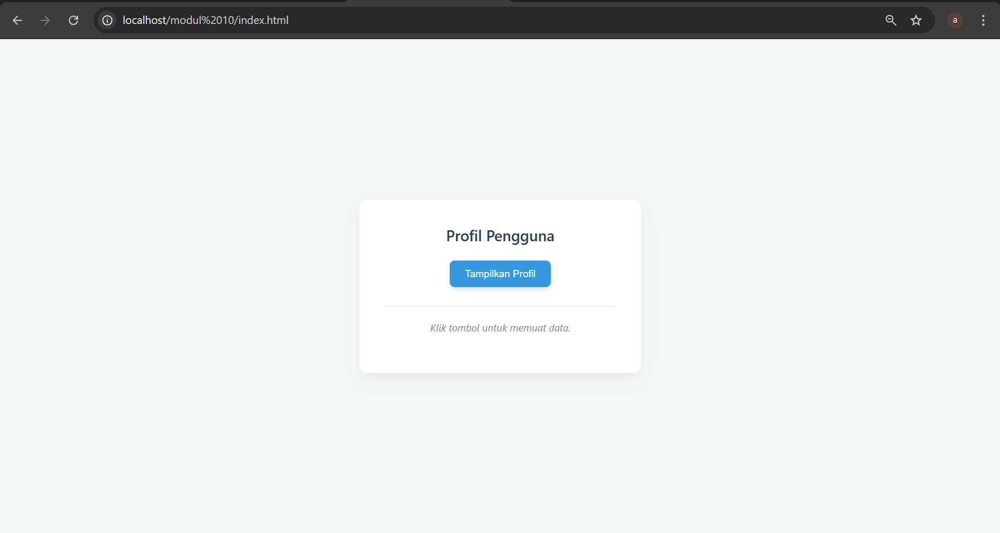
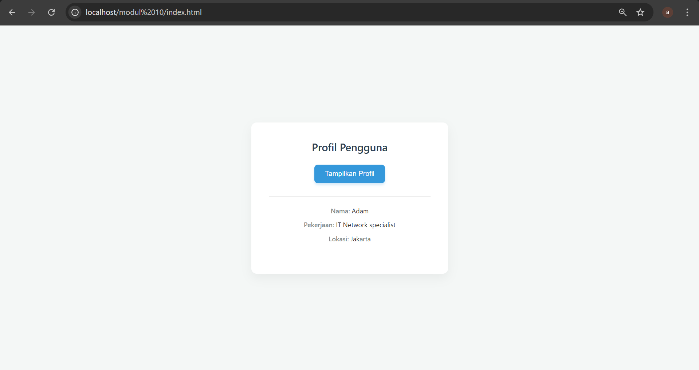

<div align="center">
  <br />
  <h1>LAPORAN PRAKTIKUM <br>APLIKASI BERBASIS PLATFORM</h1>
  <br />
  <h3>MODUL 10 <br> AJAX</h3>
  <br />
  <br />
   
  <br />
  <br />
  <br />
  <br />
  <h3>Disusun Oleh :</h3>
  <p>
    <strong>Syamsul Adam</strong><br>
    <strong>2311102144</strong><br>
    <strong>S1 IF-11-REG01</strong>
  </p>
  <br />
  <br />
  <h3>Dosen Pengampu :</h3>
  <p>
    <strong>Dimas Fanny Hebrasianto Permadi, S.ST., M.Kom</strong>
  </p>
  <br />
  <br />
    <h4>Asisten Praktikum :</h4>
    <strong> Apri Pandu Wicaksono </strong> <br>
    <strong>Rangga Pradarrell Fathi</strong>
  <br />
  <h3>LABORATORIUM HIGH PERFORMANCE
 <br>FAKULTAS INFORMATIKA <br>UNIVERSITAS TELKOM PURWOKERTO <br>2026</h3>
</div>

---

## 1. Dasar Teori

Modul ini merupakan simulasi interaksi antara Client-Side (sisi pengguna) dan Server-Side (sisi server) untuk menampilkan data secara dinamis. Fokus utamanya adalah menerapkan teknik AJAX (Asynchronous JavaScript and XML), yang memungkinkan sebuah halaman web untuk memperbarui informasi tanpa harus melakukan muat ulang (reload) secara keseluruhan.

Tujuan Pembelajaran
- Arsitektur Client-Server: Memahami bagaimana browser mengirimkan permintaan (request) dan bagaimana server memberikan tanggapan (response).

- Pertukaran Data JSON: Mengimplementasikan format JSON sebagai standar pertukaran data yang ringan dan universal.

- Pemrograman Asinkron: Menggunakan JavaScript modern (Fetch API) untuk menangani proses pengambilan data di latar belakang.

- Manipulasi DOM: Belajar menyuntikkan data mentah dari server ke dalam struktur HTML agar tampil estetis bagi pengguna.

Komponen Utama
- Backend (PHP): Berperan sebagai API sederhana yang mengolah data (dalam hal ini berupa array) dan mengubahnya menjadi format JSON menggunakan fungsi json_encode().

- Frontend (HTML & CSS): Menyediakan antarmuka pengguna yang bersih dan responsif, menggunakan container minimalis dan tipografi modern.

- Logic (JavaScript): Bertindak sebagai jembatan yang melakukan pemanggilan data ke server, menangani status loading, serta memperbarui tampilan secara instan setelah data diterima.

### Kode PHP

```PHP
<?php
// Memberitahu browser bahwa konten yang dikirim adalah JSON
header('Content-Type: application/json');

// Database sederhana berupa array
$data = [
    'nama' => 'Adam',
    'pekerjaan' => 'IT Network specialist',
    'lokasi' => 'Jakarta'
];

// Mengubah array PHP menjadi string JSON
echo json_encode($data);
?>
```
### Penjelasan Kode:
```
Kode PHP ini berfungsi sebagai API Endpoint sederhana yang bertugas menyiapkan dan mengirimkan data dari server ke sisi klien dalam format JSON. Melalui instruksi header('Content-Type: application/json'), server memberi tahu browser bahwa informasi yang dikirimkan adalah data terstruktur, bukan halaman HTML biasa, sementara fungsi json_encode() berperan mengonversi array PHP berisi profil Anda sebagai IT Network Specialist menjadi format string yang ringan dan universal. Proses ini memungkinkan pertukaran data yang efisien dan cepat, sehingga aplikasi sisi klien (seperti JavaScript) dapat menangkap dan mengolah informasi tersebut secara instan tanpa perlu memuat ulang seluruh halaman web.
```

### Kode PHP
```html
<!DOCTYPE html>
<html lang="id">
<head>
    <meta charset="UTF-8">
    <meta name="viewport" content="width=device-width, initial-scale=1.0">
    <title>Ambil Data JSON</title>
    <style>
        body { font-family: sans-serif; padding: 20px; }
        #hasil-profil { 
            margin-top: 15px; 
            padding: 10px; 
            border: 1px solid #ddd; 
            display: inline-block;
            min-width: 200px;
        }
        button { cursor: pointer; padding: 8px 16px; }
    </style>
</head>
<body>

    <h2>Profil Pengguna</h2>
    <button id="btn-tampil">Tampilkan Profil</button>

    <div id="hasil-profil">Data akan muncul di sini...</div>

    <script>
        document.getElementById('btn-tampil').addEventListener('click', function() {
            // Mengambil data dari data.php
            fetch('data.php')
                .then(response => {
                    // Cek apakah request berhasil
                    if (!response.ok) {
                        throw new Error('Gagal mengambil data');
                    }
                    return response.json(); // Mengubah response menjadi objek JS
                })
                .then(data => {
                    // Menampilkan data ke dalam elemen HTML
                    const wadah = document.getElementById('hasil-profil');
                    wadah.innerHTML = `Nama: ${data.nama} | Pekerjaan: ${data.pekerjaan} | Lokasi: ${data.lokasi}`;
                })
                .catch(error => {
                    console.error('Terjadi kesalahan:', error);
                    document.getElementById('hasil-profil').innerText = "Gagal memuat data.";
                });
        });
    </script>

</body>
</html>
```
### Penjelasan code:
```
Kode HTML ini berfungsi sebagai antarmuka pengguna (client-side) yang menggunakan Fetch API untuk melakukan permintaan data asinkron ke server tanpa memicu pemuatan ulang halaman. Saat tombol diklik, JavaScript akan mengirimkan sinyal ke data.php, memproses respons sukses dalam format JSON, lalu melakukan manipulasi DOM untuk menampilkan informasi profil secara instan ke dalam elemen <div>. Dengan adanya penanganan galat (error handling) melalui blok .catch(), kode ini memastikan bahwa pengguna tetap mendapatkan informasi meskipun terjadi kegagalan koneksi atau data tidak ditemukan, menciptakan pengalaman pengguna yang mulus dan interaktif.
```
### Hasil Tampilan (Screenshot)





## Refrensi

- [Materi Praktikum](https://drive.google.com/file/d/1J27NhEO2MbOF9DetZmOtEGAcPkczzm1r/view?usp=sharing)
