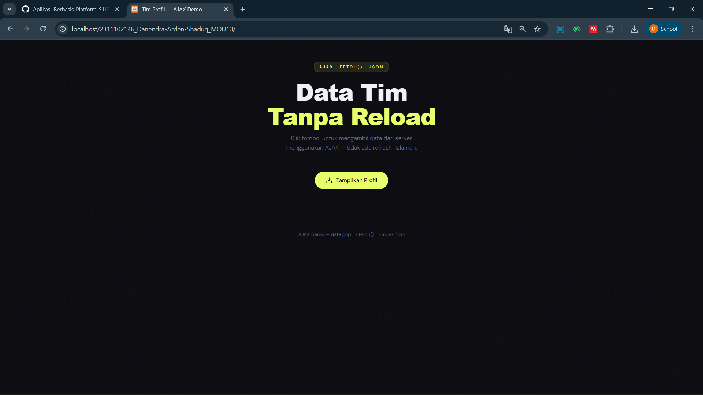
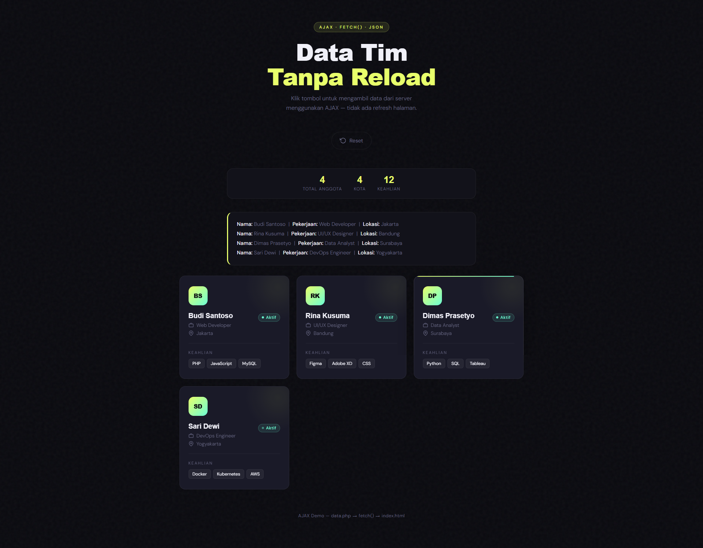

<div align="center">
  <br />
  <h1>LAPORAN PRAKTIKUM <br>APLIKASI BERBASIS PLATFORM</h1>
  <br />
  <h3> MODUL 10 <br> AJAX </h3>
  <br />
   
  <br />
  <br />
  <br />
  <h3>Disusun Oleh :</h3>
  <p>
    <strong>Danendra Arden Shaduq</strong><br>
    <strong>2311102146</strong><br>
    <strong>S1 IF-11-01</strong>
  </p>
  <br />
  <h3>Dosen Pengampu :</h3>
  <p>
    <strong>Dimas Fanny Hebrasianto Permadi, S.ST., M.Kom</strong>
  </p>
  <br />
  <br />
    <h4>Asisten Praktikum :</h4>
    <strong> Apri Pandu Wicaksono </strong> <br>
    <strong>Rangga Pradarrell Fathi</strong>
  <br />
  <h3>LABORATORIUM HIGH PERFORMANCE
 <br>FAKULTAS INFORMATIKA <br>UNIVERSITAS TELKOM PURWOKERTO <br>2026</h3>
</div>

---

## 1. Dasar Teori

AJAX  (Asynchronous JavaScript  and XML), adalah  suatu teknik  pemrograman  berbasis  web  untuk menciptakan aplikasi web di mana data yang dikirimkan secara asynchronousdapat berupa sebuah plain text  ataupun  dalam  format  XML.  AJAX  merupakan  kombinasi  dari  HTMLdan  CSS  untuk  bahasa markup  dan  tampilan.  Untuk  mengaplikasikan  AJAX  dalam  website,  yang  dibutuhkan  adalah  browser yang menyediakan layanan Javascript, dan komponen XMLHTTP bagi pengguna Internet Explorer (IE), dan XMLHttpRequest untuk Firefox, Safary, Opera dan browser lainnya.

Tujuan  dari  AJAX adalah  untuk  memindahkan  sebagian  besar  interaksi  pada  komputer  web  surfer, sehingga  website  menjadi  seperti  aplikasi  desktop  dan  website  dapat    di-update  sambil  tetap  membaca informasi yang ada pada website tersebut, karena pertukaran data dengan server dilakukan belakang layar, maka halaman web tidak harus dibaca ulang secara keseluruhan setiap kali user melakukan perubahan. ini akan meningkatkan interaktivitas, kecepatan, dan usability.

Pada umumnya dalam membangun aplikasi web, terdapat dua metode yang paling umum digunakan yaitu  metode GET,  yaitu  mengambil  data  dari  server  yang  selanjutnya  data  tersebut  ditampilkan  di browser,  dan  metode  POST,  yaitu  pengiriman  data  terpisah  (2  koneksi).  Jika  data  yang  mau  dikirimkan panjang,  maka  harus  menggunakan  metode  POST  karena  metode  GET  panjang  maksimalnya  256 karakter.  Kedua  metode  ini  akan  dijalankan  pada  saat  fungsi  open  pada  object  XMLHttpRequest dipanggil.  Pada  intinya  AJAX  itu  merupakan  gabungan  beberapa  teknologi  yang  bertujuan  untuk menghindari page  reload.  Dengan  menghindari page  reload,  kita  dapat  menghindari  paradigma click-and-waitserta memberikan sebuah fitur yang cukup kompleks pada website.Gambar 2.1. Ilustrasi Proses Kerja AJAX2.2.Pengertian Aplikasi WEBSeiring  dengan  perkembangan  internet  pada awal  tahun  1990-an  dan  di temukannya  HTTP  (Hyper Text Transfer Protokol) yang digunakan untuk mengirimkan data di internet, sejak itulah sejarah aplikasi web dimulai. Pada waktu itu tipe dokumen standar yang digunakan di internet adalah HTML (Hyper Text Markup  Language).  HTML  adalah  sebuah  bahasa  markup  yang  digunakan  untuk  membuat  sebuah halaman  web  dan  menampilkan  berbagai  informasi  di  dalam  sebuah  browser  (Sebuah  perangkat  lunak yang  berfungsi  menampilkan  dan  melakukan  interaksi  dengan  dokumen-dokumen  yang  disediakan  oleh webserver). HTML tidak dirancang untuk membuat sebuah aplikasi web  yang komplek melainkan hanya untuk menampilkan content dan formatnya dalam bentuk text dan image dalam bentuk yang statis.“Implementasi Ajax Pada Aplikasi Index Artikel Berbasis Web”

## 2. Sourcecode 

### Sourcecode data.php
``` PHP
<?php
// Set header agar browser tahu respons berformat JSON
header('Content-Type: application/json');
header('Access-Control-Allow-Origin: *'); // Izinkan request dari semua origin (untuk development)

// Simulasi "database" sederhana berupa array PHP
$profil = [
    [
        'nama'      => 'Budi Santoso',
        'pekerjaan' => 'Web Developer',
        'lokasi'    => 'Jakarta',
        'avatar'    => 'BS',
        'keahlian'  => ['PHP', 'JavaScript', 'MySQL'],
        'status'    => 'Aktif'
    ],
    [
        'nama'      => 'Rina Kusuma',
        'pekerjaan' => 'UI/UX Designer',
        'lokasi'    => 'Bandung',
        'avatar'    => 'RK',
        'keahlian'  => ['Figma', 'Adobe XD', 'CSS'],
        'status'    => 'Aktif'
    ],
    [
        'nama'      => 'Dimas Prasetyo',
        'pekerjaan' => 'Data Analyst',
        'lokasi'    => 'Surabaya',
        'avatar'    => 'DP',
        'keahlian'  => ['Python', 'SQL', 'Tableau'],
        'status'    => 'Aktif'
    ],
    [
        'nama'      => 'Sari Dewi',
        'pekerjaan' => 'DevOps Engineer',
        'lokasi'    => 'Yogyakarta',
        'avatar'    => 'SD',
        'keahlian'  => ['Docker', 'Kubernetes', 'AWS'],
        'status'    => 'Aktif'
    ]
];

// Ubah array PHP menjadi format JSON lalu tampilkan
echo json_encode([
    'success' => true,
    'total'   => count($profil),
    'data'    => $profil
], JSON_PRETTY_PRINT | JSON_UNESCAPED_UNICODE);
?>
```

### Sourcecode index.html
``` HTML
<!DOCTYPE html>
<html lang="id">
<head>
  <meta charset="UTF-8" />
  <meta name="viewport" content="width=device-width, initial-scale=1.0"/>
  <title>Tim Profil — AJAX Demo</title>

  <!-- Google Fonts: Syne (display) + DM Sans (body) -->
  <link rel="preconnect" href="https://fonts.googleapis.com"/>
  <link rel="preconnect" href="https://fonts.gstatic.com" crossorigin/>
  <link href="https://fonts.googleapis.com/css2?family=Syne:wght@700;800&family=DM+Sans:wght@300;400;500&display=swap" rel="stylesheet"/>

  <style>
    /* ── CSS Variables ──────────────────────────────────── */
    :root {
      --bg:        #0a0a0f;
      --surface:   #12121a;
      --card:      #1a1a28;
      --accent:    #e8ff6b;
      --accent2:   #6bffd4;
      --text:      #f0f0f8;
      --muted:     #6b6b88;
      --border:    rgba(255,255,255,0.06);
      --radius:    16px;
      --font-head: 'Poppins', sans-serif;
      --font-body: 'DM Sans', sans-serif;
    }

    /* ── Reset & Base ───────────────────────────────────── */
    *, *::before, *::after { box-sizing: border-box; margin: 0; padding: 0; }

    body {
      background: var(--bg);
      color: var(--text);
      font-family: var(--font-body);
      font-weight: 300;
      min-height: 100vh;
      display: flex;
      flex-direction: column;
      align-items: center;
      padding: 60px 24px 80px;
      /* Noise texture overlay */
      background-image: url("data:image/svg+xml,%3Csvg viewBox='0 0 200 200' xmlns='http://www.w3.org/2000/svg'%3E%3Cfilter id='n'%3E%3CfeTurbulence type='fractalNoise' baseFrequency='0.9' numOctaves='4' stitchTiles='stitch'/%3E%3C/filter%3E%3Crect width='100%25' height='100%25' filter='url(%23n)' opacity='0.04'/%3E%3C/svg%3E");
    }

    /* ── Header ─────────────────────────────────────────── */
    header {
      text-align: center;
      margin-bottom: 52px;
      position: relative;
    }

    .label {
      display: inline-block;
      font-size: 11px;
      font-weight: 500;
      letter-spacing: 3px;
      text-transform: uppercase;
      color: var(--accent);
      background: rgba(232,255,107,0.1);
      border: 1px solid rgba(232,255,107,0.25);
      padding: 6px 14px;
      border-radius: 100px;
      margin-bottom: 20px;
    }

    h1 {
      font-family: var(--font-head);
      font-size: clamp(2.4rem, 5vw, 4rem);
      font-weight: 800;
      line-height: 1.05;
      letter-spacing: -0.02em;
    }

    h1 span {
      color: var(--accent);
      position: relative;
    }

    .subtitle {
      margin-top: 14px;
      color: var(--muted);
      font-size: 1rem;
      max-width: 400px;
      margin-left: auto;
      margin-right: auto;
      line-height: 1.6;
    }

    /* ── Button ─────────────────────────────────────────── */
    .btn-wrap {
      display: flex;
      gap: 12px;
      justify-content: center;
      margin-bottom: 52px;
    }

    #btn-tampilkan {
      position: relative;
      display: flex;
      align-items: center;
      gap: 10px;
      background: var(--accent);
      color: #0a0a0f;
      border: none;
      font-family: var(--font-body);
      font-size: 0.95rem;
      font-weight: 500;
      padding: 14px 30px;
      border-radius: 100px;
      cursor: pointer;
      transition: transform 0.18s ease, box-shadow 0.18s ease, background 0.18s ease;
      box-shadow: 0 0 0 0 rgba(232,255,107,0);
      overflow: hidden;
    }

    #btn-tampilkan::before {
      content: '';
      position: absolute;
      inset: 0;
      background: rgba(255,255,255,0.15);
      opacity: 0;
      transition: opacity 0.2s;
      border-radius: inherit;
    }

    #btn-tampilkan:hover {
      transform: translateY(-2px);
      box-shadow: 0 0 32px rgba(232,255,107,0.4);
    }

    #btn-tampilkan:hover::before { opacity: 1; }

    #btn-tampilkan:active { transform: translateY(0); }

    #btn-tampilkan:disabled {
      opacity: 0.6;
      cursor: not-allowed;
      transform: none;
    }

    #btn-reset {
      display: none;
      align-items: center;
      gap: 8px;
      background: transparent;
      color: var(--muted);
      border: 1px solid var(--border);
      font-family: var(--font-body);
      font-size: 0.9rem;
      padding: 14px 22px;
      border-radius: 100px;
      cursor: pointer;
      transition: all 0.2s ease;
    }

    #btn-reset:hover {
      color: var(--text);
      border-color: rgba(255,255,255,0.2);
    }

    /* ── Icon SVGs ──────────────────────────────────────── */
    .icon { width: 18px; height: 18px; flex-shrink: 0; }

    /* ── Loading Spinner ────────────────────────────────── */
    #loading {
      display: none;
      flex-direction: column;
      align-items: center;
      gap: 14px;
      color: var(--muted);
      font-size: 0.9rem;
    }

    .spinner {
      width: 36px; height: 36px;
      border: 2px solid var(--border);
      border-top-color: var(--accent);
      border-radius: 50%;
      animation: spin 0.8s linear infinite;
    }

    @keyframes spin { to { transform: rotate(360deg); } }

    /* ── Error Banner ───────────────────────────────────── */
    #error-msg {
      display: none;
      background: rgba(255, 90, 90, 0.1);
      border: 1px solid rgba(255, 90, 90, 0.25);
      color: #ff8a8a;
      padding: 14px 20px;
      border-radius: var(--radius);
      font-size: 0.9rem;
      text-align: center;
      max-width: 500px;
      width: 100%;
      margin-bottom: 24px;
    }

    /* ── Stats Bar ──────────────────────────────────────── */
    #stats-bar {
      display: none;
      justify-content: center;
      gap: 32px;
      margin-bottom: 36px;
      padding: 18px 28px;
      background: var(--surface);
      border: 1px solid var(--border);
      border-radius: var(--radius);
      width: 100%;
      max-width: 680px;
      animation: fadeUp 0.4s ease;
    }

    .stat-item { text-align: center; }
    .stat-num {
      font-family: var(--font-head);
      font-size: 1.6rem;
      font-weight: 700;
      color: var(--accent);
      line-height: 1;
    }
    .stat-label {
      font-size: 0.75rem;
      letter-spacing: 1px;
      text-transform: uppercase;
      color: var(--muted);
      margin-top: 4px;
    }

    /* ── Card Grid ──────────────────────────────────────── */
    #hasil-profil {
      display: grid;
      grid-template-columns: repeat(auto-fill, minmax(280px, 1fr));
      gap: 20px;
      width: 100%;
      max-width: 940px;
    }

    /* ── Profile Card ───────────────────────────────────── */
    .card {
      background: var(--card);
      border: 1px solid var(--border);
      border-radius: var(--radius);
      padding: 28px 24px;
      position: relative;
      overflow: hidden;
      cursor: default;
      transition: transform 0.22s ease, border-color 0.22s ease, box-shadow 0.22s ease;
      opacity: 0;
      animation: fadeUp 0.5s ease forwards;
    }

    .card:nth-child(1) { animation-delay: 0.05s; }
    .card:nth-child(2) { animation-delay: 0.12s; }
    .card:nth-child(3) { animation-delay: 0.19s; }
    .card:nth-child(4) { animation-delay: 0.26s; }

    @keyframes fadeUp {
      from { opacity: 0; transform: translateY(18px); }
      to   { opacity: 1; transform: translateY(0); }
    }

    .card::before {
      content: '';
      position: absolute;
      top: 0; left: 0; right: 0;
      height: 2px;
      background: linear-gradient(90deg, var(--accent), var(--accent2));
      transform: scaleX(0);
      transform-origin: left;
      transition: transform 0.3s ease;
    }

    .card:hover {
      transform: translateY(-4px);
      border-color: rgba(255,255,255,0.12);
      box-shadow: 0 20px 60px rgba(0,0,0,0.4);
    }

    .card:hover::before { transform: scaleX(1); }

    /* Glow blob */
    .card-glow {
      position: absolute;
      width: 180px; height: 180px;
      border-radius: 50%;
      background: radial-gradient(circle, rgba(232,255,107,0.07) 0%, transparent 70%);
      top: -60px; right: -60px;
      pointer-events: none;
    }

    /* Avatar */
    .avatar {
      width: 52px; height: 52px;
      border-radius: 14px;
      background: linear-gradient(135deg, var(--accent), var(--accent2));
      display: flex; align-items: center; justify-content: center;
      font-family: var(--font-head);
      font-size: 1rem;
      font-weight: 800;
      color: #0a0a0f;
      margin-bottom: 18px;
      letter-spacing: -0.5px;
    }

    /* Status dot */
    .status-dot {
      display: inline-flex;
      align-items: center;
      gap: 6px;
      font-size: 0.72rem;
      font-weight: 500;
      letter-spacing: 0.5px;
      color: #6bffd4;
      background: rgba(107,255,212,0.1);
      border: 1px solid rgba(107,255,212,0.2);
      padding: 3px 9px;
      border-radius: 100px;
      float: right;
      margin-top: 4px;
    }

    .status-dot::before {
      content: '';
      width: 6px; height: 6px;
      border-radius: 50%;
      background: #6bffd4;
      animation: pulse 2s ease-in-out infinite;
    }

    @keyframes pulse {
      0%, 100% { opacity: 1; }
      50% { opacity: 0.4; }
    }

    .card-name {
      font-family: var(--font-head);
      font-size: 1.2rem;
      font-weight: 700;
      margin-bottom: 6px;
      letter-spacing: -0.01em;
    }

    .card-meta {
      display: flex;
      flex-direction: column;
      gap: 5px;
      margin-bottom: 18px;
    }

    .card-meta-row {
      display: flex;
      align-items: center;
      gap: 8px;
      font-size: 0.85rem;
      color: var(--muted);
    }

    .card-meta-row svg { flex-shrink: 0; }

    .divider {
      height: 1px;
      background: var(--border);
      margin: 18px 0;
    }

    .skills-label {
      font-size: 0.7rem;
      letter-spacing: 2px;
      text-transform: uppercase;
      color: var(--muted);
      margin-bottom: 10px;
    }

    .skills {
      display: flex;
      flex-wrap: wrap;
      gap: 6px;
    }

    .skill-tag {
      font-size: 0.75rem;
      padding: 4px 10px;
      border-radius: 6px;
      background: rgba(255,255,255,0.05);
      border: 1px solid var(--border);
      color: var(--text);
      font-weight: 400;
      transition: background 0.2s, border-color 0.2s;
    }

    .card:hover .skill-tag {
      background: rgba(232,255,107,0.07);
      border-color: rgba(232,255,107,0.2);
    }

    /* ── Info text sederhana (format teks biasa) ──────── */
    #info-text {
      display: none;
      background: var(--surface);
      border: 1px solid var(--border);
      border-left: 3px solid var(--accent);
      border-radius: var(--radius);
      padding: 20px 24px;
      font-size: 0.9rem;
      color: var(--muted);
      line-height: 1.8;
      max-width: 680px;
      width: 100%;
      margin-bottom: 28px;
      animation: fadeUp 0.4s ease;
    }

    #info-text strong { color: var(--text); font-weight: 500; }

    /* ── Footer ─────────────────────────────────────────── */
    footer {
      margin-top: 64px;
      font-size: 0.78rem;
      color: var(--muted);
      text-align: center;
      letter-spacing: 0.5px;
    }

    /* ── Responsive ─────────────────────────────────────── */
    @media (max-width: 500px) {
      #stats-bar { gap: 20px; flex-wrap: wrap; }
    }
  </style>
</head>
<body>

  <!-- ── Header ─────────────────────────────────── -->
  <header>
    <div class="label">AJAX · fetch() · JSON</div>
    <h1>Data Tim<br/><span>Tanpa Reload</span></h1>
    <p class="subtitle">Klik tombol untuk mengambil data dari server menggunakan AJAX — tidak ada refresh halaman.</p>
  </header>

  <!-- ── Tombol Aksi ─────────────────────────────── -->
  <div class="btn-wrap">
    <button id="btn-tampilkan">
      <!-- Icon fetch/download -->
      <svg class="icon" viewBox="0 0 24 24" fill="none" stroke="currentColor" stroke-width="2.2" stroke-linecap="round" stroke-linejoin="round">
        <path d="M21 15v4a2 2 0 01-2 2H5a2 2 0 01-2-2v-4"/>
        <polyline points="7 10 12 15 17 10"/>
        <line x1="12" y1="15" x2="12" y2="3"/>
      </svg>
      Tampilkan Profil
    </button>
    <button id="btn-reset">
      <!-- Icon reset -->
      <svg class="icon" viewBox="0 0 24 24" fill="none" stroke="currentColor" stroke-width="2" stroke-linecap="round" stroke-linejoin="round">
        <polyline points="1 4 1 10 7 10"/>
        <path d="M3.51 15a9 9 0 102.13-9.36L1 10"/>
      </svg>
      Reset
    </button>
  </div>

  <!-- ── Loading ─────────────────────────────────── -->
  <div id="loading">
    <div class="spinner"></div>
    <span>Mengambil data dari server…</span>
  </div>

  <!-- ── Error ───────────────────────────────────── -->
  <div id="error-msg"></div>

  <!-- ── Stats Bar ───────────────────────────────── -->
  <div id="stats-bar">
    <div class="stat-item">
      <div class="stat-num" id="stat-total">0</div>
      <div class="stat-label">Total Anggota</div>
    </div>
    <div class="stat-item">
      <div class="stat-num" id="stat-kota">—</div>
      <div class="stat-label">Kota</div>
    </div>
    <div class="stat-item">
      <div class="stat-num" id="stat-keahlian">0</div>
      <div class="stat-label">Keahlian</div>
    </div>
  </div>

  <!-- ── Format Teks Sederhana (sesuai instruksi) ── -->
  <div id="info-text"></div>

  <!-- ── Card Grid ───────────────────────────────── -->
  <div id="hasil-profil"></div>

  <!-- ── Footer ─────────────────────────────────── -->
  <footer>AJAX Demo &mdash; data.php &rarr; fetch() &rarr; index.html</footer>

  <!-- ================================================================
       JAVASCRIPT — LOGIKA AJAX
       ================================================================ -->
  <script>
    // ── Referensi elemen DOM ──────────────────────────────
    const btnTampilkan = document.getElementById('btn-tampilkan');
    const btnReset     = document.getElementById('btn-reset');
    const loading      = document.getElementById('loading');
    const errorMsg     = document.getElementById('error-msg');
    const statsBar     = document.getElementById('stats-bar');
    const infoText     = document.getElementById('info-text');
    const hasilProfil  = document.getElementById('hasil-profil');

    // ── Fungsi: tampilkan state loading ──────────────────
    function setLoading(aktif) {
      loading.style.display       = aktif ? 'flex' : 'none';
      btnTampilkan.disabled       = aktif;
    }

    // ── Fungsi: tampilkan pesan error ────────────────────
    function tampilkanError(pesan) {
      errorMsg.style.display = 'block';
      errorMsg.textContent   = '⚠ ' + pesan;
    }

    // ── Fungsi: reset semua tampilan ─────────────────────
    function reset() {
      hasilProfil.innerHTML      = '';
      infoText.style.display     = 'none';
      statsBar.style.display     = 'none';
      errorMsg.style.display     = 'none';
      btnReset.style.display     = 'none';
      btnTampilkan.style.display = 'flex';
    }

    // ── Fungsi: buat card HTML dari data satu profil ─────
    function buatKartu(profil) {
      const keahlianHTML = profil.keahlian
        .map(k => `<span class="skill-tag">${k}</span>`)
        .join('');

      return `
        <div class="card">
          <div class="card-glow"></div>
          <div class="avatar">${profil.avatar}</div>
          <span class="status-dot">${profil.status}</span>
          <div class="card-name">${profil.nama}</div>
          <div class="card-meta">
            <div class="card-meta-row">
              <!-- icon briefcase -->
              <svg width="14" height="14" viewBox="0 0 24 24" fill="none" stroke="currentColor" stroke-width="2" stroke-linecap="round" stroke-linejoin="round">
                <rect x="2" y="7" width="20" height="14" rx="2"/><path d="M16 7V5a2 2 0 00-2-2h-4a2 2 0 00-2 2v2"/>
              </svg>
              ${profil.pekerjaan}
            </div>
            <div class="card-meta-row">
              <!-- icon map-pin -->
              <svg width="14" height="14" viewBox="0 0 24 24" fill="none" stroke="currentColor" stroke-width="2" stroke-linecap="round" stroke-linejoin="round">
                <path d="M21 10c0 7-9 13-9 13S3 17 3 10a9 9 0 0118 0z"/><circle cx="12" cy="10" r="3"/>
              </svg>
              ${profil.lokasi}
            </div>
          </div>
          <div class="divider"></div>
          <div class="skills-label">Keahlian</div>
          <div class="skills">${keahlianHTML}</div>
        </div>
      `;
    }

    // ── Fungsi: format teks satu baris (sesuai instruksi) ─
    function formatTeksSederhana(data) {
      return data.map(p =>
        `<strong>Nama:</strong> ${p.nama} &nbsp;|&nbsp; <strong>Pekerjaan:</strong> ${p.pekerjaan} &nbsp;|&nbsp; <strong>Lokasi:</strong> ${p.lokasi}`
      ).join('<br/>');
    }

    // ── AJAX utama menggunakan fetch() ───────────────────
    async function ambilDataProfil() {
      // Reset tampilan sebelumnya
      reset();

      setLoading(true);

      try {
        /*
         * fetch() mengirim HTTP GET ke data.php
         * Ganti URL berikut jika data.php ada di subfolder, misalnya:
         *   './api/data.php'
         */
        const response = await fetch('data.php');

        // Cek apakah HTTP status OK (200-299)
        if (!response.ok) {
          throw new Error(`HTTP Error: ${response.status} ${response.statusText}`);
        }

        // Parse body response sebagai JSON
        const hasil = await response.json();

        // Validasi struktur JSON
        if (!hasil.success || !Array.isArray(hasil.data)) {
          throw new Error('Format data dari server tidak valid.');
        }

        const profils = hasil.data;

        // ── Tampilkan format teks sederhana (sesuai instruksi) ──
        infoText.innerHTML      = formatTeksSederhana(profils);
        infoText.style.display  = 'block';

        // ── Tampilkan stats bar ──────────────────────────
        const kotaUnik   = [...new Set(profils.map(p => p.lokasi))].length;
        const totalSkill = profils.reduce((acc, p) => acc + p.keahlian.length, 0);

        document.getElementById('stat-total').textContent    = hasil.total;
        document.getElementById('stat-kota').textContent     = kotaUnik;
        document.getElementById('stat-keahlian').textContent = totalSkill;
        statsBar.style.display = 'flex';

        // ── Render kartu profil ──────────────────────────
        hasilProfil.innerHTML = profils.map(buatKartu).join('');

        // Tampilkan tombol reset, sembunyikan tombol tampilkan
        btnReset.style.display     = 'flex';
        btnTampilkan.style.display = 'none';

      } catch (err) {
        // Tangani error network / parsing / validasi
        tampilkanError(err.message);
        console.error('[AJAX Error]', err);
      } finally {
        // Selalu hentikan loading meskipun error
        setLoading(false);
      }
    }

    // ── Event Listeners ──────────────────────────────────
    btnTampilkan.addEventListener('click', ambilDataProfil);
    btnReset.addEventListener('click', reset);
  </script>

</body>
</html>
```


## 3. Penjelasan Implementasi 
Tampilan Website
**BEFORE**

**AFTER**


Berikut adalah penjelasan cara kerja program tersebut, disusun menyerupai format dan gaya bahasa dari contoh yang Anda berikan:

Pada bagian server, file `data.php` berfungsi sebagai penyedia data yang menyerupai database sederhana. Di dalam file ini:
- Pertama-tama, ditambahkan `header('Content-Type: application/json')` yang bertujuan untuk memberi tahu browser bahwa data yang dikirimkan memiliki format JSON. Ditambahkan pula header `Access-Control-Allow-Origin: *` untuk mengizinkan *request* lintas domain (CORS) yang sangat berguna selama proses *development*.
- Kedua, dibuat sebuah array asosiatif bernama `$profil` yang berisi sekumpulan data tim secara terperinci, meliputi nama, pekerjaan, lokasi, avatar, daftar keahlian (dalam bentuk array bertingkat), dan status aktif. Array ini merepresentasikan kumpulan data yang biasanya diambil dari dalam sebuah tabel database.
- Setelah data didefinisikan, array tersebut dibungkus kembali ke dalam struktur respons yang memberikan informasi status (`success`) dan jumlah data (`total`). Kemudian, fungsi `json_encode()` digunakan untuk mengubah keseluruhan array PHP tersebut menjadi format JSON menggunakan *flag* tambahan (`JSON_PRETTY_PRINT | JSON_UNESCAPED_UNICODE`) agar lebih rapi dan aman untuk diproses oleh JavaScript. Hasil konversi tersebut dikirimkan ke *client* menggunakan perintah `echo`.

Pada sisi client, file `index.html` berperan sebagai antarmuka pengguna interaktif yang mengelola dan menampilkan data. 
- Halaman ini dilengkapi dengan tombol interaksi "Tampilkan Profil" yang digunakan untuk memicu proses pengambilan data dari server secara AJAX, serta tombol "Reset" untuk mengosongkan layar kembali. Disediakan pula beberapa area tampilan spesifik seperti `<div id="stats-bar">` untuk statistik data, `<div id="info-text">` untuk ringkasan teks, dan `<div id="hasil-profil">` sebagai kontainer *grid* kartu profil.

- Lalu, ketika tombol "Tampilkan Profil" diklik, JavaScript akan menjalankan fungsi *asynchronous* `ambilDataProfil()`. Di dalam proses tersebut, sebuah *loading spinner* dimunculkan terlebih dahulu sebagai indikator visual kepada pengguna bahwa pengambilan data sedang berlangsung. Selanjutnya, digunakan fungsi `fetch()` untuk mengirim permintaan HTTP GET ke file `data.php` tanpa perlu me-reload halaman (*asynchronous*). Setelah server merespons dengan status OK, *body response* tersebut diubah menjadi format objek JavaScript menggunakan method `.json()`.

- Data yang telah divalidasi kemudian diproses secara reaktif di sisi *client*. Data diolah untuk menampilkan tiga hal sekaligus: 
  1. Menghasilkan teks sederhana berisi nama, pekerjaan, dan lokasi (`#info-text`).
  2. Melakukan kalkulasi logika `reduce` dan `Set` untuk menampilkan statistik jumlah kota unik dan total keahlian seluruh anggota (`#stats-bar`).
  3. Menggunakan perulangan `.map()` untuk merakit setiap profil menjadi komponen kartu (card) HTML yang kaya akan gaya dan ikon menggunakan *template string*. Seluruh elemen HTML hasil rakitan tersebut lalu dimasukkan sekaligus ke dalam elemen `<div id="hasil-profil">` menggunakan `innerHTML`.

- Selain itu, implementasi ini menunjukkan standar penulisan kode yang kuat dengan menerapkan penanganan *error* menggunakan blok `try...catch...finally`. Apabila terjadi kegagalan jaringan, atau format data JSON dari server tidak sesuai, kesalahan tersebut akan ditangkap oleh blok `catch` dan ditampilkan ke layar pengguna pada elemen `<div id="error-msg">`. Blok `finally` memastikan *loading spinner* akan selalu dimatikan di akhir proses, terlepas dari pengambilan data itu berhasil atau gagal.

## Kesimpulan
Praktikum ini berhasil memenuhi seluruh ketentuan praktikum dengan fitur yang jauh lebih modern dan kompleks. Aplikasi AJAX ini berhasil mengimplementasikan konsep *asynchronous data fetching* menggunakan modern Fetch API dan fungsi `async/await`. Data kompleks berhasil diambil dari server PHP dalam format JSON murni dan langsung diolah oleh *client* untuk menghasilkan ringkasan teks, statistik dinamis, serta UI berbentuk *grid card* interaktif tanpa perlu melakukan *reload* halaman sama sekali. Penggunaan manajemen *state* sederhana (seperti *loading* dan respons *error*), logika manipulasi array (`map`, `reduce`, `Set`), serta manipulasi DOM menunjukkan integrasi aplikasi web dua arah yang sangat baik antara PHP di sisi *backend* dan JavaScript di sisi *frontend*.

## Referensi
[1] Tahir, M. A. (2018). Implementasi Ajax pada Aplikasi Indeks Artikel Berbasis Web. Jurnal Ilmiah Sistem Informasi dan Teknik Informatika (JISTI), 1(2), 60-68. (https://journal.jisti.unipol.ac.id/index.php/jisti/article/view/12)
