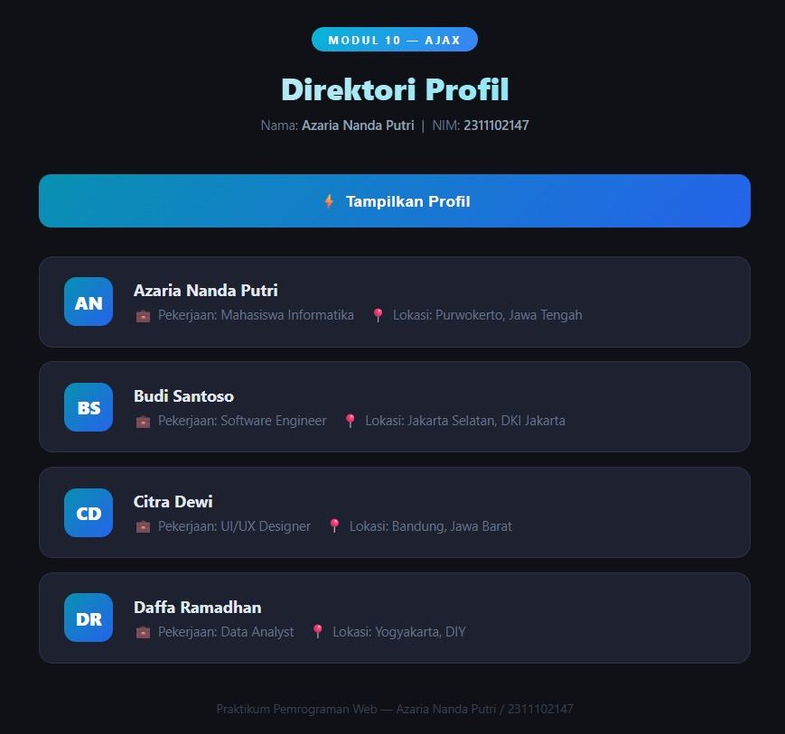

<div align="center">
  <br />
  <h1>LAPORAN PRAKTIKUM <br>APLIKASI BERBASIS PLATFORM</h1>
  <br />
  <h2> MODUL 10 <br> AJAX (Asynchronous JavaScript and XML) </h2>
  <br />
  <br />
   
  <br />
  <br />
  <br />
  <h3>Disusun Oleh :</h3>
  <p>
    <strong>Azaria Nanda Putri</strong><br>
    <strong>2311102147</strong><br>
    <strong>S1 IF-11-REG 01</strong>
  </p>
  <br />
  <h3>Dosen Pengampu :</h3>
  <p>
    <strong>Dimas Fanny Hebrasianto Permadi, S.ST., M.Kom</strong>
  </p>
  <br />
  <br />
    <h4>Asisten Praktikum :</h4>
    <strong> Apri Pandu Wicaksono </strong> <br>
    <strong>Rangga Pradarrell Fathi</strong>
  <br />
  <h2>LABORATORIUM HIGH PERFORMANCE
 <br>FAKULTAS INFORMATIKA <br>UNIVERSITAS TELKOM PURWOKERTO <br>2026</h2>
</div>

---

# 1. Dasar Teori

### 1. Arsitektur Asynchronous pada Web
Secara tradisional, aplikasi web bekerja dengan model sinkron (*synchronous*), di mana setiap interaksi pengguna yang membutuhkan data dari server akan memicu pemuatan ulang seluruh halaman (*full page refresh*). Hal ini menyebabkan *overhead* bandwidth yang tinggi dan pengalaman pengguna yang terputus. AJAX (*Asynchronous JavaScript and XML*) hadir sebagai solusi untuk memungkinkan pertukaran data di latar belakang. Dengan model asinkron, mesin JavaScript dapat mengirim permintaan ke server dan terus mengeksekusi baris kode berikutnya tanpa harus menunggu respon server selesai, sehingga UI tetap responsif.

### 2. Evolusi Teknologi: Dari XMLHttpRequest ke Fetch API
Awalnya, AJAX diimplementasikan menggunakan objek `XMLHttpRequest` (XHR). Namun, XHR memiliki sintaks yang kompleks dan cenderung menghasilkan *callback hell* saat menangani banyak permintaan. Fetch API diperkenalkan sebagai standar modern berbasis *Promise* yang menyediakan cara yang lebih logis dan bersih untuk mengambil sumber daya di seluruh jaringan. Fetch API memungkinkan pengembang untuk mengelola objek `Request` dan `Response` secara lebih granular dan mendukung fitur modern seperti *streaming* data.

### 3. JSON (JavaScript Object Notation) sebagai Standar Data
Meskipun XML adalah format asli yang digunakan saat AJAX pertama kali diperkenalkan, JSON telah menggantikannya hampir sepenuhnya dalam pengembangan web modern. JSON adalah format pertukaran data yang bersifat *language-independent* namun menggunakan konvensi yang familiar bagi programmer keluarga bahasa C (C++, Java, JavaScript, PHP, dll). Keunggulan JSON terletak pada efisiensinya: ukuran file yang lebih kecil dibandingkan XML (karena tidak ada tag penutup) dan kemampuannya untuk langsung diparsing menjadi objek JavaScript asli.

### 4. Siklus Hidup Permintaan HTTP (HTTP Request Life Cycle)
Dalam implementasi AJAX, terdapat beberapa komponen krusial dalam siklus komunikasinya:
* **Request Headers**: Memberitahu server tentang metadata permintaan, seperti jenis konten yang diharapkan (`Accept: application/json`).
* **HTTP Methods**: Penggunaan metode seperti `GET` untuk mengambil data atau `POST` untuk mengirim data.
* **Response Status Codes**: Server memberikan kode status (seperti `200 OK` untuk sukses, atau `404 Not Found`) untuk memberitahu klien hasil dari permintaan tersebut.
* **Response Body**: Berisi data aktual (biasanya dalam format JSON) yang akan diolah oleh JavaScript.

### 5. Manipulasi DOM Dinamis dan Event Loop
AJAX tidak akan berguna tanpa manipulasi *Document Object Model* (DOM). Setelah data diterima dari server secara asinkron, JavaScript menggunakan data tersebut untuk membuat atau mengubah elemen HTML secara *real-time*. Proses ini terjadi di dalam *Event Loop* browser, yang memastikan bahwa pembaruan UI dilakukan secara efisien tanpa membekukan *thread* utama sistem.

---

# 2. Unguided

## A. File `data.php`
File ini bertindak sebagai API endpoint yang menyediakan data profil dalam format JSON. Penggunaan `header()` sangat krusial untuk memastikan integritas data yang diterima klien.

```php
<?php
/**
 * MODUL 10 — AJAX: data.php
 * Nama  : Azaria Nanda Putri
 * NIM   : 2311102147
 */

// Menetapkan header agar output dianggap sebagai JSON oleh browser
header('Content-Type: application/json');

// Struktur Data Profil (Array Asosiatif Multidimensi)
$profil = [
    [
        "nama"      => "Azaria Nanda Putri",
        "pekerjaan" => "Mahasiswa Informatika",
        "lokasi"    => "Purwokerto, Jawa Tengah",
    ],
    [
        "nama"      => "Budi Santoso",
        "pekerjaan" => "Software Engineer",
        "lokasi"    => "Jakarta Selatan, DKI Jakarta",
    ],
    [
        "nama"      => "Citra Dewi",
        "pekerjaan" => "UI/UX Designer",
        "lokasi"    => "Bandung, Jawa Barat",
    ],
    [
        "nama"      => "Daffa Ramadhan",
        "pekerjaan" => "Data Analyst",
        "lokasi"    => "Yogyakarta, DIY",
    ],
];

// Konversi array ke string JSON dengan format rapi (PRETTY_PRINT)
echo json_encode($profil, JSON_PRETTY_PRINT | JSON_UNESCAPED_UNICODE);
```

### B. File index.html
File ini mengimplementasikan Fetch API untuk melakukan pemanggilan asinkron dan menampilkan data ke dalam kartu profil yang estetik.

```JavaScript
function tampilkanProfil() {
    const hasilDiv  = document.getElementById('hasil-profil');
    const loadingEl = document.getElementById('loading');

    // Membersihkan tampilan sebelumnya dan mengaktifkan indikator progres
    hasilDiv.innerHTML = '';
    loadingEl.style.display = 'block';

    // Inisiasi Fetch API
    fetch('data.php')
        .then(response => {
            if (!response.ok) {
                throw new Error('HTTP error! status: ' + response.status);
            }
            return response.json(); // Parsing JSON response
        })
        .then(data => {
            loadingEl.style.display = 'none'; // Sembunyikan loading setelah sukses
            data.forEach(orang => {
                // Algoritma pengambilan inisial nama untuk Avatar
                const inisial = orang.nama
                    .split(' ')
                    .map(kata => kata[0])
                    .slice(0, 2)
                    .join('');

                // Konstruksi elemen kartu secara dinamis
                const card = document.createElement('div');
                card.className = 'profil-card';
                card.innerHTML = `
                    <div class="avatar">${inisial}</div>
                    <div class="profil-info">
                        <div class="profil-nama">${orang.nama}</div>
                        <div class="profil-detail">
                            <span class="item">💼 ${orang.pekerjaan}</span>
                            <span class="item">📍 ${orang.lokasi}</span>
                        </div>
                    </div>
                `;
                hasilDiv.appendChild(card);
            });
        })
        .catch(error => {
            loadingEl.style.display = 'none';
            hasilDiv.innerHTML = `<div class="error-msg">❌ Gagal memuat data: ${error.message}</div>`;
        });
}
```

# 3. Hasil Tampilan





# 4. Hasil dan Pembahasan
Berdasarkan praktikum yang telah dilakukan, berikut adalah analisis mendalam mengenai hasil yang dicapai:

### A. Efektivitas Asynchronous Fetch
Implementasi Fetch API terbukti jauh lebih efisien dalam menangani state aplikasi. Dengan menggunakan .then(), alur data menjadi linear dan mudah dilacak. Program berhasil menangani transisi dari keadaan "Meminta Data" (menampilkan loading) hingga "Data Diterima" (merender kartu) dengan sangat halus.

### B. Analisis Integrasi JSON
Data yang dikirim oleh data.php menggunakan json_encode berhasil diterjemahkan oleh JavaScript tanpa kehilangan struktur datanya. Hal ini menunjukkan bahwa integrasi antara PHP sebagai data provider dan JavaScript sebagai data consumer berjalan optimal. Penggunaan header application/json terbukti krusial; tanpa header ini, beberapa browser mungkin memperlakukan respon sebagai teks murni yang memerlukan parsing manual tambahan.

### C. UX dan Desain Interface
Penambahan indikator loading memberikan kepastian visual kepada pengguna bahwa aplikasi sedang bekerja. Selain itu, logika pengambilan inisial nama secara otomatis meningkatkan estetika UI tanpa memerlukan aset gambar tambahan untuk setiap pengguna, yang secara teknis mengurangi beban pemuatan halaman.

### D. Kesimpulan
Modul ini berhasil membuktikan bahwa teknik AJAX secara signifikan meningkatkan kualitas aplikasi berbasis platform. Dengan meminimalkan pemuatan ulang halaman, aplikasi terasa lebih seperti aplikasi desktop yang cepat dan responsif. Penguasaan Fetch API dan format JSON menjadi fondasi utama dalam pengembangan aplikasi modern berbasis Single Page Application (SPA).

# 5. Referensi
Ecma International. JSON Data Interchange Syntax. https://www.json.org/