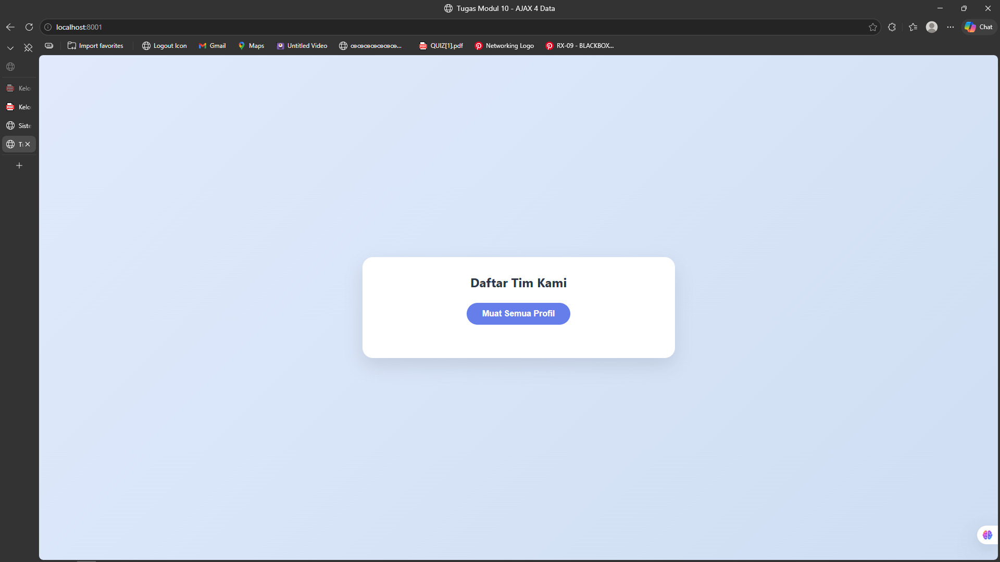
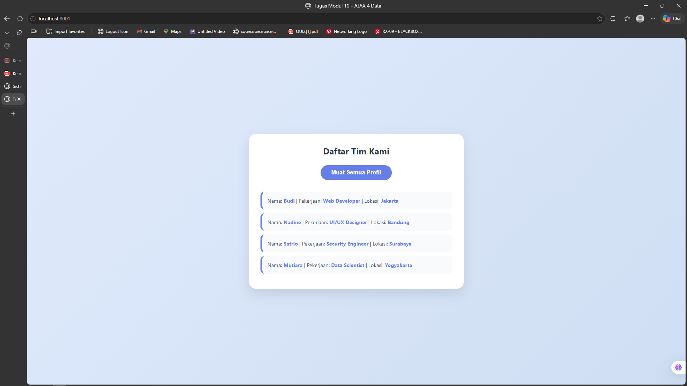

<div align="center">
  <br />
  <h1>LAPORAN PRAKTIKUM <br>APLIKASI BERBASIS PLATFORM</h1>
  <br />
  <h2> MODUL 10 <br> AJAX (Asynchronous JavaScript and XML) </h2>
  <br />
  <br />
   
  <br />
  <br />
  <br />
  <h3>Disusun Oleh :</h3>
  <p>
    <strong>Satrio Wibowo</strong><br>
    <strong>2311102149</strong><br>
    <strong>S1 IF-11-REG 01</strong>
  </p>
  <br />
  <h3>Dosen Pengampu :</h3>
  <p>
    <strong>Dimas Fanny Hebrasianto Permadi, S.ST., M.Kom</strong>
  </p>
  <br />
  <br />
    <h4>Asisten Praktikum :</h4>
    <strong> Apri Pandu Wicaksono </strong> <br>
    <strong>Rangga Pradarrell Fathi</strong>
  <br />
  <h2>LABORATORIUM HIGH PERFORMANCE
 <br>FAKULTAS INFORMATIKA <br>UNIVERSITAS TELKOM PURWOKERTO <br>2026</h2>
</div>

---

## 1. Dasar Teori

**AJAX (Asynchronous JavaScript and XML)** adalah teknik yang memungkinkan halaman web untuk berkomunikasi dengan server secara latar belakang (asynchronously). Dengan AJAX, kita dapat mengambil data dari server dan memperbarui bagian tertentu dari halaman tanpa harus melakukan muat ulang (reload) seluruh halaman secara penuh.  Meskipun namanya mengandung "XML", pada praktiknya saat ini format pertukaran data yang paling umum digunakan adalah JSON (JavaScript Object Notation) karena strukturnya yang ringan dan mudah diproses oleh JavaScript.

Dalam implementasi modern, pengembang cenderung menggunakan Fetch API dibandingkan `XMLHttpRequest`. Fetch API menggunakan sistem Promises, yang membuat penanganan alur data asinkron menjadi lebih bersih dan mudah dibaca.

---

## 2. Implementasi Persyaratan Tugas (Kebutuhan Sistem)

Program ini telah dirancang untuk memenuhi syarat pengambilan data multidimensi dari server dan menampilkannya secara dinamis menggunakan Fetch API.

### 2.1 Membuat File Server (Database Sederhana) dengan PHP

Data disimpan dalam bentuk array multidimensi PHP yang berisi informasi 4 profil anggota tim. File ini bertindak sebagai API sederhana yang mengubah array PHP menjadi string JSON menggunakan `json_encode()`.

```php
<?php
header('Content-Type: application/json');

// Array multidimensi yang berisi 4 data profil
$data = [
    ['nama' => 'Budi', 'pekerjaan' => 'Web Developer', 'lokasi' => 'Jakarta'],
    ['nama' => 'Nadine', 'pekerjaan' => 'UI/UX Designer', 'lokasi' => 'Bandung'],
    ['nama' => 'Satrio', 'pekerjaan' => 'Security Engineer', 'lokasi' => 'Surabaya'],
    ['nama' => 'Mutiara', 'pekerjaan' => 'Data Scientist', 'lokasi' => 'Yogyakarta']
];

echo json_encode($data);
?>
```

### 2.2 Mengambil Data Menggunakan Fetch API (AJAX)

Proses pengambilan data dilakukan saat pengguna mengklik tombol. Program akan menghubungi `data.php`, menerima array JSON, lalu melakukan perulangan (looping) untuk merender setiap item ke dalam DOM.
```javascript
document.getElementById('btn-tampil').addEventListener('click', function() {
    const wadah = document.getElementById('hasil-profil');
    
    fetch('data.php')
        .then(response => response.json())
        .then(data => {
            // Kosongkan wadah sebelum mengisi data baru
            wadah.innerHTML = '';

            // Lakukan perulangan untuk setiap object di dalam array
            data.forEach((item, index) => {
                const div = document.createElement('div');
                div.className = 'profil-item';
                
                // Set delay animasi agar muncul satu per satu (Staggered Animation)
                div.style.animationDelay = `${index * 0.1}s`;

                div.innerHTML = `
                    Nama: <span class="highlight">${item.nama}</span> | 
                    Pekerjaan: <span class="highlight">${item.pekerjaan}</span> | 
                    Lokasi: <span class="highlight">${item.lokasi}</span>
                `;
                
                wadah.appendChild(div);
            });
        })
        .catch(err => {
            wadah.innerHTML = "<p style='color:red;'>Gagal memuat data!</p>";
        });
});
```

### 2.3 Menampilkan Data Profil ke Elemen HTML

Data JSON yang diterima dari server langsung diinjeksikan ke dalam elemen `<div id="hasil-profil">` menggunakan manipulasi DOM (*innerHTML*). Format tampilan mengikuti ketentuan soal, yaitu: **Nama | Pekerjaan | Lokasi**, dengan tambahan styling *class* untuk membedakan state *loaded* dan *error*. *File Referensi: `index.html`*

```javascript
hasil.className = 'loaded';
hasil.innerHTML =
    `<span>Nama:</span> ${data.nama} &nbsp;|&nbsp; ` +
    `<span>Pekerjaan:</span> ${data.pekerjaan} &nbsp;|&nbsp; ` +
    `<span>Lokasi:</span> ${data.lokasi}`;
```

### 2.4 Penanganan State UI (Loading, Loaded, Error)

Sistem ini dirancang untuk memberikan umpan balik visual yang jelas kepada pengguna di setiap tahap proses AJAX:

- **Loading** – Tombol dinonaktifkan (`disabled`) dan teksnya berubah menjadi *"Mengambil data..."* selama proses berlangsung.
- **Loaded** – Class `loaded` ditambahkan ke `#hasil-profil` untuk mengubah warna teks menjadi terang, menandakan data berhasil ditampilkan.
- **Error** – Jika `fetch` gagal (misalnya server tidak tersedia), class `error` diterapkan dan pesan kesalahan ditampilkan dengan warna merah.

```javascript

btn.disabled = true;
hasil.textContent = 'Memuat...';

hasil.className = 'error';
hasil.textContent = '⚠ ' + err.message;

btn.disabled = false;
btn.textContent = 'Tampilkan Profil';
```

---

## 3. Penjelasan Kode Sumber (Struktur File & Arsitektur)

Proyek ini dibuat efisien dengan hanya menggunakan **2 file dasar** sesuai persyaratan soal:

1. **`data.php` (Pseudo-Backend / REST API Sederhana):**
   Bertindak sebagai sumber data (*provider*). Script ini menyimpan array profil, memilih satu entri secara acak menggunakan `array_rand()`, lalu mengembalikannya sebagai respons bertipe MIME `application/json`.

2. **`index.html` (View HTML, UI, & AJAX Controller):**
   Titik interaksi utama untuk pengguna (*front-end*). File ini berisi:
   - Struktur HTML dengan elemen tombol `<button id="btn">` dan wadah hasil `<div id="hasil-profil">`.
   - Desain responsif menggunakan CSS internal dengan tema gelap (*dark theme*), tanpa dependensi *framework* eksternal.
   - Script JavaScript internal yang menangani *event listener* klik tombol, eksekusi `fetch()` ke `data.php`, serta manipulasi DOM untuk merender hasil secara dinamis.

---

## 4. Hasil Tampilan (Screenshots) Aplikasi AJAX

Berikut adalah lampiran UI / *screenshot* dari Aplikasi Profil Pengguna AJAX yang menghubungkan *backend* PHP ke tampilan UI secara dinamis di lingkungan Web Server Lokal (misalnya Laragon/XAMPP).

* Tampilan awal sebelum tombol ditekan:



* Tampilan setelah tombol "Tampilkan Profil" ditekan dan data berhasil diambil:



---

## 5. Referensi Web

- **MDN Web Docs – Fetch API (AJAX Asinkron):** [https://developer.mozilla.org/en-US/docs/Web/API/Fetch_API/Using_Fetch](https://developer.mozilla.org/en-US/docs/Web/API/Fetch_API/Using_Fetch)
- **MDN Web Docs – async/await:** [https://developer.mozilla.org/en-US/docs/Learn/JavaScript/Asynchronous/Promises](https://developer.mozilla.org/en-US/docs/Learn/JavaScript/Asynchronous/Promises)