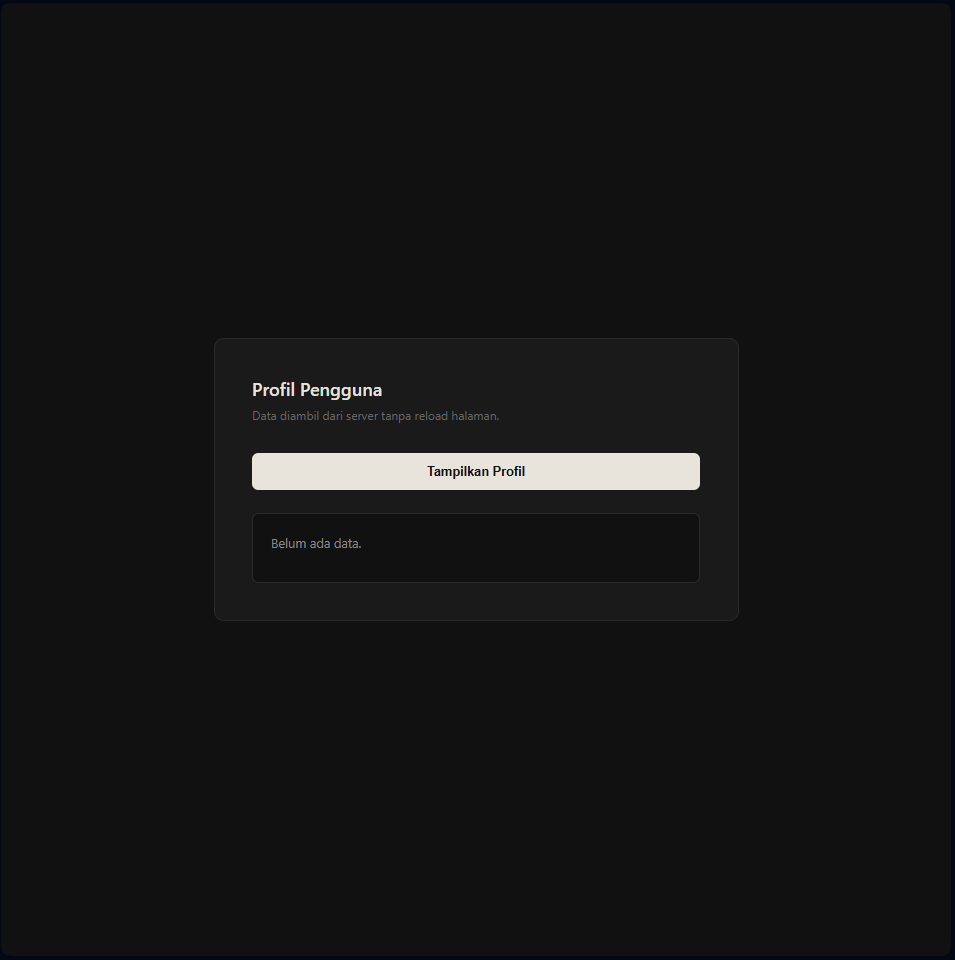
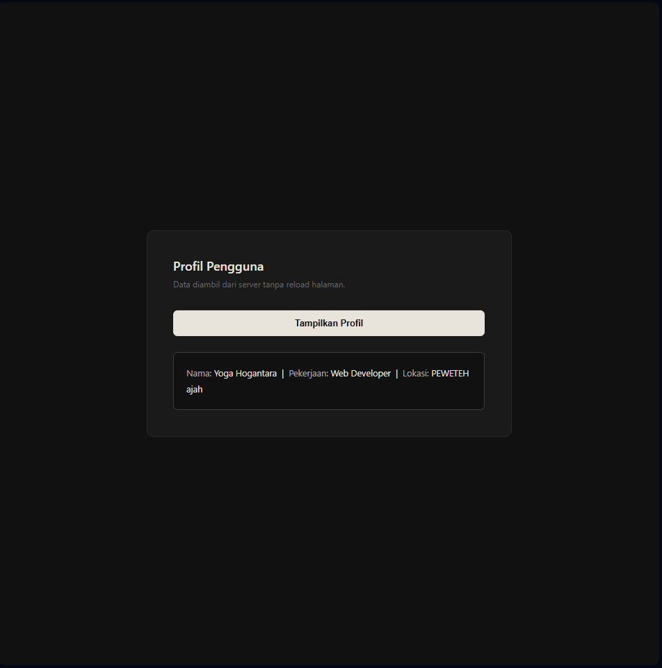

<div align="center">
  <br />
  <h1>LAPORAN PRAKTIKUM <br>APLIKASI BERBASIS PLATFORM</h1>
  <br />
  <h3>TUGAS MODUL 10 <br> AJAX</h3>
  <br />
  <br />
   
  <br />
  <br />
  <br />
  <br />
  <h3>Disusun Oleh :</h3>
  <p>
    <strong>Yoga Hogantara</strong><br>
    <strong>2311102153</strong><br>
    <strong>S1 IF-11-REG01</strong>
  </p>
  <br />
  <br />
  <h3>Dosen Pengampu :</h3>
  <p>
    <strong>Dimas Fanny Hebrasianto Permadi, S.ST., M.Kom</strong>
  </p>
  <br />
  <br />
    <h4>Asisten Praktikum :</h4>
    <strong> Apri Pandu Wicaksono </strong> <br>
    <strong>Rangga Pradarrell Fathi</strong>
  <br />
  <h3>LABORATORIUM HIGH PERFORMANCE
 <br>FAKULTAS INFORMATIKA <br>UNIVERSITAS TELKOM PURWOKERTO <br>2026</h3>
</div>

---

## 1. Dasar Teori

**AJAX (Asynchronous JavaScript and XML)** adalah kumpulan teknik pemrograman web yang memungkinkan halaman web untuk mengambil data dari server secara latar belakang (*asynchronously*) tanpa harus memuat ulang (*reload*) seluruh halaman secara penuh. Dengan AJAX, aplikasi web menjadi lebih interaktif, cepat, dan menyerupai aplikasi desktop. Walaupun utamanya mengandung kata "XML", format pertukaran data yang digunakan pada era modern saat ini cenderung lebih bertumpu pada **JSON (JavaScript Object Notation)** karena jauh lebih universal, ringan, dan sejalan langsung dengan sintaks JavaScript bawaan.

Untuk melakukan fungsi pengambilan (*request*) di sisi klien, antarmuka standar modern (API) yang saat ini paling banyak diimplementasikan di berbagai alat peramban (*web browser*) menggantikan `XMLHttpRequest` usang adalah fungsionalitas **`fetch()`**. Fetch API didukung oleh sistem *Promises* serta sintaks `async/await` yang memberi kemudahan penanganan eksekusi HTTP asinkron sehingga mempermudah pembacaan dan pemeliharaan struktur kode.

---

## 2. Implementasi Persyaratan Tugas (Kebutuhan Sistem)

Program ini telah dirancang untuk memenuhi semua syarat wajib pada soal dengan mengimplementasikan AJAX menggunakan **Fetch API** modern bersama sintaks `async/await` sebagaimana dicontohkan pada cuplikan kode berikut.

### 2.1 Membuat File Server (Database Sederhana) dengan PHP

Data disimpan dalam bentuk array multidimensi PHP yang berisi informasi `nama`, `pekerjaan`, dan `lokasi`. Untuk setiap *request*, sistem memilih **satu data secara acak** menggunakan `array_rand()` dan mengembalikannya sebagai respons JSON. Header `Content-Type` dan `Access-Control-Allow-Origin` disertakan agar *output* dibaca dengan benar oleh *client*. *File Referensi: `data.php`*

```php
<?php
header('Content-Type: application/json');
header('Access-Control-Allow-Origin: *');

$profil = [
    ['nama' => 'Yoga Hogantara', 'pekerjaan' => 'Web Developer',  'lokasi' => 'PEWETEH ajah'],
    ['nama' => 'Yhota',          'pekerjaan' => 'UI/UX Designer', 'lokasi' => 'Bandung'],
    ['nama' => 'YHOTA',          'pekerjaan' => 'Data Scientist', 'lokasi' => 'Surabaya'],
];

// Mengambil 1 profil secara acak dari array
$random = $profil[array_rand($profil)];

echo json_encode($random);
?>
```

### 2.2 Mengambil Data Menggunakan Fetch API (AJAX)

Pengambilan data dari *server* dilakukan di sisi *client* menggunakan fungsi bawaan *browser*, yaitu `fetch()`, dikombinasikan dengan sintaks `async/await`. Proses ini berjalan secara *asynchronous* di latar belakang sehingga pertukaran data terjadi tanpa me-*refresh* halaman web secara keseluruhan. Penanganan error dilakukan dengan blok `try/catch`. *File Referensi: `index.html`*

```javascript
btn.addEventListener('click', async () => {
    btn.disabled = true;
    btn.textContent = 'Mengambil data...';

    try {
        const res  = await fetch('data.php');
        if (!res.ok) throw new Error('Gagal terhubung ke server.');

        const data = await res.json();

        hasil.innerHTML =
            `<span>Nama:</span> ${data.nama} &nbsp;|&nbsp; ` +
            `<span>Pekerjaan:</span> ${data.pekerjaan} &nbsp;|&nbsp; ` +
            `<span>Lokasi:</span> ${data.lokasi}`;

    } catch (err) {
        hasil.textContent = '⚠ ' + err.message;
    } finally {
        btn.disabled = false;
        btn.textContent = 'Tampilkan Profil';
    }
});
```

### 2.3 Menampilkan Data Profil ke Elemen HTML

Data JSON yang diterima dari server langsung diinjeksikan ke dalam elemen `<div id="hasil-profil">` menggunakan manipulasi DOM (*innerHTML*). Format tampilan mengikuti ketentuan soal, yaitu: **Nama | Pekerjaan | Lokasi**, dengan tambahan styling *class* untuk membedakan state *loaded* dan *error*. *File Referensi: `index.html`*

```javascript
hasil.className = 'loaded';
hasil.innerHTML =
    `<span>Nama:</span> ${data.nama} &nbsp;|&nbsp; ` +
    `<span>Pekerjaan:</span> ${data.pekerjaan} &nbsp;|&nbsp; ` +
    `<span>Lokasi:</span> ${data.lokasi}`;
```

### 2.4 Penanganan State UI (Loading, Loaded, Error)

Sistem ini dirancang untuk memberikan umpan balik visual yang jelas kepada pengguna di setiap tahap proses AJAX:

- **Loading** – Tombol dinonaktifkan (`disabled`) dan teksnya berubah menjadi *"Mengambil data..."* selama proses berlangsung.
- **Loaded** – Class `loaded` ditambahkan ke `#hasil-profil` untuk mengubah warna teks menjadi terang, menandakan data berhasil ditampilkan.
- **Error** – Jika `fetch` gagal (misalnya server tidak tersedia), class `error` diterapkan dan pesan kesalahan ditampilkan dengan warna merah.

```javascript

btn.disabled = true;
hasil.textContent = 'Memuat...';

hasil.className = 'error';
hasil.textContent = '⚠ ' + err.message;

btn.disabled = false;
btn.textContent = 'Tampilkan Profil';
```

---

## 3. Penjelasan Kode Sumber (Struktur File & Arsitektur)

Proyek ini dibuat efisien dengan hanya menggunakan **2 file dasar** sesuai persyaratan soal:

1. **`data.php` (Pseudo-Backend / REST API Sederhana):**
   Bertindak sebagai sumber data (*provider*). Script ini menyimpan array profil, memilih satu entri secara acak menggunakan `array_rand()`, lalu mengembalikannya sebagai respons bertipe MIME `application/json`.

2. **`index.html` (View HTML, UI, & AJAX Controller):**
   Titik interaksi utama untuk pengguna (*front-end*). File ini berisi:
   - Struktur HTML dengan elemen tombol `<button id="btn">` dan wadah hasil `<div id="hasil-profil">`.
   - Desain responsif menggunakan CSS internal dengan tema gelap (*dark theme*), tanpa dependensi *framework* eksternal.
   - Script JavaScript internal yang menangani *event listener* klik tombol, eksekusi `fetch()` ke `data.php`, serta manipulasi DOM untuk merender hasil secara dinamis.

---

## 4. Hasil Tampilan (Screenshots) Aplikasi AJAX

Berikut adalah lampiran UI / *screenshot* dari Aplikasi Profil Pengguna AJAX yang menghubungkan *backend* PHP ke tampilan UI secara dinamis di lingkungan Web Server Lokal (misalnya Laragon/XAMPP).

* Tampilan awal sebelum tombol ditekan:



* Tampilan setelah tombol "Tampilkan Profil" ditekan dan data berhasil diambil:



---

## 5. Referensi Web

- **MDN Web Docs – Fetch API (AJAX Asinkron):** [https://developer.mozilla.org/en-US/docs/Web/API/Fetch_API/Using_Fetch](https://developer.mozilla.org/en-US/docs/Web/API/Fetch_API/Using_Fetch)
- **MDN Web Docs – async/await:** [https://developer.mozilla.org/en-US/docs/Learn/JavaScript/Asynchronous/Promises](https://developer.mozilla.org/en-US/docs/Learn/JavaScript/Asynchronous/Promises)
