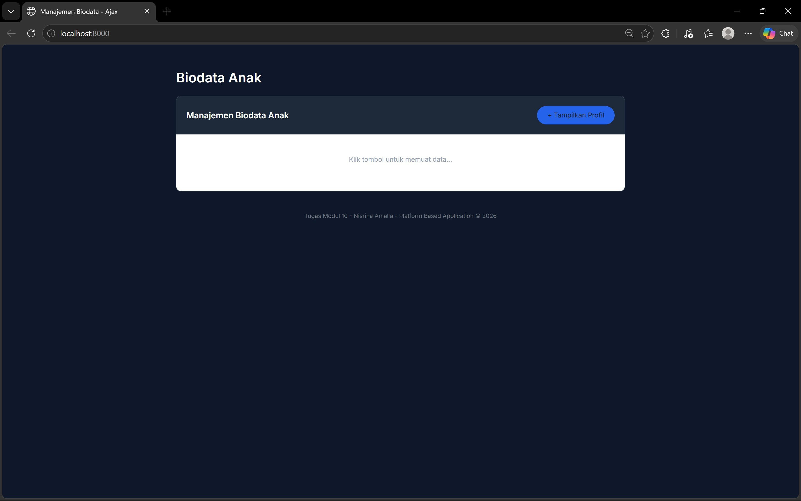
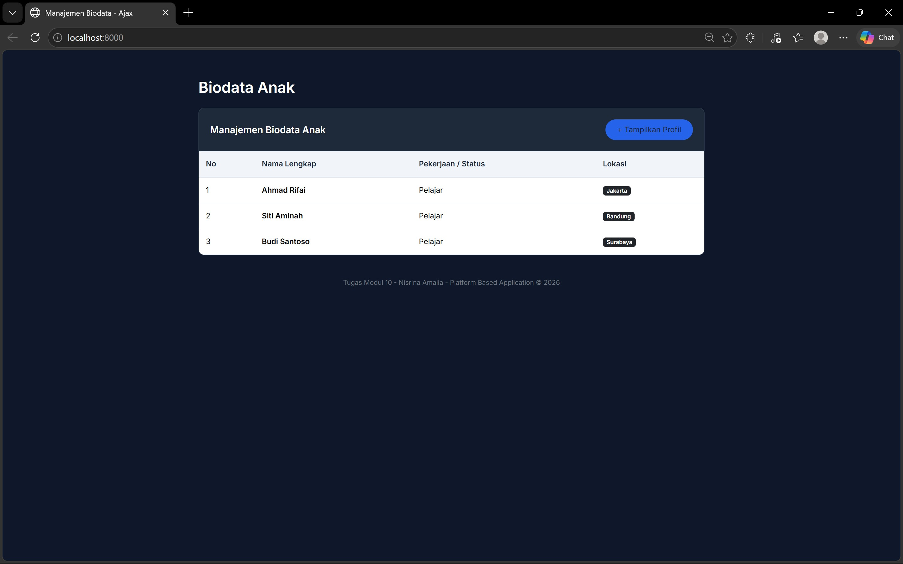

<div align="center">
  <br />
  <h1>LAPORAN PRAKTIKUM <br>APLIKASI BERBASIS PLATFORM</h1>
  <br />
  <h3> MODUL 10 <br> AJAX </h3>
  <br />
   
  <br />
  <br />
  <br />
  <h3>Disusun Oleh :</h3>
  <p>
    <strong>Nisrina Amalia Iffatunnisa</strong><br>
    <strong>2311102156</strong><br>
    <strong>S1 IF-11-01</strong>
  </p>
  <br />
  <h3>Dosen Pengampu :</h3>
  <p>
    <strong>Dimas Fanny Hebrasianto Permadi, S.ST., M.Kom</strong>
  </p>
  <br />
  <br />
    <h4>Asisten Praktikum :</h4>
    <strong> Apri Pandu Wicaksono </strong> <br>
    <strong>Rangga Pradarrell Fathi</strong>
  <br />
  <h3>LABORATORIUM HIGH PERFORMANCE
 <br>FAKULTAS INFORMATIKA <br>UNIVERSITAS TELKOM PURWOKERTO <br>2026</h3>
</div>

---

## 1. Dasar Teori

AJAX (Asynchronous JavaScript and XML) adalah teknik dalam pengembangan web yang memungkinkan browser berkomunikasi dengan server secara asinkron tanpa harus memuat ulang seluruh halaman. Dengan AJAX, user experience menjadi lebih baik karena interaksi terasa lebih cepat dan dinamis. Cara Kerja AJAX
berikut alur kerja AJAX secara sederhana:
- Pertama pengguna melakukan aksi misalnya klik tombol, ketik di kolom pencarian, dll.
- JavaScript akan membuat permintaan (request) ke server.
- Server memproses permintaan dan mengembalikan data.
- JavaScript menerima respons.
- Halaman web diperbarui sebagian tanpa reload.

AJAX memiliki berbagai manfaat dalam pengembangan aplikasi web modern, di antaranya memungkinkan halaman tidak perlu melakukan reload sehingga memberikan pengalaman pengguna yang lebih halus dan responsif, meningkatkan kinerja karena hanya data yang dibutuhkan saja yang dimuat, serta mendukung interaktivitas tinggi yang cocok untuk fitur real-time seperti dashboard atau chat. Selain itu, penggunaan AJAX juga membantu menghemat bandwidth karena pertukaran data lebih efisien. Namun, AJAX juga memiliki beberapa kekurangan, seperti ketergantungan pada JavaScript sehingga tidak dapat berjalan jika JavaScript dinonaktifkan, potensi kesulitan dalam optimasi SEO meskipun teknologi modern sudah mulai mengatasinya, risiko keamanan apabila tidak disertai validasi di sisi server, serta proses debugging yang cenderung lebih kompleks. Dalam praktiknya, AJAX banyak digunakan dalam aplikasi modern seperti Single Page Application (SPA) yang dibangun dengan React, Vue, atau Angular, serta fitur-fitur seperti live search, infinite scroll, real-time dashboard, dan aplikasi chat. Saat ini, implementasi AJAX umumnya sudah dibungkus dalam bentuk abstraction menggunakan teknologi seperti Fetch API, Axios, atau API bawaan dari masing-masing framework untuk mempermudah pengembangan.

Pada implementasi modern, AJAX umumnya menggunakan Fetch API, yang merupakan fitur JavaScript untuk melakukan HTTP request ke server dan mengambil data dalam berbagai format, seperti JSON.

JSON (JavaScript Object Notation) adalah format pertukaran data yang ringan dan mudah dibaca oleh manusia serta mudah diproses oleh mesin. JSON sering digunakan dalam komunikasi antara client dan server.

Dalam PHP, fungsi json_encode() digunakan untuk mengubah array atau object menjadi format JSON, sehingga dapat dikirim ke client dan diproses oleh JavaScript.


## 2. Sourcecode 

### Sourcecode data.php
``` PHP
<?php
// Menentukan header agar browser mengenali ini sebagai data JSON
header('Content-Type: application/json');

// Database sederhana berupa array
$data_anak = [
    [
        'nama' => 'Ahmad Rifai',
        'pekerjaan' => 'Pelajar',
        'lokasi' => 'Jakarta'
    ],
    [
        'nama' => 'Siti Aminah',
        'pekerjaan' => 'Pelajar',
        'lokasi' => 'Bandung'
    ],
    [
        'nama' => 'Budi Santoso',
        'pekerjaan' => 'Pelajar',
        'lokasi' => 'Surabaya'
    ]
];

// Mengirimkan data dalam format JSON
echo json_encode($data_anak);
?>
```

### Sourcecode index.html
``` HTML
<!DOCTYPE html>
<html lang="id">
<head>
    <meta charset="UTF-8">
    <meta name="viewport" content="width=device-width, initial-scale=1.0">
    <title>Manajemen Biodata - Ajax</title>
    <link href="https://cdn.jsdelivr.net/npm/bootstrap@5.3.0/dist/css/bootstrap.min.css" rel="stylesheet">
    <link href="https://fonts.googleapis.com/css2?family=Inter:wght@400;600&display=swap" rel="stylesheet">
    <style>
        body {
            background-color: #0f172a;
            color: #ffffff;
            font-family: 'Inter', sans-serif;
            padding-top: 60px;
        }
        .card-custom {
            background-color: #1e293b;
            border: 1px solid #334155;
            border-radius: 12px;
            overflow: hidden;
        }
        .text-header-title {
            color: #ffffff !important;
            font-weight: 600;
        }
        .btn-primary-custom {
            background-color: #2563eb;
            border: none;
            padding: 10px 25px;
            font-weight: 500;
        }
        /* Tabel Putih dengan Teks Hitam agar Jelas */
        .table-container {
            background-color: #ffffff; /* Background tabel jadi putih */
        }
        .table {
            margin-bottom: 0;
            color: #000000 !important; /* Paksa teks tabel jadi hitam */
        }
        .table thead th {
            background-color: #f1f5f9;
            color: #1e293b;
            font-weight: 600;
            border-bottom: 2px solid #e2e8f0;
            padding: 15px;
        }
        .table tbody td {
            color: #000000 !important; /* Teks nama & lainnya pasti hitam */
            padding: 15px;
            border-bottom: 1px solid #e2e8f0;
        }
    </style>
</head>
<body>

<div class="container">
    <div class="row justify-content-center">
        <div class="col-md-10">
            <h2 class="mb-4 fw-bold text-white">Biodata Anak</h2>
            
            <div class="card card-custom">
                <div class="card-header border-0 p-4 d-flex justify-content-between align-items-center">
                    <h5 class="m-0 text-header-title">Manajemen Biodata Anak</h5>
                    <button id="btn-tampilkan" class="btn btn-primary-custom rounded-pill">
                        + Tampilkan Profil
                    </button>
                </div>
                
                <div id="hasil-profil" class="table-container">
                    <div class="p-5 text-center">
                        <p style="color: #94a3b8;">Klik tombol untuk memuat data...</p>
                    </div>
                </div>
            </div>

            <footer class="mt-5 text-center text-secondary small">
                Tugas Modul 10 - Nisrina Amalia - Platform Based Application &copy; 2026
            </footer>
        </div>
    </div>
</div>

<script>
document.getElementById('btn-tampilkan').addEventListener('click', function() {
    const container = document.getElementById('hasil-profil');
    container.innerHTML = '<div class="text-center p-5"><div class="spinner-border text-primary" role="status"></div></div>';

    fetch('data.php')
        .then(response => response.json())
        .then(data => {
            let tableHTML = `
                <div class="table-responsive">
                    <table class="table">
                        <thead>
                            <tr>
                                <th>No</th>
                                <th>Nama Lengkap</th>
                                <th>Pekerjaan / Status</th>
                                <th>Lokasi</th>
                            </tr>
                        </thead>
                        <tbody>
            `;

            data.forEach((item, index) => {
                tableHTML += `
                    <tr>
                        <td>${index + 1}</td>
                        <td class="fw-bold text-dark">${item.nama}</td>
                        <td>${item.pekerjaan}</td>
                        <td><span class="badge bg-dark">${item.lokasi}</span></td>
                    </tr>
                `;
            });

            tableHTML += `
                        </tbody>
                    </table>
                </div>
            `;
            container.innerHTML = tableHTML;
        })
        .catch(error => {
            container.innerHTML = `<div class="alert alert-danger m-4">Error: ${error.message}</div>`;
        });
});
</script>

</body>
</html>
```


## 3. Penjelasan Implementasi 
Pada tugas ini, sistem dibangun dengan konsep client-server sederhana yang terdiri dari dua file utama yaitu data.php sebagai server dan index.html sebagai client. Keduanya saling terhubung menggunakan teknologi AJAX dengan bantuan Fetch API.

Tampilan Website



Pada bagian server, file data.php berfungsi sebagai penyedia data yang menyerupai database sederhana. Di dalam file ini:
- Pertama-tama ditambahkan `header Content-Type: application/json` yang bertujuan untuk memberi tahu browser bahwa data yang dikirimkan memiliki format JSON. 
- Kedua, dibuat sebuah array asosiatif bernama `$data_anak` yang berisi beberapa data, seperti nama, pekerjaan, dan lokasi. Array ini merepresentasikan kumpulan data yang biasanya disimpan dalam database. 
- Setelah data didefinisikan, fungsi `json_encode()` digunakan untuk mengubah array PHP menjadi format JSON agar dapat diproses oleh JavaScript di sisi client. Hasil konversi tersebut kemudian dikirimkan ke client menggunakan perintah `echo`.

Pada sisi client, file index.html berperan sebagai antarmuka pengguna yang menampilkan data. 
- Halaman ini dilengkapi dengan sebuah tombol Interaksi berupa "Tampilkan Profil" yang digunakan untuk memicu proses pengambilan data dari server. Selain itu, disediakan elemen `<div id="hasil-profil">` sebagai tempat untuk menampilkan data yang diterima dari server.

- Lalu, ketika tombol diklik, JavaScript akan menjalankan event listener yang telah didefinisikan. Di dalam event tersebut, pertama-tama ditampilkan loading spinner sebagai indikator bahwa proses pengambilan data sedang berlangsung. Selanjutnya, digunakan fungsi `fetch()` untuk mengirim permintaan HTTP ke file data.php. Permintaan ini dilakukan secara asynchronous, sehingga halaman tidak perlu direload. Setelah server merespons, hasilnya diubah menjadi format JSON menggunakan method `.json()`.

- Data yang telah diterima kemudian diproses menggunakan perulangan forEach() untuk menampilkan setiap item ke dalam bentuk tabel HTML. Setiap baris tabel menampilkan nomor, nama, pekerjaan, dan lokasi. Data tersebut disusun secara dinamis menggunakan template string JavaScript, kemudian dimasukkan ke dalam elemen `<div id="hasil-profil">`. Dengan cara ini, tampilan halaman akan diperbarui secara langsung tanpa perlu memuat ulang halaman.

- Selain itu, pada implementasi ini juga ditambahkan fitur penanganan error menggunakan `.catch()` yang akan menampilkan pesan kesalahan apabila terjadi kegagalan dalam proses pengambilan data. Hal ini menunjukkan bahwa sistem tidak hanya berfungsi dengan baik dalam kondisi normal, tetapi juga mampu menangani kemungkinan kesalahan.

Secara keseluruhan, implementasi ini menunjukkan integrasi yang baik antara PHP sebagai backend dan JavaScript sebagai frontend, serta pemanfaatan AJAX untuk menciptakan aplikasi web yang lebih interaktif dan responsif.

## Kesimpulan
Praktikum ini berhasil memenuhi seluruh ketentuan praktikum. Pada aplikasi ini, program AJAX ini berhasil mengimplementasikan konsep asynchronous data fetching menggunakan Fetch API. Data berhasil diambil dari server PHP dalam format JSON dan ditampilkan ke halaman web tanpa perlu reload. Penggunaan array pada server dan manipulasi DOM pada client menunjukkan integrasi yang baik antara PHP dan JavaScript.

## Referensi
[1] Kembuan, S., & Santa, K. (2025). PENGGUNAAN ASYNCHRONOUS JAVASCRIPT AND XML (AJAX) PADA RANCANG BANGUN SISTEM E-LEARNING PENINGKATAN LITERASI SEJARAH DAN BUDAYA SULAWESI UTARA. Journal of Innovation And Future Technology, 7(1), 42-51.
[2] [AJAX] (https://terapan-ti.vokasi.unesa.ac.id/post/memahami-ajax-dalam-pengembangan-web) </br>
