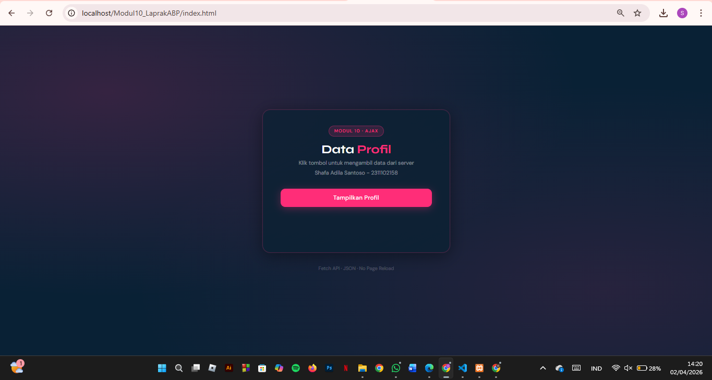
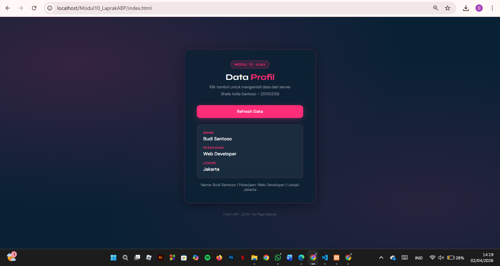

<div align="center">

# LAPORAN PRAKTIKUM  
# APLIKASI BERBASIS PLATFORM

## MODUL 10
## AJAX


### Disusun Oleh
**Shafa Adila Santoso**  
2311102158  
S1 IF-11-REG01

### Dosen Pengampu
**Dimas Fanny Hebrasianto Permadi, S.ST., M.Kom**

### Asisten Praktikum
Apri Pandu Wicaksono  
Rangga Pradarrell Fathi  

### LABORATORIUM HIGH PERFORMANCE  
FAKULTAS INFORMATIKA  
UNIVERSITAS TELKOM PURWOKERTO  
2026

</div>

---

<div align="justify">

# 1. Dasar Teori

AJAX (Asynchronous JavaScript and XML) merupakan teknik dalam pengembangan web yang memungkinkan aplikasi berkomunikasi dengan server tanpa perlu melakukan reload seluruh halaman. Walaupun namanya menyertakan XML, saat ini AJAX lebih sering memanfaatkan JSON (JavaScript Object Notation) karena lebih ringan dan lebih mudah diproses oleh JavaScript. Dengan penggunaan AJAX, tampilan web menjadi lebih interaktif dan responsif karena hanya bagian tertentu saja yang diperbarui.

**Cara Kerja AJAX**

AJAX bekerja secara asynchronous, yaitu JavaScript tetap bisa menjalankan proses lain tanpa harus menunggu respons dari server. Berikut alurnya:

- Trigger Event: Pengguna melakukan aksi (misalnya klik tombol)
- Request Object: Browser membuat request menggunakan XMLHttpRequest atau fetch
- Send Request: Permintaan dikirim ke server (GET/POST)
- Server Process: Server mengolah request dan mengirimkan data (umumnya dalam JSON)
- Response Handling: JavaScript menerima hasil dan memperbarui tampilan (DOM)

**Fetch API**

Fetch API adalah cara modern dalam JavaScript untuk melakukan HTTP request sebagai pengganti XMLHttpRequest. Fetch berbasis Promise sehingga penulisan kode menjadi lebih rapi dan mudah dipahami. Sintaks dasarnya menggunakan fetch(url) yang akan menghasilkan Promise berisi Response. Untuk mengambil data JSON, digunakan method .json(). Selain itu, Fetch juga bisa dikombinasikan dengan async/await agar kode asynchronous terlihat seperti synchronous.

**JSON (JavaScript Object Notation)**

JSON adalah format pertukaran data yang sederhana, ringan, dan mudah dibaca manusia. Strukturnya menggunakan pasangan key-value dalam {} untuk objek dan [] untuk array. Pada PHP, fungsi json_encode() digunakan untuk mengubah data menjadi JSON, sedangkan di JavaScript digunakan response.json() untuk mengubahnya menjadi objek. Keunggulan JSON adalah ukurannya kecil dan langsung kompatibel dengan JavaScript.

**Client-Server Architecture**

Dalam penggunaan AJAX terdapat dua bagian utama:

- Server Side (PHP)
    Bertugas menyediakan data, biasanya dari database atau array, lalu mengubahnya ke format JSON dengan header Content-Type: application/json.
- Client Side (HTML/JavaScript)
    Berfungsi mengirim request ke server menggunakan fetch, lalu menampilkan data ke halaman dengan memodifikasi DOM tanpa reload.

**DOM Manipulation**

DOM (Document Object Model) adalah representasi struktur halaman HTML yang bisa diubah menggunakan JavaScript. Dalam AJAX, setelah data diterima dari server, JavaScript akan memanipulasi elemen HTML menggunakan method seperti:

- document.getElementById()
- innerHTML
- createElement()
- appendChild()

Tujuannya untuk menampilkan atau memperbarui konten secara dinamis sesuai data yang diterima tanpa perlu memuat ulang halaman.

---

**Code PHP**

```php
<?php
// Set header agar browser tahu ini data JSON
header('Content-Type: application/json');

// Data profil (simulasi database sederhana)
$profil = [
    'nama'      => 'Budi Santoso',
    'pekerjaan' => 'Web Developer',
    'lokasi'    => 'Jakarta'
];

// Ubah array ke format JSON dan tampilkan
echo json_encode($profil);
?>
```
Kode PHP di atas berfungsi sebagai penyedia data (server-side) dalam format JSON untuk digunakan oleh AJAX. Pertama, header diatur menjadi `application/json` agar browser mengenali bahwa data yang dikirim berupa JSON. Kemudian dibuat array asosiatif `$profil` yang berisi informasi sederhana seperti nama, pekerjaan, dan lokasi sebagai simulasi database. Terakhir, fungsi `json_encode()` digunakan untuk mengubah array tersebut menjadi format JSON dan menampilkannya, sehingga dapat diambil dan ditampilkan secara dinamis oleh JavaScript (Fetch API) pada halaman web tanpa perlu reload.

--- 

**Code HTML**
```html
<!DOCTYPE html>
<html lang="id">
<head>
  <meta charset="UTF-8" />
  <meta name="viewport" content="width=device-width, initial-scale=1.0"/>
  <title>Modul 10 – AJAX Profil</title>

  <!-- Google Fonts -->
  <link href="https://fonts.googleapis.com/css2?family=Syne:wght@700;800&family=DM+Sans:wght@400;500&display=swap" rel="stylesheet"/>

  <style>
    /* ── Variabel Warna ── */
    :root {
      --navy:      #092135;
      --navy-mid:  #082b47;
      --hotpink:   #ff2d78;
      --pink-soft: #e997b8;
      --white:     #ffffff;
      --card-bg:   #092032bd;
    }

    /* ── Reset & Base ── */
    *, *::before, *::after { box-sizing: border-box; margin: 0; padding: 0; }

    body {
      min-height: 100vh;
      background-color: var(--navy);
      background-image:
        radial-gradient(ellipse at 15% 20%, rgba(255, 45, 120, 0.18) 0%, transparent 55%),
        radial-gradient(ellipse at 85% 80%, rgba(255, 45, 120, 0.12) 0%, transparent 55%);
      font-family: 'DM Sans', sans-serif;
      display: flex;
      flex-direction: column;
      align-items: center;
      justify-content: center;
      padding: 2rem;
    }

    /* ── Kartu Utama ── */
    .card {
      background: var(--card-bg);
      border: 1px solid rgba(255, 45, 120, 0.25);
      border-radius: 20px;
      padding: 2.5rem 2.8rem;
      width: 100%;
      max-width: 480px;
      box-shadow: 0 8px 40px rgba(0, 0, 0, 0.4), 0 0 0 1px rgba(255,255,255,0.04);
    }

    /* ── Header ── */
    .card-header {
      margin-bottom: 2rem;
      text-align: center;
    }

    .badge {
      display: inline-block;
      background: rgba(255, 45, 120, 0.15);
      color: var(--hotpink);
      font-size: 0.72rem;
      font-weight: 500;
      letter-spacing: 0.12em;
      text-transform: uppercase;
      padding: 0.3rem 0.85rem;
      border-radius: 999px;
      border: 1px solid rgba(255, 45, 120, 0.35);
      margin-bottom: 0.9rem;
    }

    h1 {
      font-family: 'Syne', sans-serif;
      font-size: 1.9rem;
      color: var(--white);
      line-height: 1.2;
    }

    h1 span {
      color: var(--hotpink);
    }

    .subtitle {
      margin-top: 0.5rem;
      font-size: 0.88rem;
      color: rgba(255,255,255,0.45);
    }

    /* ── Tombol ── */
    #btn-tampilkan {
      display: block;
      width: 100%;
      padding: 0.85rem;
      background: var(--hotpink);
      color: var(--white);
      font-family: 'DM Sans', sans-serif;
      font-size: 0.95rem;
      font-weight: 500;
      border: none;
      border-radius: 12px;
      cursor: pointer;
      transition: background 0.2s, transform 0.15s, box-shadow 0.2s;
      box-shadow: 0 4px 20px rgba(255, 45, 120, 0.35);
      letter-spacing: 0.02em;
    }

    #btn-tampilkan:hover {
      background: var(--pink-soft);
      transform: translateY(-2px);
      box-shadow: 0 6px 28px rgba(255, 45, 120, 0.5);
    }

    #btn-tampilkan:active {
      transform: translateY(0);
    }

    #btn-tampilkan:disabled {
      opacity: 0.6;
      cursor: not-allowed;
      transform: none;
    }

    /* ── Area Hasil ── */
    #hasil-profil {
      margin-top: 1.5rem;
      min-height: 52px;
    }

    /* State: loading */
    .loading {
      display: flex;
      align-items: center;
      gap: 0.6rem;
      color: rgba(255,255,255,0.5);
      font-size: 0.88rem;
    }

    .spinner {
      width: 18px;
      height: 18px;
      border: 2px solid rgba(255,45,120,0.3);
      border-top-color: var(--hotpink);
      border-radius: 50%;
      animation: spin 0.7s linear infinite;
    }

    @keyframes spin { to { transform: rotate(360deg); } }

    /* State: hasil data */
    .profil-box {
      background: rgba(255, 255, 255, 0.05);
      border: 1px solid rgba(255, 45, 120, 0.2);
      border-radius: 12px;
      padding: 1.2rem 1.4rem;
      animation: fadeUp 0.35s ease;
    }

    @keyframes fadeUp {
      from { opacity: 0; transform: translateY(8px); }
      to   { opacity: 1; transform: translateY(0); }
    }

    .profil-box .label {
      font-size: 0.72rem;
      font-weight: 500;
      color: var(--hotpink);
      text-transform: uppercase;
      letter-spacing: 0.1em;
      margin-bottom: 0.25rem;
    }

    .profil-box .value {
      font-size: 1.05rem;
      font-weight: 500;
      color: var(--white);
      margin-bottom: 0.9rem;
    }

    .profil-box .value:last-child { margin-bottom: 0; }

    .profil-text {
      font-size: 0.85rem;
      color: rgba(255,255,255,0.45);
      margin-top: 1rem;
      text-align: center;
      letter-spacing: 0.01em;
    }

    /* State: error */
    .error-box {
      background: rgba(255,45,45,0.08);
      border: 1px solid rgba(255,80,80,0.3);
      border-radius: 12px;
      padding: 1rem 1.2rem;
      color: #ff7070;
      font-size: 0.88rem;
      animation: fadeUp 0.3s ease;
    }

    /* ── Footer ── */
    .footer {
      margin-top: 2rem;
      font-size: 0.78rem;
      color: rgba(255,255,255,0.2);
      text-align: center;
    }
  </style>
</head>
<body>

  <div class="card">
    <div class="card-header">
      <div class="badge">Modul 10 · AJAX</div>
      <h1>Data <span>Profil</span></h1>
      <p class="subtitle">Klik tombol untuk mengambil data dari server</p>
      <p class="subtitle">Shafa Adila Santoso - 2311102158</p>   
    </div>

    <!-- Tombol -->
    <button id="btn-tampilkan">Tampilkan Profil</button>

    <!-- Tempat menampilkan hasil -->
    <div id="hasil-profil"></div>
  </div>

  <p class="footer">Fetch API · JSON · No Page Reload</p>

  <script>
    const btn    = document.getElementById('btn-tampilkan');
    const hasil  = document.getElementById('hasil-profil');

    btn.addEventListener('click', function () {
      // Tampilkan loading
      hasil.innerHTML = `
        <div class="loading">
          <div class="spinner"></div>
          <span>Mengambil data...</span>
        </div>`;
      btn.disabled = true;

      // Ambil data dari data.php menggunakan fetch()
      fetch('data.php')
        .then(function (response) {
          if (!response.ok) throw new Error('Gagal mengambil data dari server.');
          return response.json();   // ubah response ke JSON
        })
        .then(function (data) {
          // Tampilkan data ke dalam #hasil-profil
          hasil.innerHTML = `
            <div class="profil-box">
              <p class="label">Nama</p>
              <p class="value">${data.nama}</p>

              <p class="label">Pekerjaan</p>
              <p class="value">${data.pekerjaan}</p>

              <p class="label">Lokasi</p>
              <p class="value">${data.lokasi}</p>
            </div>
            <p class="profil-text">
              Nama: ${data.nama} | Pekerjaan: ${data.pekerjaan} | Lokasi: ${data.lokasi}
            </p>`;
          btn.textContent = 'Refresh Data';
        })
        .catch(function (error) {
          hasil.innerHTML = `<div class="error-box">⚠ ${error.message}</div>`;
        })
        .finally(function () {
          btn.disabled = false;
        });
    });
  </script>

</body>
</html>
```
Kode HTML, CSS, dan JavaScript di atas merupakan halaman web interaktif yang menampilkan data profil menggunakan teknik AJAX (melalui Fetch API) tanpa perlu reload halaman. Tampilan dibuat dalam bentuk kartu dengan desain modern menggunakan CSS, kemudian terdapat tombol “Tampilkan Profil” yang saat diklik akan mengambil data dari file `data.php`. Saat proses berlangsung, ditampilkan indikator loading, lalu data yang diterima dalam format JSON (nama, pekerjaan, lokasi) akan ditampilkan secara dinamis ke dalam halaman. Jika terjadi kesalahan, sistem akan menampilkan pesan error. Secara keseluruhan, kode ini menunjukkan cara kerja AJAX sederhana untuk mengambil dan menampilkan data dari server secara asynchronous sehingga pengalaman pengguna lebih responsif.

--- 

**Output:**

<p align="center">  </p> 
<p align="center">  </p> 


